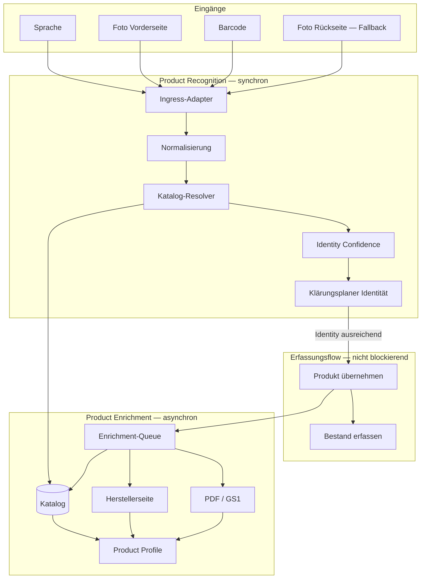

# GA-013

| Feld | Wert |
|------|------|
| **ID** | GA-013 |
| **Titel** | KI-gestützte Düngererkennung — Architektur |
| **Status** | ✅ Stufe 1 umgesetzt und auf Dev validiert (Product Profiles, Save-Flow, mobiler Smoke-Test) |
| **Priorität** | Hoch |
| **Erstellt** | 2026-07-28 |
| **Zuletzt geändert** | 2026-07-29 (Stufe 1 Abschluss) |
| **Verantwortlich** | — |
| **Verwandte Dokumente** | [DL-010](../decisions/dl-010.md); [CM-013](../playbook/conversation-model.md#cm-013--kontextbezogene-rückfragen-bei-der-erfassung); [GM-003](../model/gm-003.md); [GM-008](../model/gm-008.md); [GA-001](./ga-001.md); [GA-012](./ga-012.md); [product-governance.md](../product-governance.md); [Project Delivery](../project-delivery/README.md) |
| **Kurzbeschreibung** | Zielarchitektur: Product Recognition (Identität) und Product Enrichment (Profil) getrennt; Bestandserfassung wartet nicht auf vollständiges Product Profile. |

---

## Zweck

Dieses Dokument beschreibt die **Zielarchitektur** der KI-gestützten Düngererkennung — auf Basis eines Technical Spikes, kontrollierter Integration und **Feldtest-Erkenntnissen (2026-07-28)**.

Kernfrage:

> Wie bestimmt Greenkeeper **möglichst schnell und eindeutig**, welches Produkt der Nutzer erfasst — und wie wird das **fachliche Produktprofil** aufgebaut, ohne die Bestandserfassung zu blockieren?

**Methodik:** Auswertung bestehender Repository-Bausteine, OpenAI Responses API mit Bildinput, Feldtest (Rasendoktor HEIC) und fachliche Vorgaben aus [DL-010](../decisions/dl-010.md) / [CM-013](../playbook/conversation-model.md#cm-013--kontextbezogene-rückfragen-bei-der-erfassung).

Der isolierte Technical Spike beweist den Ablauf mit echtem Vorderseitenfoto. Die **Zielarchitektur** trennt Recognition und Enrichment — der Spike führt Web-Anreicherung noch synchron aus (siehe [Abweichung Spike vs. Ziel](#abweichung-spike-vs-zielarchitektur)).

---

## Kurzantwort

**Ja — mit klarer Trennung von Identität und Profil.**

Greenkeeper bestimmt mit **Sprache, Vorderseitenfoto oder Barcode** in den meisten Fällen ausreichend schnell:

> **Welches Produkt ist das?**

Sobald die **Produktidentität** belastbar steht, darf der Erfassungsflow fortgesetzt werden — **ohne** auf ein vollständiges fachliches Produktprofil zu warten.

Das **Product Enrichment** baut das vollständige Profil **asynchron** und **wiederverwendbar** auf ([Product Profile](#product-profile)). Die Bestandserfassung blockiert nicht darauf.

**Vollautomatisch ohne jede Rückfrage** gelingt nur bei eindeutigen Fällen (klares Etikett, eindeutige Gebindegröße, Katalogtreffer). In der Praxis ist **null bis eine** kontextbezogene Rückfrage ([DL-010](../decisions/dl-010.md)) die realistische Erwartung — nicht ein Fragemonster.

---

## Architekturentscheidung (Feldtest 2026-07-28)

Der reale Feldtest (Rasendoktor HEIC, ~17 s Latenz) hat gezeigt:

| Erkenntnis | Konsequenz |
|------------|------------|
| Vision + Web liefern Identität schnell und belastbar | **Recognition** darf nach Identität enden |
| Web-Anreicherung im selben Request dauert lang und liefert oft wenig Mehrwert für Identität | **Enrichment** aus dem kritischen Pfad nehmen |
| `dataCompleteness` im Spike misst nur den aktuellen Lauf | Langfristig: **Product Profile Completeness** am Produkt, nicht am Foto-Lauf |
| Fehlende NPK/Dosierung rechtfertigen kein Rückseitenfoto | Rückseite nur bei **unklarer Identität** oder fehlenden belastbaren Quellen |

**Leitsatz:**

> Die Aufgabe der Produkterkennung ist nicht, möglichst viele Produktdaten aus einem Foto zu extrahieren.
> Die Aufgabe ist ausschließlich: **Die Produktidentität möglichst schnell und eindeutig zu bestimmen.**

---

## Zwei Verantwortlichkeiten: Recognition und Enrichment

### Product Recognition

**Frage:** „Welches Produkt ist das?“

| Verantwortung | Inhalt |
|---------------|--------|
| Identifizieren | Marke, Produktlinie, Variante, Produktname |
| Gebinde | Gebindegröße und -einheit, wenn sichtbar oder ableitbar |
| Sicherheit | **Identity Confidence** — ausreichende Identität für Fortsetzung |
| Ende | Belastbare Produktidentität → Erfassungsflow darf fortgesetzt werden |

**Eingänge:** Sprache, Vorderseitenfoto, Barcode (GTIN).

**Ausgabe:** Produktreferenz (Katalogtreffer **oder** persönlicher Recognition Candidate) — kein Katalog-Write ([GM-003](../model/gm-003.md)).

**Nicht Aufgabe von Recognition:** vollständige NPK-Deklaration, Mikronährstoffe, Dosierung, Langzeitwirkung, Anwendungszeiträume — das ist **Enrichment**.

### Product Enrichment

**Frage:** „Welche fachlichen Eigenschaften besitzt dieses Produkt?“

Baut das **Product Profile** auf — **asynchron**, nach erfolgreicher Identität, ohne den Erfassungsflow zu blockieren.

**Quellen (Priorität):**

1. Greenkeeper Product Catalog ([GA-001](./ga-001.md))
2. Offizielle Herstellerseite
3. Offizielle Produktdatenblätter / PDFs
4. GS1 / GTIN
5. Weitere verifizierte Herstellerquellen
6. Vom Nutzer bereitgestellte Verpackungsinformationen (Fotos, Etikettangaben)

**Typische Profilfelder:** vollständige NPK, Stickstoffformen, Spurenelemente, Mikronährstoffe, Langzeitwirkung, Aufwandmenge, Flächenleistung, Anwendungszeiträume, Deklarationen, weitere objektive Produkteigenschaften — ausschließlich aus [verifizierten Quellen](#verifizierte-produktinformationen).

**Governance:** Neue oder unsichere Katalogdaten über Governance ([GM-003](../model/gm-003.md), [product-governance.md](../product-governance.md)) — nie direkter Katalog-Schreibzugriff aus Enrichment.

---

## Product Profile

Produktidentität und Produktprofil sind **zwei verschiedene Dinge**.

| Begriff | Frage | Zeitpunkt |
|--------|-------|-----------|
| **Produktidentität** | Welches Produkt ist das? | Synchron im Erfassungsflow (Recognition) |
| **Product Profile** | Welche fachlichen Eigenschaften hat es? | Nach Recognition (Stufe 1: minimal aus Snapshot); langfristig asynchron via Enrichment |

**Ziel:** Jedes Produkt in Greenkeeper erhält langfristig ein **vollständiges Product Profile** — unabhängig davon, ob es im offiziellen Katalog oder als persönlicher Candidate startet.

### Erstimplementierung (Stufe 1)

Nach erfolgreicher Produkterkennung legt Greenkeeper beim **Speichern** serverseitig ein minimales Product Profile an — **nur aus dem Recognition Snapshot**, ohne Web-Recherche und ohne Enrichment.

| Aspekt | Umsetzung |
|--------|-----------|
| Tabelle | `product_profiles` — **persönliche Drafts** (`profile_status = draft`, `user_id` Pflicht) und **globale verifizierte Profile** (`profile_status = verified`) |
| Inhalt | Identität (brand, line, official name, variant), strukturiertes NPK, optional product form |
| Quelle | Snapshot-Drafts: `source = packaging_photo` |
| Status | Snapshot-Drafts: `profile_status = draft`, `verification_status = unverified` |
| Wiederverwendung | Verifiziertes Profil → global; Draft → nur innerhalb desselben Nutzers; **kein Update** bestehender Felder |
| Gebinde | **Nicht** im Product Profile — nur in `fertilizer_containers` |
| Verknüpfung | `fertilizer_recognition_candidates.product_profile_id` → Product Profile |
| Katalog | `products.product_profile_id` → optionales **verifiziertes** Product Profile; **DB-Trigger** erlauben nur verified/global |
| RPC | `ensure_product_profile_from_snapshot(jsonb)` — atomar mit `ON CONFLICT`; `resolve_product_profile_for_catalog(uuid)` |
| Zeitpunkt | **Verbindlich serverseitig** in `save_fertilizer_capture` — kein Client-Ensure |
| Idempotenz | Replay liefert dieselbe `product_profile_id` wie Erst-Save |

**Architekturregeln Stufe 1:**

- Recognition Candidate = persönliche Erkennung
- Snapshot-Product-Profile = persönlicher **Draft**, nicht global verifiziert
- Recognition Confidence ist **keine** fachliche Verifizierung
- Nur `profile_status = verified` ist global wiederverwendbar
- Katalogprodukte dürfen auf Datenbankebene ausschließlich mit globalen, verifizierten Product Profiles verknüpft werden
- **Aktive** Katalogprodukte benötigen verified/global Profile; soft-gelöschte blockieren keine Profilstatusänderung
- Bei **Reaktivierung** (`soft_deleted_at` → `NULL`) wird die Profilintegrität erneut geprüft
- Verknüpfte Profile können nicht stillschweigend gelöscht werden (`ON DELETE RESTRICT`)
- Journal, Nährstoffbilanz und Product Enrichment sind **nicht** Teil dieser Stufe

Recognition Candidate bleibt **persönlich**; Product Profile beschreibt das **Produkt** fachlich — getrennte Verantwortlichkeiten.

### Wiederverwendung

Sobald ein Product Profile für ein Produkt vollständig aufgebaut wurde (Katalog + Enrichment-Pipeline), **profitieren alle künftigen Erkennungen** desselben Produkts davon.

Die vollständige Anreicherung muss **nicht bei jedem Nutzer** und **nicht bei jedem Foto** erneut durchgeführt werden.

Enrichment-Läufe schreiben in das **profilgebundene Wissen** (Katalog-Eintrag oder verknüpftes Profil-Objekt) — nicht in den einzelnen Recognition-Lauf.

---

## Verifizierte Produktinformationen

Ein **Product Profile** darf ausschließlich aus **verifizierten Quellen** aufgebaut oder erweitert werden.

### Verifizierte Quellen

| Quelle | Rolle |
|--------|-------|
| Greenkeeper Product Catalog | Authoritative Basis ([GA-001](./ga-001.md)) |
| Offizielle Herstellerseiten | Herstellerbestätigte Produktdaten |
| Offizielle Produktdatenblätter / PDFs | Deklarierte Nährstoff- und Anwendungsangaben |
| GS1 / GTIN | Strukturierte Produktreferenz und Kurzmetadaten |
| Vom Nutzer bereitgestellte Verpackungsinformationen | Fotos und Angaben direkt von der physischen Packung |

### Rolle der KI

Die KI darf Informationen **erkennen**, **strukturieren**, **zusammenführen** und **validieren**.

Die KI darf jedoch **niemals** fachliche Produkteigenschaften **schätzen**, **ergänzen** oder **erfinden**.

Fehlende Informationen bleiben **unbekannt**, bis sie durch eine verifizierte Quelle bestätigt werden.

### Geltungsbereich

Diese Regel gilt insbesondere für:

- NPK-Werte
- Stickstoffformen
- Mikronährstoffe
- Spurenelemente
- Aufwandmengen
- Flächenleistung
- Langzeitwirkung
- Deklarationen
- sonstige fachliche Produkteigenschaften

**Ziel:** Product Profiles bleiben jederzeit **fachlich belastbar** und **nachvollziehbar** — jeder Wert ist auf eine verifizierte Quelle zurückführbar.

---

## Kennzahlen

| Kennzahl | Bedeutung | Entscheidend für |
|----------|----------|------------------|
| **Identity Confidence** | Sicherheit der Produktidentität | Fortsetzung Erfassungsflow, Rückfragen, Rückseitenfoto |
| **Product Profile Completeness** | Vollständigkeit des fachlichen Profils am Produkt | Empfehlungen, Journal, Governance — **nicht** Bestandserfassung |

### Abgrenzung zum Spike (`dataCompleteness`)

Im Technical Spike misst `dataCompleteness` die **Vollständigkeit optionaler Felder innerhalb eines einzelnen Recognition-Laufs** (Bild + synchroner Web-Versuch). Das war für den PoC nützlich, ist aber **kein langfristiges Steuerungsmaß**.

**Zielarchitektur:** Steuerung über **Identity Confidence** (Recognition) und **Product Profile Completeness** (Enrichment, am Produkt persistiert).

---

## Bestandserfassung und Enrichment

> **Produktentscheidung:** Die Bestandserfassung wartet **niemals** auf ein vollständiges Product Profile.

Ablauf:

```
Recognition → Identity Confidence ausreichend
  → Nutzer übernimmt Produkt
  → Bestandserfassen (GA-012, DL-010)
  → [parallel/asynchron] Product Enrichment → Product Profile wächst
```

Fehlende optionale Profilfelder (Dosierung, Mikronährstoffe, Hersteller, GTIN, …) **blockieren** weder Übernahme noch Speichern.

---

## Rückseitenfoto

Ein Rückseitenfoto ist **ausdrücklich nur ein Fallback**.

Anfordern **nur wenn**:

- die Produktidentität **nicht eindeutig** bestimmt werden kann, **oder**
- **keine belastbaren offiziellen Quellen** existieren, aus denen die Identität geklärt werden kann.

**Niemals** allein wegen:

- fehlender NPK-Deklaration,
- fehlender Dosierung oder Mikronährstoffe,
- fehlgeschlagenem oder unvollständigem Web-Enrichment,
- niedriger Product Profile Completeness.

Für **Bestandserfassung** ist NPK **nicht** Pflicht ([DL-010](../decisions/dl-010.md)).

---

## Untersuchte Erfassungswege

### 1. Sprache

**Beispiel:** „Ich habe einen Sack ICL All Season gekauft.“

| Aspekt | Bewertung |
|--------|-----------|
| Hersteller erkennen | Hoch — bei bekannten Marken (ICL, Compo, Substral, …) |
| Produktlinie erkennen | Hoch bis mittel — abhängig von eindeutigem Namen |
| Kaufabsicht / Kontext | Hoch — „gekauft“, „neu“, „Sack“ |
| Gebindegröße | Niedrig — selten in Sprache enthalten; „Sack“ ist mehrdeutig |
| Aktuelle Bestandsmenge | Niedrig — „gekauft“ ≠ Restmenge |
| NPK / Nährstoffe | Sehr niedrig — Nutzer nennen das selten korrekt |

**Technischer Pfad (Recognition):**

```
Audio (Client)
  → Transkription (Whisper / gpt-4o-transcribe)
  → Intent + Entitätsextraktion (Structured Output, gpt-4o-mini)
  → Katalog-Match (interne products)
  → Identity Confidence
  → Klärungsplaner (nur Identität + Bestand)
  → [asynchron] Product Enrichment
```

Bestehende Basis: [parse-activity](../netlify/functions/parse-activity.ts) nutzt bereits `gpt-4o-mini` mit Structured Output — Muster für Entitätsextraktion aus Freitext ist vorhanden, aber auf **Maßnahmen**, nicht auf Produkterkennung spezialisiert.

---

### 2. Foto der Vorderseite

| Information | Zuverlässigkeit (Vorderseite) | Anmerkung |
|-------------|-------------------------------|-----------|
| Hersteller / Marke | **Hoch** | Logo und Wortmarke meist sichtbar |
| Produktname / Linie | **Hoch** | Größte Typografie auf der Packung |
| Produktform (Granulat / Flüssig) | **Mittel bis hoch** | Oft visuell oder über Keywords („Granulat“, „Flüssigdünger“) |
| Gebindegröße | **Mittel** | Wenn gedruckt — aber gleiches Design für 7 kg / 20 kg / 25 kg häufig |
| NPK-Deklaration | **Niedrig bis mittel** | Oft auf Rückseite oder Seitenpanel |
| Mikronährstoffe, Dosierung | **Niedrig** | Selten vollständig auf der Vorderseite |
| Barcode (EAN) | **Hoch** | Wenn im Bild scharf und vollständig — kann separat decodiert werden |

Bestehende Basis: [product-assistant-analyze](../netlify/functions/product-assistant-analyze.ts) sendet Bilder mit `detail: 'high'` an `gpt-4o-mini` und extrahiert strukturierte Produktdaten per JSON Schema ([productAssistantAnalyzeCore](../src/lib/productAssistantAnalyzeCore.ts)).

**Fazit Vorderseite:** Für **Product Recognition** (Marke, Linie, Variante, Gebinde) gut geeignet. NPK und Mikronährstoffe gehören in **Product Enrichment** — nicht in den synchronen Identitätspfad.

---

### 3. Barcode

| Aspekt | Bewertung |
|--------|-----------|
| GTIN/EAN extrahieren | **Sehr hoch** — klassische Barcode-Bibliothek (ZXing, QuaggaJS, native Scanner) |
| Produktidentität allein aus Barcode | **Nur mit externer oder interner Datenbank** |
| Strukturierte NPK-Daten allein aus Barcode | **Sehr niedrig** — GS1/Open-Data liefert meist Kurzbeschreibung, selten NPK |

**Barcode allein reicht nicht** für vollständige Produktdaten. Er ist ein **starker Identifier-Schlüssel**:

```
GTIN
  → Lookup: Greenkeeper-Katalog (primär)
  → Fallback: GS1 / GTIN-Registry (Identitäts-Hinweise)
  → Identity Confidence
  → [asynchron] Product Enrichment aus Katalog und verifizierten Quellen
```

Bei Treffer im **eigenen Katalog** ist Barcode der schnellste und zuverlässigste Weg für **Identität** — ohne Vision-Kosten. Vollständiges Product Profile kommt aus Katalog + Enrichment.

---

### 4. Foto der Rückseite (Fallback)

| Information | Zuverlässigkeit (Rückseite) |
|-------------|----------------------------|
| NPK (N-P₂O₅-K₂O) | **Hoch** — Pflichtdeklaration auf Packung |
| Dosierung / Aufwandmenge | **Mittel bis hoch** |
| Inhaltsstoffe, Nebenbestandteile | **Mittel** |
| Gebindegröße (wenn nicht auf Vorderseite) | **Mittel** |

**Architekturregel:** Rückseite **nur**, wenn Identität nach Vorderseite + Katalog + verfügbaren Quellen **unklar** bleibt — oder keine belastbare offizielle Quelle existiert. **Nicht** für Profil-Vollständigkeit im Enrichment-Pfad.

Profilfelder von der Rückseite fließen in **Product Enrichment** ein, nicht in den synchronen Recognition-Abschluss.

---

## OpenAI-Modelle — Empfehlung

| Aufgabe | Empfohlenes Modell | Begründung |
|---------|-------------------|------------|
| Transkription (Sprache → Text) | **whisper-1** oder **gpt-4o-transcribe** | Bewährt, günstig, serverseitig |
| Intent + Entitäten aus Transkript | **gpt-4o-mini** | Structured Output, niedrige Latenz/Kosten; Repository-Standard |
| Verpackungsfoto — Produkterkennung (Name, Marke, Form) | **gpt-4o-mini** mit `detail: high` | Bereits im Einsatz; für klare Retail-Packungen ausreichend |
| Verpackungsfoto — feine Etikett-Details (NPK, Kleinsttext) | **gpt-4o** mit `detail: high` | Bessere OCR-ähnliche Genauigkeit bei kleiner Schrift |
| Klärungsplanung / Routing | **gpt-4o-mini** oder regelbasiert | Regeln aus DL-010/CM-013 sollten **primär deterministisch** sein; LLM nur für Formulierung optional |
| Katalog-Fuzzy-Match | **Kein LLM nötig** | PostgreSQL `pg_trgm`, normalisierte Namen, GTIN-Exact-Match |

**Nicht empfohlen als alleinige Lösung:** reine OCR-Pipeline (Tesseract o. ä.) ohne LLM — bei verformten Etiketten, Perspektive und Kontext schlechter als Vision-LLM, ohne Mehrwert bei Produktform-Erkennung.

**Kosten-Latenz-Strategie:** Recognition mit `gpt-4o-mini` und **kurzem kritischen Pfad** (Identität + Katalog); Enrichment asynchron mit längeren Timeouts und mehreren Quellen — nicht im Nutzer-Wartepfad der Erfassung.

---

## Was automatisch bestimmbar ist — und was fehlt

### Ohne weitere Rückfrage (typisch)

| Feld | Sprache | Foto Vorderseite | Barcode + Katalog |
|------|---------|------------------|-------------------|
| Hersteller | ✓ | ✓ | ✓ (bei Treffer) |
| Produktname / Linie | ✓ | ✓ | △ (Kurztext) |
| Produktform | △ | ✓ | △ |
| GTIN | ✗ | ✓ (wenn lesbar) | ✓ |
| Kaufabsicht | ✓ | ✗ | ✗ |

### Regelmäßig fehlend oder mehrdeutig

| Feld | Grund |
|------|-------|
| **Gebindegröße** | Mehrere SKUs, gleiches Design; Sprache unpräzise („Sack“) |
| **Aktuelle Bestandsmenge** | Weder Sprache noch Foto liefern zuverlässig den persönlichen Restbestand |
| **NPK vollständig** | Oft nicht auf Vorderseite |
| **Offizieller Produktname** | Marketingname ≠ Governance-`official_name` |
| **Verifizierte Nährstoffwerte** | LLM-Extraktion erfordert Governance-Review ([GM-003](../model/gm-003.md)) |

### Daraus entstehende Rückfragen (DL-010-konform)

Nur **Pflichtangaben für Bestand** — nicht für Katalog-Governance:

| Situation | Eine Rückfrage (Beispiel) |
|-----------|---------------------------|
| Mehrere Gebindegrößen im Katalog | „Waren es 7 kg oder 25 kg?“ |
| Produktform unbekannt (seltenes Produkt) | „Ist das Granulat oder Flüssigdünger?“ |
| Kein Katalogtreffer, Name unklar | „Meinst Du [Vorschlag A] oder ein anderes Produkt?“ |
| Bestand erfassen | „Wie viel hast Du aktuell?“ — **immer** nötig, sofern nicht aus Kontext ableitbar |

**Keine** Rückfragen zu: Preis, Händler, Kaufdatum, NPK — sofern nicht explizit für den aktuellen Schritt erforderlich.

---

## Zielarchitektur

### Prinzipien

1. **Recognition ≠ Enrichment.** Recognition endet bei belastbarer Identität; Enrichment baut das Product Profile asynchron auf.
2. **Bestand wartet nicht auf Profil.** Identity Confidence reicht für Erfassungsfortsetzung ([DL-010](../decisions/dl-010.md), [GA-012](./ga-012.md)).
3. **Erkennung ≠ Inventar.** Bestand entsteht im Erfassungsflow; Recognition liefert nur Produktreferenz.
4. **Katalog zuerst (Enrichment).** Interner Katalog ist authoritative Quelle für strukturierte Produktdaten ([GA-001](./ga-001.md), [GM-003](../model/gm-003.md)).
5. **Governance-Gate.** Neue Katalogdaten nur über Governance — nie direkt aus Recognition/Enrichment in `products`.
6. **Verifizierte Profildaten.** Product Profile nur aus verifizierten Quellen; KI strukturiert und validiert, erfindet keine fachlichen Eigenschaften ([Verifizierte Produktinformationen](#verifizierte-produktinformationen)).
7. **Wiederverwendung.** Vollständige Profile werden einmal aufgebaut und für alle Nutzer wiederverwendet.
8. **Kontextbezogene Rückfragen.** Klärungsplaner implementiert DL-010/CM-013 deterministisch — nur für Identität und Bestand, nicht für Profil-Vollständigkeit.

### Gesamtfluss (Ziel)



### Pfade im Detail

**Product Recognition (kritisch, synchron)**

```
Eingang (Sprache / Vorderseite / Barcode)
  → Normalisierung
  → Katalog-Resolver (GTIN exact > Name fuzzy)
  → Identity Confidence
  → bei ausreichend: Erfassungsflow fortsetzen
  → bei unklar: eine gezielte Klärung ODER Rückseitenfoto (Fallback)
```

**Product Enrichment (asynchron, nach Übernahme)**

```
Produktreferenz (Katalog-ID oder Candidate)
  → Enrichment-Job
  → Quellen in Prioritätsreihenfolge (Katalog → Hersteller → PDF → GS1 → …)
  → Product Profile aktualisieren
  → Product Profile Completeness messen
  → bei Governance-relevanten Lücken: Submission vorbereiten (optional, getrennt)
```

**Foto Rückseite (nur Fallback in Recognition)**

```
Nur wenn: Identität unklar ODER keine belastbare offizielle Quelle
  → Vision-LLM für Identitätsmerkmale
  → nicht für „Profil vervollständigen“ im Wartepfad
```

---

## Externe Datenquellen

| Quelle | Rolle | Eignung Dünger DE/EU |
|--------|-------|----------------------|
| **Greenkeeper `products` (intern)** | Primär für Enrichment — authoritative | Hoch für importierte Produkte |
| **Verified by GS1 / GS1 Registry** | GTIN → Identität; Enrichment-Hinweise | Mittel — Abdeckung Garten variabel |
| **Open GTIN-Dienste** (z. B. Open Product Data, Barcode Lookup) | Fallback GTIN | Mittel — Qualität uneinheitlich |
| **Vision-LLM (OpenAI)** | Identität aus Fotos (Recognition) | Hoch für Etikett-Inhalte auf Vorderseite |
| **Hersteller-Webseiten / PDF** | Product Enrichment (asynchron) | Hoch — verifizierte Profilfelder |

**Nicht empfohlen als alleinige Quelle:** generisches Web-Scraping, unkuratierte Shop-APIs — widerspricht Governance und Vertrauensmodell. Web-Suche im Spike dient der Identitätsklärung; langfristig fließt Web in **Enrichment**, nicht in den blockierenden Recognition-Pfad.

---

## Erwartete Erkennungsqualität (Schätzung)

PoC-Schätzung auf Basis Domänenwissen und bestehender Pipeline — **vor** einem quantitativen Feldtest zu validieren.

| Szenario | Identifikation (richtiges Produkt) | Vollautomatisch ohne Rückfrage |
|----------|-----------------------------------|--------------------------------|
| Bekanntes Produkt im Katalog + Barcode | 95 %+ | 70–85 % (Gebindegröße bleibt Risiko) |
| Bekanntes Produkt + Foto Vorderseite | 85–95 % | 55–75 % |
| Bekanntes Produkt + Sprache (Markenname) | 80–90 % | 50–70 % |
| Unbekanntes Produkt + Foto | 60–80 % (Name extrahierbar) | 20–40 % |
| Unbekanntes Produkt + Sprache | 50–70 % | 15–30 % |

**Bestandserfassung:** Aktuelle Menge wird in **> 90 %** der Fälle eine Rückfrage erfordern — „gekauft“ oder „neuer Sack“ reicht nicht für Restbestand ([DL-010](../decisions/dl-010.md)).

---

## Risiken

| Risiko | Auswirkung | Mitigation |
|--------|------------|------------|
| LLM-Halluzination (NPK, Dosierung) | Falsche Produktdaten | Governance-Review; `uncertainFields`; nie direkter Katalog-Schreibzugriff |
| Verwechslung ähnlicher SKUs | Falscher Bestand | Gebinde-Rückfrage; Confidence-Schwellen; GTIN bevorzugen |
| GS1-Lücke bei Nischenprodukten | Barcode ohne Treffer | Fallback Vision + manuelle Suche |
| Kosten / Latenz Vision | UX-Leid | gpt-4o-mini zuerst; Barcode/Katalog vor LLM |
| Datenschutz (Fotos an OpenAI) | Compliance | Server-side only; Retention-Policy; Nutzerhinweis; EU-DPA |
| Etikett variiert nach Charge/Land | Extraktionsfehler | Snapshot + Review; Katalog als Normalform |

---

## Abgrenzung zu bestehenden Entscheidungen

| Entscheidung | Konsequenz für KI-Erkennung |
|--------------|----------------------------|
| [DL-010](../decisions/dl-010.md) | KI darf nicht pauschal alle Felder erfragen; Klärungsplaner ist verbindlich |
| [CM-013](../playbook/conversation-model.md) | Sprach-Home routet in Erfassung, nicht Auto-Speichern bei Mehrdeutigkeit |
| [GM-003](../model/gm-003.md) | KI-Extraktion → Submission, nicht direktes `products`-Update |
| [GA-012](./ga-012.md) | Erkennung liefert Produktreferenz; Bestand = Bewegungen |
| [product-governance.md](../product-governance.md) | `ai_confidence_score` intern; Snapshots für Fotos |

**Kein Konflikt** identifiziert. KI-Erkennung ergänzt den Erfassungsflow — sie ersetzt weder Governance noch kontextbezogene Rückfragen.

---

## Technical Spike (2026-07-28) — erprobtes Ablaufmodell

> **Status:** isolierter Spike, **nicht produktiv**. Kein Schreibzugriff auf `products` oder Inventar.

### Pipeline (implementiert, Spike v2 — 2026-07-28)

```
Vorderseitenfoto (Client, inkl. HEIC)
  → POST /.netlify/functions/product-recognize
  → serverseitige Bildvorbereitung (HEIC/HEIF → JPEG via heic-convert)
  → Vision (gpt-4o-mini, Structured Output) — brand / productLine / variant getrennt
  → identityConfidence + dataCompleteness (getrennte Bewertung)
  → Katalog-Resolver (GTIN → exakt → fuzzy ≥ 0,88)
  → bei fehlendem Treffer: OpenAI Web Search Tool + strukturierte Extraktion mit Quellen
  → Entscheidung: identified | needs_clarification | not_identified
  → nextAction: none | ask_question | request_back_photo (nur bei unklarer Identität)
  → stockCapture: Recognition Candidate, kein Katalog-Write
```

### Abweichung Spike vs. Zielarchitektur

| Aspekt | Spike / Integration (aktuell) | Zielarchitektur |
|--------|------------------------------|-----------------|
| Web-Anreicherung | Synchron im `product-recognize`-Request | Asynchron in Product Enrichment |
| Kennzahl Vollständigkeit | `dataCompleteness` pro Lauf | `productProfileCompleteness` am Produkt |
| Latenz im Erfassungsflow | ~17 s (Feldtest inkl. Web) | Recognition-Ziel: deutlich kürzer ohne blockierendes Enrichment |
| Profil-Wiederverwendung | Noch nicht persistiert | Einmal aufgebaut, für alle Nutzer wiederverwendet |

Die Spike-Pipeline bleibt als Entwicklungs- und Integrationsbasis erhalten; die **Zielarchitektur** verlangt eine Entkopplung von Recognition und Enrichment in künftiger Implementierung.

### Spike v2 — Feldtest-Learnings (Rasendoktor HEIC)

| Thema | Ergebnis nach v2 |
|-------|------------------|
| HEIC | Serverseitige Konvertierung, keine Nutzer-Konvertierung |
| Marke vs. Linie vs. Hersteller | `Professional` → productLine, manufacturer bleibt null ohne Quelle |
| Identität ohne Katalog/Web | identityConfidence aus Bild (Marke, Variante, NPK, Gebinde) |
| Fehlende Webquelle | **Kein** Rückseitenfoto allein deshalb |
| Web-Suche | OpenAI `web_search` Tool (Adapter: `productRecognizeSearchCore`) |
| Bestand | `stockCapture.allowed` bei belastbarer Identität, auch wenn Web fehlschlägt |

**Live-Test:** `spike/fixtures/IMG_0081.HEIC` — siehe Abschlussbericht nach erneutem Lauf.

### Code (Spike)

| Baustein | Pfad |
|----------|------|
| Netlify Function | [product-recognize](../netlify/functions/product-recognize.ts) |
| Orchestrierung | [productRecognizeCore.ts](../src/lib/productRecognizeCore.ts) |
| HEIC-Vorverarbeitung | [productRecognizeImagePrepCore.ts](../src/lib/productRecognizeImagePrepCore.ts) |
| Identität / Normalisierung | [productRecognizeIdentityCore.ts](../src/lib/productRecognizeIdentityCore.ts) |
| Bildanalyse-Schema | [productRecognizeImageCore.ts](../src/lib/productRecognizeImageCore.ts) |
| Katalog-Resolver | [productRecognizeCatalogCore.ts](../src/lib/productRecognizeCatalogCore.ts) |
| Web-Search-Adapter | [productRecognizeSearchCore.ts](../src/lib/productRecognizeSearchCore.ts) |
| Web-Merge | [productRecognizeWebCore.ts](../src/lib/productRecognizeWebCore.ts) |
| Rückseiten-Entscheidung | [productRecognizeDecisionCore.ts](../src/lib/productRecognizeDecisionCore.ts) |
| Erstbestand (getrennt) | [productRecognizeStockCore.ts](../src/lib/productRecognizeStockCore.ts) |
| Dev-Testoberfläche | [/dev/product-recognize](../src/pages/dev/ProductRecognizeSpikePage.tsx) |
| Manueller Integrationstest | [manual-product-recognize-spike.mjs](../scripts/manual-product-recognize-spike.mjs) |

### Lokal starten

1. `OPENAI_API_KEY`, `SUPABASE_URL`, `SUPABASE_SERVICE_ROLE_KEY` in `.env.local`
2. `npm run dev:netlify`
3. Browser: `/dev/product-recognize` — Testfoto: `spike/fixtures/IMG_0081.HEIC`

Automatisierte Tests mocken OpenAI und Internet. Live-Test: `npx tsx scripts/manual-product-recognize-spike.mjs spike/fixtures/IMG_0081.HEIC`

### Erprobte Regeln (Spike)

- **Keine Halluzination:** Bildanalyse nur sichtbare Felder; Web-Felder nur mit `evidence` + `sourceUrl`.
- **Identität ≠ Vollständigkeit:** `identityConfidence` und `dataCompleteness` getrennt.
- **Katalog vor Web:** Bei ausreichendem Treffer wird Web-Anreicherung übersprungen.
- **Rückseitenfoto:** Nur bei unklarer Identität, Variantenkonflikt oder widersprüchlichen Quellen — **nicht** wegen fehlendem Katalog-, Web- oder Dosierungsdaten.
- **HEIC:** Serverseitig konvertiert, skaliert und komprimiert (`diagnostics.imagePrep`, max. 1600 px Kantenlänge).
- **Bestand:** `stockCapture.allowed` bei belastbarer Identität; Recognition Candidate ohne Katalog-Persistenz ([GM-003](../model/gm-003.md)).

### Kontrollierte Integration (2026-07-28)

Die Spike-Pipeline ist **hinter Feature-Flag** an `/ausruestung/duenger/erfassen` angebunden:

| Aspekt | Umsetzung |
|--------|-----------|
| Feature-Flag | `VITE_PRODUCT_RECOGNITION_ENABLED=true` in `.env.local` |
| Einstieg | Kachel „Verpackung fotografieren“ startet Foto-Flow (Kamera + Datei, HEIC/JPEG/PNG/WEBP) |
| UI-Zustände | Foto wählen → Analyse (3 Schritte, Abbruch, 12 s Hinweis, 30 s Timeout) → Ergebnis / Klärung / Fallback |
| Übernahme | Recognition Candidate oder bestehender Katalogtreffer — **kein** automatischer Katalog-Write |
| Bestand | Getrennt von Erkennung; einmalige Restbestandsfrage nur bei erstmaligem persönlichen Bestand |
| Dev-Spike | `/dev/product-recognize` und `manual-product-recognize-spike.mjs` bleiben unverändert als Entwicklungswerkzeuge |
| Telemetrie | Datensparsam, ohne Bild/OCR — [fertilizerRecognitionTelemetry.ts](../src/lib/fertilizerRecognitionTelemetry.ts) |
| Latenz | Pipeline-Latenzen in `diagnostics.pipelineLatencies`; Web-Anreicherung eigener Timeout (15 s), Gesamt 30 s |
| **Session-Draft** | `sessionStorage` pro Nutzer — **editierbarer** Erfassungs- und Erkennungszustand überlebt Tabwechsel/Remount; Löschung bei erfolgreichem Speichern oder bewusstem Verlassen |
| **Abschlusszustand** | Separater, **nicht editierbarer** `savedReceipt` in `sessionStorage` — Erfolgsansicht nach Speichern überlebt Tabwechsel/Remount; Löschung bei „Zum Düngerbestand“, Verlassen der Capture-Route oder TTL |


### Referenz-Testprodukt

Rasendoktor Professional — Frühjahr & Neuansaat, NPK 14-28-10, 5 kg (Granulat). Erwartung: Identität aus Foto; Anreicherung aus Katalog oder offizieller Herstellerseite.

---

## Empfehlung: Nächste Implementierungsschritte

1. **Recognition-Pfad verkürzen:** Web-Anreicherung aus dem synchronen `product-recognize`-Request entfernen; nur Identität + Katalog-Resolver im kritischen Pfad.
2. **Product Enrichment asynchron:** Enrichment-Queue nach Produktübernahme; Quellen gemäß Priorität (Katalog → Hersteller → PDF → GS1).
3. **Product Enrichment (Stufe 2+):** Profilgebundenes Wissen über den minimalen Snapshot hinaus; `productProfileCompleteness`; Wiederverwendung verifizierter Profile bei künftigen Erkennungen (Stufe 1 legt Draft-Profile serverseitig an).
4. **Kennzahlen umstellen:** Steuerung über Identity Confidence (Recognition) und Product Profile Completeness (Enrichment) — `dataCompleteness` nur noch als Spike-Diagnostik.
5. Feature-Flag in Dev aktivieren und Rasendoktor-Referenzfall gegen verkürzten Recognition-Pfad verifizieren.
6. Datenschutz-Hinweis und Retention für Fotos in Produktion final klären.

Der Endpoint `product-recognize` bleibt serverseitig; der Dev-Spike unter `/dev/product-recognize` ist weiterhin **explizit als Entwicklungswerkzeug** gekennzeichnet.

---

## Ersetzt durch

—

## Verwandte Dokumente

- [DL-010 — Kontextbezogene Dünger-Erfassung](../decisions/dl-010.md)
- [CM-013 — Kontextbezogene Rückfragen](../playbook/conversation-model.md#cm-013--kontextbezogene-rückfragen-bei-der-erfassung)
- [Product Governance](../product-governance.md)
- [product-assistant-analyze](../netlify/functions/product-assistant-analyze.ts) — bestehende Vision-Pipeline
- [parse-activity](../netlify/functions/parse-activity.ts) — bestehende Sprach-Extraktion
