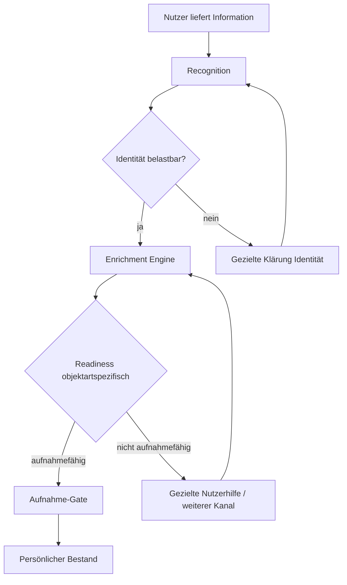
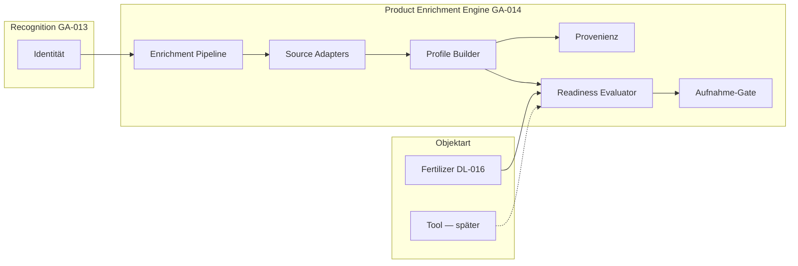

# GA-014

| Feld | Wert |
|------|------|
| **ID** | GA-014 |
| **Titel** | Product Enrichment Engine |
| **Status** | 📋 Geplant |
| **Priorität** | Hoch |
| **Erstellt** | 2026-07-29 |
| **Zuletzt geändert** | 2026-07-30 (Phase 4: `session_access_hash` statt roher Session-ID) |
| **Verantwortlich** | — |
| **Verwandte Dokumente** | [GA-013](./ga-013.md); [DL-011](../decisions/dl-011.md); [DL-012](../decisions/dl-012.md); [DL-013](../decisions/dl-013.md); [DL-014](../decisions/dl-014.md); [DL-015](../decisions/dl-015.md); [DL-016](../decisions/dl-016.md); [DL-017](../decisions/dl-017.md); [GM-009](../model/gm-009.md); [DL-003](../decisions/dl-003.md); [GM-003](../model/gm-003.md); [GM-008](../model/gm-008.md); [CM-013](../playbook/conversation-model.md#cm-013--kontextbezogene-rückfragen-bei-der-erfassung); [product-governance.md](../product-governance.md); [greenkeeper-data-model.md](../greenkeeper-data-model.md) |
| **Kurzbeschreibung** | Allgemeine KI-gestützte Enrichment-Schicht: aus erkannter Identität nutzbares Product Profile aufbauen — objektartspezifische Readiness-Regeln, gemeinsame Pipeline-Infrastruktur. Dünger zuerst (DL-016). |

---

## Zweck

Dieses Dokument beschreibt das **Zielbild** der **Product Enrichment Engine** — eine übergreifende Greenkeeper-Fähigkeit, die aus erkannter **Produktidentität** **nutzbares Produktwissen** erzeugt.

Kernfrage:

> Wie baut Greenkeeper aus wenigen Nutzerinformationen ein **aufnahmefähiges Product Profile** auf — **bevor** ein Objekt im persönlichen Bestand erscheint?

**Grundprinzip:**

> **Erkennen → Anreichern → Aufnahme**

**Nicht:**

> Erkennen → Aufnahme → später hoffen

[GA-013](./ga-013.md) beschreibt Recognition und Stufe-1-Umsetzung für Dünger. **GA-014** definiert die **Enrichment-Schicht** als eigenständige Architekturentscheidung — fachlich abgestimmt mit [DL-011](../decisions/dl-011.md) bis [DL-016](../decisions/dl-016.md).

---

## 1. Zielbild

### Warum eine Enrichment-Schicht?

Greenkeeper unterscheidet sich von klassischen Verwaltungsapps: Der Nutzer **liefert** Informationen in natürlicher Form ([DL-011](../decisions/dl-011.md)); Greenkeeper **übernimmt** Identifikation, Recherche, Strukturierung und Wissensaufbau ([DL-013](../decisions/dl-013.md)).

**Recognition allein reicht nicht:**

- Identität beantwortet: *Welches Produkt ist das?*
- Nutzung erfordert: *Welche Eigenschaften hat es?* — Nährstoffe, Form, Anwendung, technische Daten, …

Ohne Enrichment entstünden leere oder halbfertige Product Profiles. Das widerspricht [DL-015](../decisions/dl-015.md) (Qualitätsbarriere) und dem Nutzerversprechen aus [DL-013](../decisions/dl-013.md).

### Wissensanreicherung als Kernbestandteil

Automatische Anreicherung ist **kein optionales Extra**, sondern **Kern der Greenkeeper-Erfahrung** ([DL-013](../decisions/dl-013.md)). Die Enrichment Engine ist die **technische und prozessuale Umsetzung** dieses Prinzips — bereichsübergreifend, mit objektartspezifischen Regeln.

### Product Profile vs. Bestand

Product Profile speichert **Produktwissen** (wiederverwendbar, quellenbasiert). Persönlicher Bestand speichert **Besitz und Verbrauch** ([DL-012](../decisions/dl-012.md)). Die Enrichment Engine schreibt in das **Product Profile**; die Aufnahme in den Bestand erfolgt erst nach bestandener Readiness-Prüfung.

---

## 2. Abgrenzung Recognition und Enrichment

| | **Product Recognition** | **Product Enrichment** |
|---|-------------------------|------------------------|
| **Frage** | Was ist das Produkt? | Welche Informationen existieren zu diesem Produkt? |
| **Ergebnis** | Produktreferenz, Identity Confidence | Aufnahmefähiges Product Profile |
| **Typische Felder** | Hersteller, Modell/Name, Variante, GTIN | Nährstoffe, Form, Anwendung, technische Specs — objektartabhängig |
| **Quellen** | Foto, Sprache, Barcode, Katalog-Match (Identität) | Hersteller, PDF, Katalog, verifizierte Web-Quellen |
| **Zeitpunkt** | Erster Schritt im Erfassungsflow | Nach belastbarer Identität, **vor** Bestandsaufnahme |
| **Bei Lücke** | Gezielte Klärung der **Identität** (CM-013) | Gezielte Klärung fehlender **Profilinformationen** oder zusätzlicher Kanal ([DL-011](../decisions/dl-011.md)) |
| **Implementierung heute** | [GA-013](./ga-013.md) — Spike + Stufe 1 | **GA-014** — Zielbild, noch nicht umgesetzt |

**Leitsatz Recognition:**

> Die Aufgabe der Produkterkennung ist ausschließlich: **Die Produktidentität möglichst schnell und eindeutig zu bestimmen.**

**Leitsatz Enrichment:**

> Die Aufgabe der Enrichment Engine ist: **Aus verifizierten Quellen ein aufnahmefähiges Product Profile aufzubauen** — ohne Werte zu erfinden ([DL-003](../decisions/dl-003.md), [GA-013](./ga-013.md)).

Web-Recherche und Profil-Vollständigkeit gehören in **Enrichment**, nicht in den blockierenden Recognition-Pfad der Stufe-1-Spike-Integration (siehe [GA-013 — Abweichung Spike vs. Ziel](./ga-013.md#abweichung-spike-vs-zielarchitektur)).

---

## 3. Aufnahmeprozess

### Zielablauf



**Schritte:**

1. **Nutzer liefert Information** — Foto, Sprache, PDF, Barcode, … ([DL-011](../decisions/dl-011.md))
2. **Recognition** — Identität ermitteln
3. **Identität vorhanden** — belastbare Produktzuordnung
4. **Enrichment** — Quellen sammeln, strukturieren, Product Profile aufbauen
5. **Objektartspezifische Readiness-Prüfung** — Aufnahmefähigkeit prüfen
6. **Aufnahme in persönlichen Bestand** — erst wenn Readiness erfüllt ([DL-015](../decisions/dl-015.md))

### Zeitverhalten

- **Recognition:** kurzer synchroner Pfad (Identität + Katalog-Match)
- **Enrichment:** technisch entkoppelte Pipeline (Worker/Queue möglich), aber **Erfassungsflow blockiert** bis Readiness oder gezielte Nutzerhilfe ([DL-015](../decisions/dl-015.md))
- Der Nutzer sieht **keinen fertigen Bestandseintrag**, solange die Qualitätsbarriere nicht erreicht ist

---

## 4. Architekturprinzip: Allgemeine Engine, objektartspezifische Regeln

Die **Product Enrichment Engine** ist eine **allgemeine Greenkeeper-Fähigkeit**. Sie stellt gemeinsame Funktionen bereit; **fachliche Regeln** werden **pro Objektart** definiert.

```
Product Enrichment Engine
    |
    +-- Dünger
    |      |
    |      +-- Fertilizer Readiness Rules
    |          (DL-016, DL-014)
    |
    +-- Werkzeuge
    |      |
    |      +-- Tool Readiness Rules
    |          (zukünftige Entscheidung)
    |
    +-- Maschinen
    |      |
    |      +-- Machine Readiness Rules
    |          (zukünftige Entscheidung)
    |
    +-- Bodenhilfsstoffe / Saatgut / …
           |
           +-- eigene Readiness Rules
               (zukünftige Entscheidungen)
```

### Keine globale Vollständigkeitsregel

Es gibt **keine** universelle Vollständigkeitsregel für alle Gartenobjekte.

Jede Objektart besitzt **eigene Aufnahmefähigkeitsregeln** (Readiness Rules). Die Engine ruft den passenden **Readiness Evaluator** für die Objektart auf.

| Readiness-Modul | Status | Grundlage |
|-----------------|--------|-----------|
| **FertilizerReadinessRules** | ✅ Spezifikation festgelegt | [GM-009](../model/gm-009.md) (DL-016, DL-014) |
| **ToolReadinessRules** | 📋 offen | zukünftiges DL/GM |
| **MachineReadinessRules** | 📋 offen | zukünftiges DL/GM |
| **SoilAmendmentReadinessRules** | 📋 offen | zukünftiges DL/GM |
| **SeedReadinessRules** | 📋 offen | zukünftiges DL/GM |

**[DL-016](../decisions/dl-016.md) gilt ausschließlich für Dünger** und darf **nicht** als allgemeine Regel für Werkzeuge, Maschinen oder andere Objektarten interpretiert werden.

---

## 5. Dünger als erste Implementierung

Die **erste konkrete Umsetzung** der Enrichment Engine erfolgt für **Dünger** — auf Basis der bestehenden GA-013-Infrastruktur (Recognition, Product Profiles Stufe 1, Capture-Flow).

### FertilizerReadinessRules

Verbindliche Implementierungsspezifikation: **[GM-009](../model/gm-009.md)**. Fachliche Grundlage: [DL-016](../decisions/dl-016.md), Deklarationsprinzip: [DL-014](../decisions/dl-014.md).

Kurzüberblick — für Dünger müssen vor Aufnahme vorliegen:

**Identität (Pflicht)**

- Hersteller
- Produktname
- eindeutige Produktzuordnung

**Basisdaten (Pflicht)**

- Produktform: Granulat oder Flüssig
- NPK-Zusammensetzung (Sonderfälle fachlich dokumentieren)

**Inhaltsstoffe (Pflicht, DL-014)**

- Herstellerangabe → Wert übernehmen
- nicht genannt → 0 %
- relevante Bereiche: Makronährstoffe, Stickstoffformen, Sekundärnährstoffe, Spurenelemente

**Anwendung**

- Aufwandmenge und weitere Empfehlungen: **sammeln**, blockieren **nicht** automatisch die Aufnahme, sofern keine Herstellerangabe verfügbar ([DL-016](../decisions/dl-016.md))

### Nicht auf Dünger übertragbar

DL-016-Anforderungen (NPK, Spurenelement-Matrix, …) gelten **nicht** für:

- Werkzeuge
- Maschinen
- Bodenhilfsstoffe
- Saatgut
- weitere Gartenobjekte

Diese Objektarten erhalten **eigene** Readiness-Definitionen in späteren Entscheidungen.

---

## 6. Technische Zielarchitektur (konzeptionell)

Noch **keine** Implementierungsdetails, Tabellenmigrationen oder Dateiplanung. Konzeptionelle Bausteine:

### Enrichment Pipeline

Orchestriert den Ablauf: Identitätsreferenz entgegennehmen → Quellen anbinden → Profile materialisieren → Readiness prüfen → Ergebnis an Aufnahme-Gate.

Technisch entkoppelt von Recognition; kann synchron (Fast Path bei Katalog) oder asynchron (Worker) ausgeführt werden — der **Erfassungsflow** wartet auf das Ergebnis.

### Source Adapter

Einheitliche Schnittstelle für Quelltypen:

- Hersteller-Webseiten
- Produktdatenblätter / PDF
- Geprüfter interner Katalog (`products`)
- GS1 / GTIN-Metadaten
- Nutzerbereitgestellte Medien (Foto Rückseite, Upload)

Priorisierung und Merge-Logik zentral; objektartspezifische Extraktionsprofile optional.

### Product Profile Builder

Materialisiert strukturiertes Wissen im **Product Profile** ([DL-012](../decisions/dl-012.md)):

- Identität und fachliche Felder
- Anwendung der **objektartspezifischen** Normalisierungsregeln (für Dünger: [DL-014](../decisions/dl-014.md))
- Trennung Aufnahmefähigkeit vs. Erweiterbarkeit

### Provenienzverwaltung

Pro Feld oder Feldgruppe:

- Quelle, URL, Kategorie, Evidenz, Zeitpunkt, Vertrauensniveau

Kein Profilfeld ohne nachvollziehbare Herkunft — außer explizit definierter Regeln (z. B. DL-014-0-%-Defaults für deklarationspflichtige Matrix).

### Readiness Evaluator

Pluggable Modul pro Objektart. Die Engine **bestimmt zuerst die Objektart**, **wählt dann** den passenden Evaluator und wendet **objektartspezifische Readiness Rules** an — erst danach entscheidet das Aufnahme-Gate.

```
Product Enrichment Engine
  → Objektart bestimmen
  → passenden Readiness Evaluator auswählen
  → objektartspezifische Readiness Rules anwenden
  → Aufnahme-Gate entscheiden
```

- Input: Product Profile (Entwurf) + `objectCategory`
- Output (regulär): objektartspezifisches Readiness-Ergebnis (Dünger: `ready` | `needs_input` | `not_ready` — siehe [GM-009](../model/gm-009.md))
- Bei falscher Evaluator-Zuordnung (z. B. Fertilizer Evaluator für Werkzeug): Vertragsfehler `unsupported_object_category` — **kein** Readiness-Status
- Dünger: **[GM-009 — Fertilizer Readiness Rules](../model/gm-009.md)** — Vorbedingung `objectCategory === 'fertilizer'`
- **Implementiert (Stufe 1):** `evaluateFertilizerReadiness()` in `src/lib/fertilizerReadinessCore.ts` — deterministisch, ohne Seiteneffekte; siehe [Abschnitt 11](#11-enrichmentreadiness-schnittstelle-dünger)

### Aufnahme-Gate

Letzte fachliche Barriere vor persistenter Bestandsaufnahme:

- Readiness erfüllt → Save (Container, Bewegungen) erlaubt
- nicht erfüllt → kein Bestand, keine Erfolgsmeldung ([DL-015](../decisions/dl-015.md))

Verknüpft Enrichment Engine mit Inventar-RPCs ([GM-008](../model/gm-008.md), [GA-012](./ga-012.md)).

### Gesamtfluss (Komponenten)



### Wiederverwendung aus GA-013 (Spike)

Bestehende Bausteine können in Source Adapter / Profile Builder einfließen — nach Entkopplung aus dem synchronen Recognition-Request:

- Web-Search und Merge-Logik (Spike)
- Katalog-Resolver (Identität + Katalog als Enrichment-Quelle)
- OpenAI Structured Extraction

---

## 7. UX-Prinzip

Der Nutzer soll **nicht** Produktdaten manuell erfassen ([DL-011](../decisions/dl-011.md), [DL-013](../decisions/dl-013.md)).

Greenkeeper übernimmt:

- Erkennung
- Recherche
- Strukturierung
- Wissensaufbau

**Nur wenn** automatische Anreicherung nicht ausreichend erfolgreich ist:

- **gezielte Rückfrage** im Gespräch ([CM-013](../playbook/conversation-model.md#cm-013--kontextbezogene-rückfragen-bei-der-erfassung))
- **zusätzliche Quelle** (Rückseitenfoto, PDF, Barcode)
- **letzter Fallback:** manuelle Eingabe

### Kommunikation

| Phase | Nutzerwahrnehmung |
|-------|-------------------|
| Recognition | „Verpackung wird gelesen…“ |
| Enrichment | „Greenkeeper sammelt Produktinformationen…“ |
| Nicht aufnahmefähig | „Ich konnte … noch nicht vollständig bestimmen. Bitte …“ |
| Aufnahmefähig | Bestandsfragen → *„Dein Dünger wurde hinzugefügt.“* |

Die Erfolgsmeldung bedeutet: **vollständig nutzbar** für die Objektart — nicht „alle denkbaren Informationen existieren“ ([DL-016](../decisions/dl-016.md)).

---

## 8. Offene Architekturentscheidungen

Vor Implementierung zu klären:

| Thema | Frage |
|-------|--------|
| **Job-Orchestrierung** | Netlify Background Functions, Supabase Edge, synchroner Fast Path bei Katalogtreffer? |
| **Quellenpriorisierung** | Feinjustierung der Prioritätsmatrix pro Objektart |
| **Datenmodell-Erweiterungen** | Normalisierte Nährstofftabellen vs. JSONB; Provenienz-Schema; Job-Tabelle |
| **Statusmodell** | `recognized` / `enriching` / `needs_input` / `intake_ready` / `extended` / `verified` |
| **Weitere Objektarten** | Reihenfolge nach Dünger; eigene DL/GM pro Readiness |
| **Governance-Übergänge** | Wann Enrichment-Ergebnis `submitNewProduct` / Change Request auslöst ([DL-003](../decisions/dl-003.md)) |
| **GA-013 Stufe 1 Abgleich** | Migration bestehender Draft-Profile vs. nur Neuerfassungen |
| **Timeout & Retry** | Wann Nutzer einbinden vs. automatisch erneut versuchen |
| **Konfliktauflösung** | Widersprüchliche Quellen → Priorität, Review, oder `needs_input` |
| **Inhaltsstoff-Matrix Dünger** | Exakte `nutrient_key`-Liste für DL-014-0-%-Regel |

---

## 9. Beziehung zu bestehenden Entscheidungen

| Dokument | Rolle |
|----------|-------|
| [DL-011](../decisions/dl-011.md) | Eingangskanäle; Enrichment nutzt und erweitert Kanäle bei Lücken |
| [DL-012](../decisions/dl-012.md) | Product Profile vs. Bestand; Zielspeicher der Engine |
| [DL-013](../decisions/dl-013.md) | Anreicherung als Kern — Engine ist Umsetzung |
| [DL-014](../decisions/dl-014.md) | Deklarationsprinzip — **nur Dünger** im Profile Builder |
| [DL-015](../decisions/dl-015.md) | Qualitätsbarriere — Aufnahme-Gate |
| [DL-016](../decisions/dl-016.md) | **FertilizerReadinessRules** — nicht global |
| [GA-013](./ga-013.md) | Recognition, Stufe 1, Spike-Bausteine |
| [DL-003](../decisions/dl-003.md) / [product-governance.md](../product-governance.md) | Kein direkter Katalog-Write aus Enrichment |

---

## 10. Empfohlene Umsetzungsphasen (Orientierung)

Die detaillierte Schnittstelle und die begründete Reihenfolge stehen in [Abschnitt 11.17](#1117-umsetzungsphasen).

| Phase | Inhalt | Status |
|-------|--------|--------|
| **1a** | Fertilizer Readiness Evaluator + Vertrag ([GM-009](../model/gm-009.md)) | ✅ umgesetzt (`fertilizerReadinessCore.ts`) |
| **1b** | Enrichment-Ergebnisstruktur + Readiness-Input-Builder (reiner Feld-Adapter, **keine** DL-014-Logik) + Unit-Tests | ✅ umgesetzt |
| **2** | DL-014-Normalizer + Provenienz- und Konfliktmodell + Unit-Tests | ✅ umgesetzt — [§12](#12-phase-2-dl-014-normalizer-provenienz-und-konflikte-dünger) |
| **2c** | Isolierte Pipeline Normalizer → Builder → Evaluator | ✅ umgesetzt (`evaluateRawFertilizerDeclaration`) |
| **3** | Enrichment-Orchestrierung + Quellenadapter + Server-Job-Grenze — noch kein Save | ✅ umgesetzt (3a–3e) — [§13](#13-phase-3-enrichment-orchestrierung-quellenadapter-und-timeout-dünger) |
| **4** | Persistentes Job-Repository, Datenmodell, Zugriff, Idempotenz, Retention, Cleanup | 📋 spezifiziert — [§14](#14-phase-4-persistentes-job-repository-dünger) |
| **5** | `needs_input`-Übergabe an laufenden Erfassungsflow (UI) | 📋 offen |
| **6** | Save-Gate und Bestandsintegration nach `intake_ready` | 📋 offen |

**Abweichung gegenüber früherer GA-014-Fassung:** Phase 1 wurde in **1a** (Evaluator) und **1b** (Adapter/Builder) getrennt. Der Evaluator existiert; die Enrichment-Übergabe wird **zuerst** als reine Core-Adapter-Schicht spezifiziert und implementiert — **ohne** Worker, Queue oder UI. Phase 2 (Normalisierung) folgt bewusst **vor** Persistenz-Erweiterungen, damit DL-014-Logik testbar bleibt, bevor Provenienz in der Datenbank modelliert wird.

Details und Reihenfolge können in Project Delivery präzisiert werden — nicht Gegenstand dieses GA.

---

## 11. Enrichment–Readiness-Schnittstelle (Dünger)

Dieser Abschnitt definiert die **nächste technische Architekturstufe** nach der implementierten Fertilizer-Readiness-Prüfung ([GM-009](../model/gm-009.md), Commit `feat: add fertilizer readiness evaluator`).

**Zielablauf:**

```
Recognition
  → Product Enrichment
  → Normalisierung der Herstellerdeklaration (DL-014)
  → Aufbau FertilizerProductProfileReadinessInput
  → evaluateFertilizerReadiness()
  → ready | needs_input | not_ready  (oder Vertragsfehler)
```

Noch **keine** Bestandsaufnahme, **keine** UI-Integration, **kein** Enrichment-Worker in diesem Abschnitt — nur der **verbindliche Vertrag** zwischen Enrichment/Normalisierung und dem bestehenden Evaluator.

### 11.1 Bestandsanalyse (Repository)

#### Wiederverwendbare Bausteine

| Baustein | Ort | Rolle in der Schnittstelle |
|----------|-----|----------------------------|
| **Fertilizer Readiness Vertrag + Evaluator** | `src/types/fertilizerReadiness.ts`, `src/lib/fertilizerReadinessCore.ts` | Zielvertrag; **unverändert** deterministisch |
| **`ProductProfileForm`** | `src/types/productProfile.ts` | Aufnahmefähige Produktform (`granular` \| `liquid`) |
| **`ProductProfile`** | `src/types/productProfile.ts` | Persistiertes Produktwissen (Identität, NPK, Form); Fast-Path-Quelle |
| **`FertilizerRecognitionCandidate`** | `src/types/fertilizerRecognitionCandidate.ts` | Persönlicher Recognition-Output mit Feld-Provenienz (`source`, `evidence`, `sourceUrl`) |
| **`ProductRecognizeRecognition`** | `src/types/productRecognize.ts` | Spike-Struktur: NPK, Form, Nutrients[], Application, Feldquellen |
| **`ProductRecognizeFieldSource` / `ProductRecognizeSourceRecord`** | `src/types/productRecognize.ts` | Quellentypen und Evidenz — Basis für Enrichment-Provenienz |
| **`ProductGovernance` Quellentypen** | `src/types/productGovernance.ts` | Governance-Prioritäten (`manufacturer`, `datasheet`, …) — langfristige Ausrichtung |
| **`FERTILIZER_NUTRIENT_MATRIX_KEYS`** | `src/types/fertilizerReadiness.ts` | Verbindliche v1-Matrix — Normalizer-Ziel |

#### Fehlende Bausteine

| Lücke | Auswirkung |
|-------|------------|
| **Vollständige Nährstoffmatrix im Product Profile** | DB-Modell speichert heute nur N/P/K — keine Stickstoffformen, Sekundär-/Spurenelemente |
| **`declarationEvaluation`** | Kein persistierter Status `not_started` \| `insufficient_sources` \| `fully_evaluated` |
| **Strukturiertes Konfliktmodell** | Readiness-Input kennt nur aggregiertes `blockingSourceConflict`; keine Feld-Konflikte |
| **DL-014-Normalizer** | Keine getrennte Funktion, die 0-%-Regel **nur nach** `fully_evaluated` anwendet |
| **`buildFertilizerReadinessInput()`** | Kein Adapter Enrichment → Readiness |
| **`FertilizerEnrichmentResult`** | Kein typisierter Enrichment-Output |
| **Enrichment-Orchestrierungsstatus** | Kein `recognized` / `enriching` / … Lebenszyklus |
| **Feld-Provenienz-Persistenz** | Spike liefert Provenienz pro Feld; Product Profile speichert sie nicht |

#### Adaptergrenzen

```
┌─────────────────────┐     ┌──────────────────────────┐     ┌─────────────────────────────┐
│ Recognition Output  │     │ Enrichment + Normalizer  │     │ Readiness (implementiert)   │
│ (Identität, Kateg.) │ ──► │ FertilizerEnrichmentResult│ ──► │ buildFertilizerReadinessInput│
│                     │     │ + DL-014 Normalizer      │     │ → evaluateFertilizerReadiness│
└─────────────────────┘     └──────────────────────────┘     └─────────────────────────────┘
         │                              │                                    │
   Kein NPK/Matrix-              Kein Readiness-                   Kein Netzwerk, DB,
   Vollständigkeits-              Urteil; keine                     KI, Speichern
   urteil                         Werte erfinden
```

- **Recognition → Enrichment:** Übergabe von Identität + `objectCategory` + optional Katalog-/Candidate-Referenz — **keine** Aufnahmefähigkeitsentscheidung.
- **Enrichment → Normalizer:** Rohextraktion + Quellen — **keine** 0-%-Auffüllung ohne `fully_evaluated`.
- **Normalizer + Enrichment → Builder:** Strukturiertes `FertilizerEnrichmentResult` — **keine** Readiness-Bewertung.
- **Builder → Evaluator:** `FertilizerProductProfileReadinessInput` — Evaluator **recherchiert/normalisiert nicht**.

#### Ausdrücklich nicht wiederverwenden

| Übergangslösung | Grund |
|-----------------|-------|
| **`dataCompleteness` im Recognition Candidate** | Misst Spike-Lauf, nicht GM-009-Aufnahmefähigkeit |
| **Synchrones Web-Enrichment im Recognition-Request** | Gehört in Enrichment-Pipeline ([GA-013 Abweichung](./ga-013.md#abweichung-spike-vs-zielarchitektur)) |
| **Save ohne Readiness-Gate (GA-013 Stufe 1)** | Wird durch DL-015/GM-009 überholt — Save-Flow bleibt bis Phase 5 unangetastet |
| **Freie `ProductRecognizeNutrientField.name`-Strings** | Müssen auf `FERTILIZER_NUTRIENT_MATRIX_KEYS` gemappt werden — kein direkter Matrix-Eintrag |
| **Katalogtreffer = sofort `ready`** | Fast Path erfordert weiterhin Evaluator-Lauf ([§11.13](#1113-fast-path-für-bestehende-product-profiles)) |

#### Fachlich schwache oder widersprüchliche Strukturen

- **`ProductProfile`** vs. **`FertilizerRecognitionCandidate`:** Identität doppelt modelliert — Builder muss eine **kanonische Identitätsquelle** pro Lauf wählen (Enrichment-Ergebnis, nicht parallele Wahrheiten).
- **GA-013 Stufe 1** speichert minimales Profil **vor** Enrichment; **DL-015** verlangt Readiness **vor** Bestand — dokumentierter Zielkonflikt, Auflösung in Phase 5, nicht im Builder.
- **`ProductRecognizeFormValue` inkl. `unknown`** passt zum Readiness-Input; **`ProductProfile.productForm: null`** ist separater Persistenzzustand.

### 11.2 Verantwortungsgrenzen

Vier getrennte Verantwortlichkeiten — keine Überschneidung der Entscheidungslogik:

#### Recognition

Verantwortet **ausschließlich:**

- Hersteller, offizieller Produktname, Produktlinie, Variante
- Identity Fingerprint, Identity Confidence
- Ambiguitäten (`identityAmbiguity`)
- erkannte Produktkategorie → **`objectCategory`** für Engine-Routing

**Nicht:** vollständige Nährstoffdaten, Deklarationsauswertung, Aufnahmefähigkeit.

#### Product Enrichment

Verantwortet:

- Quellenrecherche und Auswahl geeigneter Herstellerquellen
- Extraktion: Produktform, NPK, Nährstoffe, Anwendung (nicht blockierend)
- Feldprovenienz, Quellenkonflikte (strukturiert)
- Kennzeichnung, ob Deklaration vollständig auswertbar ist (`declarationEvaluation`-Vorbereitung)

**Nicht:** DL-014-0-% anwenden (Normalizer), Readiness-Status, Speichern, Bestand.

#### Deklarationsnormalisierung (DL-014)

Verantwortet:

- Überführung in GM-009-Inhaltsstoffmatrix
- eindeutige Deklarationsbasis pro Wert
- numerische Normalisierung (keine Schätzung)
- 0-% **nur nach** `fully_evaluated`
- keine stillschweigende Element-/Oxid-Umrechnung

**Nicht:** Quellenrecherche, Readiness-Urteil.

#### Fertilizer Readiness Evaluator

Verantwortet **ausschließlich:**

- Prüfung des fertigen `FertilizerProductProfileReadinessInput`
- `ready` \| `needs_input` \| `not_ready`
- Vertragsfehler `unsupported_object_category` bei falscher Objektart

**Nicht:** recherchieren, normalisieren, speichern, UI.

### 11.3 Technische Übergabestruktur

**Namenskonvention (Repository):** Typen in `src/types/`, reine Logik in `src/lib/*Core.ts` — analog zu `fertilizerReadinessCore.ts`.

#### `FertilizerEnrichmentResult`

Zwischenergebnis der Enrichment-Schicht **vor** Readiness. Enthält Roh- **und** normalisierte Zustände plus Provenienz — der Evaluator sieht davon nichts direkt.

```typescript
type FertilizerEnrichmentResult = {
  objectCategory: 'fertilizer'           // von Recognition/Engine gesetzt
  specificationVersion: 'fertilizer-readiness-v1'

  identity: FertilizerEnrichmentIdentity
  productForm: FertilizerEnrichmentField<ProductProfileForm | 'unknown' | null>
  npk: FertilizerEnrichmentNpkBlock
  nutrientMatrix: Partial<Record<FertilizerNutrientMatrixKey, FertilizerEnrichmentNutrientEntry>>
  declarationEvaluation: FertilizerEnrichmentDeclarationEvaluation
  sourceConflicts: FertilizerEnrichmentConflict[]
  application?: FertilizerEnrichmentApplication   // optional, nicht blockierend

  enrichmentRunId: string
  enrichedAt: string
}
```

**Hilfstypen (konzeptionell):**

```typescript
type FertilizerEnrichmentField<T> = {
  value: T
  provenanceId: string | null
  evidence: string | null
  sourceUrl: string | null
  sourceCategory: ProductRecognizeWebSourceCategory | null
  confidence: number | null
  conflict: FertilizerEnrichmentConflictRef | null
}

type FertilizerEnrichmentNutrientEntry = FertilizerEnrichmentField<number | null> & {
  declarationBasis: string | null
  unit: '%'
  /** Nach DL-014 normalisiert — erst nach fully_evaluated gesetzt */
  normalization: 'declared' | 'dl014_zero' | 'unresolved' | null
}

type FertilizerEnrichmentDeclarationEvaluation = {
  status: 'not_started' | 'insufficient_sources' | 'fully_evaluated'
  evaluatedSourceIds: string[]
  evaluatedAt: string | null
  /** Warum ausreichend / unzureichend */
  coverageNotes: string | null
  variantResolved: boolean
  productScopeConfirmed: boolean
}

type FertilizerEnrichmentConflict = {
  conflictType: FertilizerEnrichmentConflictType
  fieldPath: string
  blocking: boolean
  resolvable: boolean
  participantProvenanceIds: string[]
  preferredInputAction?: FertilizerSuggestedInputAction
}
```

**Identität im Enrichment-Ergebnis:**

| Feld | Quelle |
|------|--------|
| `manufacturer`, `officialName`, `productLine`, `variant` | Recognition + ggf. Enrichment-Korrektur mit Provenienz |
| `identityFingerprint` | Recognition |
| `identityConfidence` | Recognition |
| `identityAmbiguity` | Recognition → abgebildet als `hasIdentityAmbiguity` + `identityAmbiguityResolvable` + `identityNotActionable` im Builder |

Mapping auf Readiness-Input: `hasIdentityAmbiguity` → `identity.identityAmbiguity.isAmbiguous`.

#### `NormalizedFertilizerProfile`

Optionaler **Zwischenzustand nach DL-014-Normalizer** — Teilmenge von `FertilizerEnrichmentResult`, in der Matrix nur noch numerische Endwerte oder explizit fehlende Keys (vor Builder) enthalten sind. Kann in Phase 2 als separater Typ oder als View auf `FertilizerEnrichmentResult` modelliert werden.

### 11.4 Readiness-Input-Builder

**Konzeptionelle Signatur:**

```typescript
function buildFertilizerReadinessInput(
  enrichment: FertilizerEnrichmentResult,
): FertilizerProductProfileReadinessInput
```

**Eigenschaften (Pflicht):**

- rein, deterministisch, ohne Seiteneffekte
- keine Netzwerk-/DB-/KI-Aufrufe
- erfindet **keine** Werte
- unterscheidet `0`, `null`, fehlend
- mappt aggregiertes `blockingSourceConflict` aus `sourceConflicts[]`

**Mapping-Regeln (Auszug):**

| Enrichment | Readiness-Input |
|------------|-----------------|
| `objectCategory` | `objectCategory` (unverändert) |
| Identitätsfelder | `identity.*` |
| `productForm.value` | `productForm` |
| NPK-Werte + Basis | `npk` |
| Matrix-Einträge mit `normalization !== 'unresolved'` und gültigem numerischem Wert | `nutrientMatrix[key]` |
| Matrix-Einträge `unresolved` / fehlend vor `fully_evaluated` | **nicht** in Matrix — Key fehlt oder `null` |
| `declarationEvaluation.status` | `declarationEvaluation.status` |
| Blockierender Konflikt | `blockingSourceConflict: { blocking, resolvable }` |

**Builder-Fehler (eigene Klasse, konzeptionell `FertilizerReadinessInputBuildError`):**

| Code | Wann | Beispiel |
|------|------|----------|
| `invalid_enrichment_contract` | Pflichtfelder des Enrichment-Results fehlen | kein `objectCategory` |
| `object_category_mismatch` | Enrichment liefert nicht-`fertilizer`, Builder für Dünger aufgerufen | Engine-Routing-Fehler **vor** Evaluator |

**Nicht Builder-Aufgabe:** Aufnahmefähigkeit — das bewertet **ausschließlich** `evaluateFertilizerReadiness()`.

**Phase-1b-Grenze — der Builder darf nicht:**

- fehlende Nährstoffe auf `0` setzen
- `normalization: 'dl014_zero'` erzeugen
- Deklarationsbasen umrechnen oder vereinheitlichen
- die GM-009-Matrix fachlich vervollständigen
- Quellen priorisieren
- Konflikte inhaltlich auflösen
- Werte schätzen oder erfinden

Der Builder **mappt nur** bereits strukturierte Enrichment-Daten in den bestehenden Readiness-Vertrag: Feldnamen abbilden, vorhandene Werte unverändert weiterreichen, fehlende Werte als fehlend erhalten, vorhandene Konfliktinformationen aggregieren, `declarationEvaluation.status` abbilden. DL-014-Normalisierung, Matrixvervollständigung, Basisprüfung sowie das Provenienz- und Konfliktmodell gehören **ausschließlich zu Phase 2** ([§11.5](#115-dl-014-normalisierung), [§11.8](#118-konfliktmodell)). Liegen `dl014_zero`-Werte bereits im Enrichment-Ergebnis (nach Phase 2), gibt der Builder sie **unverändert** an den Readiness-Input weiter — er erzeugt sie nicht selbst.

**Aufrufkette (Zielarchitektur):**

```typescript
// Phase 2 (Normalizer) läuft vor dem Builder — nicht Teil von Phase 1b:
const normalized = normalizeFertilizerDeclaration(enrichmentResult)
const input = buildFertilizerReadinessInput(normalized)
const result = evaluateFertilizerReadiness(input)
// objectCategory !== 'fertilizer' → FertilizerReadinessContractError (Evaluator)
```

### 11.5 DL-014-Normalisierung

Separater Normalizer (Phase 2), konzeptionell `normalizeFertilizerDeclaration(enrichmentPartial)`.

#### Vor `fully_evaluated`

- Nicht gefundene Nährstoffwerte bleiben `null` / fehlend.
- **Kein** DL-014-0-%.
- `normalization: 'unresolved'` oder kein Matrix-Eintrag.
- Readiness-Evaluator → `needs_input` + `ingredients.declaration_source`.

#### Nach `fully_evaluated`

Für **jeden** `FERTILIZER_NUTRIENT_MATRIX_KEYS`-Eintrag:

| Situation | Normalizer | Matrix |
|-----------|------------|--------|
| Hersteller nennt Wert | `normalization: 'declared'` | numerischer Wert + `declarationBasis` |
| Hersteller nennt Stoff nicht | `normalization: 'dl014_zero'` | `value: 0` |
| Widersprüchliche Herstellerwerte | Konflikt — **keine** stille Auswahl | `unresolved` + `sourceConflicts[]` |
| Keine geeignete Deklaration | Status bleibt ≠ `fully_evaluated` | keine 0-Auffüllung |

**Nachvollziehbarkeit:** Jeder Matrixwert trägt `normalization` (`declared` \| `dl014_zero`) und `provenanceId` — unterscheidet direkt deklariert vs. DL-014-0.

**Wann `fully_evaluated` gesetzt werden darf:**

- mindestens eine **produktspezifische offizielle Herstellerdeklaration** (Verpackung, Datenblatt, offizielle Produktseite) wurde vollständig für **dieses Produkt und diese Variante** ausgewertet
- alle v1-Matrix-relevanten Angaben sind entweder extrahiert oder explizit als „nicht genannt“ klassifizierbar
- **nicht** bei alleiniger KI-Zusammenfassung ohne belastbare Herstellerquelle
- **nicht** bei ungelöster Variantenzuordnung

### 11.6 Deklarationsbasis und Einheiten

**Unterstützt in v1 (Readiness-Vertrag):**

| Bereich | Erwartete Basis |
|---------|-----------------|
| NPK N | `N` |
| NPK P | `P2O5` |
| NPK K | `K2O` |
| Matrix-Einträge | wie auf Quelle deklariert (`declarationBasis: string`) |

**Regeln:**

- Keine stillschweigende Element-/Oxid-Umrechnung.
- Gemischte Basen für dasselbe Feld → **Konflikt** (`declaration_basis_conflict`) oder fehlende Basis → Readiness `needs_input` + `basis.npk.declaration_basis` / Matrix-Blocker.
- **Erlaubte Umrechnungen** (z. B. Fe ↔ Fe₂O₃) bleiben **offene Fachentscheidung** — nicht in dieser Stufe implementieren.

**Einheit v1:** Massenprozent (`unit: '%'`) — wie GM-009.

### 11.7 Quellenpriorisierung

Priorität **pro Feld**, nicht nur pro Produkt:

1. produktspezifische offizielle Herstellerdeklaration (Etikett, Datenblatt)
2. offizielles Produktdatenblatt (PDF)
3. offizielle Produktseite
4. offizieller Katalog (`verified_catalog`)
5. weitere belastbare Quellen nur ergänzend

**Prinzipien:**

- Neuere produktspezifische offizielle Quelle kann ältere überholen — mit dokumentiertem `sourceConflicts` / Versionskonflikt.
- Händlerdaten (`retailer`) **überschreiben** Herstellerwerte nicht stillschweigend.
- KI-Zusammenfassungen / Such-Snippets sind **Extraktionshilfe**, keine eigenständige Wahrheit — erfordern verlinkte Hersteller-Provenienz.
- Jede entscheidungsrelevante Angabe: `provenanceId`, `evidence`, `sourceUrl`.

Anknüpfung: `ProductRecognizeWebSourceCategory`, `ProductGovernance` `SOURCE_TYPE_PRIORITY` (Feinjustierung offen).

### 11.8 Konfliktmodell

Kontrollierte Konfliktarten (`FertilizerEnrichmentConflictType`):

| Typ | Blockierend wenn | Lösbar → | Unlösbar → | Typische Action |
|-----|------------------|----------|------------|-----------------|
| `identity_conflict` | unterschiedliche Hersteller/Produkte | `needs_input` | `not_ready` | `retry_recognition` |
| `variant_conflict` | Variante nicht zuordenbar | `needs_input` | `not_ready` | `confirm_product_variant` |
| `product_form_conflict` | granular vs. liquid | `needs_input` | `needs_input` | `confirm_product_form` |
| `npk_conflict` | N/P/K widersprüchlich | `needs_input` | `not_ready` | `upload_product_document` |
| `declaration_basis_conflict` | N vs. P₂O₅ gemischt ohne Regel | `needs_input` | `needs_input` | `manual_fallback_input` |
| `nutrient_value_conflict` | Matrixwert widersprüchlich | `needs_input` | `not_ready` | `upload_product_document` |
| `source_version_conflict` | alte vs. neue offizielle Deklaration | `needs_input` | `needs_input` | `upload_product_document` |

**Aggregation für Evaluator:** Der Builder leitet daraus **höchstens ein** aggregiertes `blockingSourceConflict` ab:

- `blocking: true` wenn mindestens ein Konflikt `blocking`
- `resolvable: false` nur wenn **explizit** mindestens ein blockierender Konflikt als unlösbar markiert ist

Keine Freitext-Logik im Evaluator — nur strukturierte Flags.

### 11.9 Verhalten bei `needs_input`

Nach `evaluateFertilizerReadiness()` — **technische Verantwortung der Orchestrierung** (Phase 4):

- **keine** Speicherung im persönlichen Bestand
- **keine** Erfolgsmeldung
- **keine** verzögerte Rückfrage außerhalb des laufenden Erfassungsflows ([DL-015](../decisions/dl-015.md), CM-013)
- Weitergabe: `missingRequirements`, `suggestedInputActions`, optional `enrichmentRunId`
- Orchestrierung wählt **eine** primäre nächste Aktion (nicht alle gleichzeitig dem Nutzer)

| Lücke (Requirement) | Bevorzugte Action |
|---------------------|------------------|
| `ingredients.declaration_source` | `upload_back_photo` oder `upload_product_document` |
| `identity.ambiguity` | `confirm_product_variant` |
| `basis.product_form` | `confirm_product_form` |
| Identität unzureichend | `retry_recognition` oder `capture_additional_packaging_photo` |

Keine UI-Texte in dieser Spezifikation.

### 11.10 Verhalten bei `not_ready`

- keine Speicherung, keine Erfolgsmeldung
- strukturierter Abbruchgrund über `blockingIssues[]` + `missingRequirements`
- **kein** technischer Systemfehler — Unterscheidung zu Orchestrierungsfehlern ([§11.15](#1115-fehlergrenzen))
- **keine** automatische Umwandlung in `needs_input`
- erneuter Identifikationsstart nur durch übergeordnete Orchestrierung

### 11.11 Verhalten bei `ready`

- `ready` **erlaubt fachlich** den nächsten Schritt (Save-Gate) — speichert **selbst nichts**
- späterer Save-Flow erhält normalisiertes, aufnahmefähiges Product Profile (aus Enrichment + Normalizer, nicht aus Evaluator-Output allein)
- Bestandssichtbarkeit und Erfolgsmeldung **erst nach erfolgreichem Save** ([DL-015](../decisions/dl-015.md))

Save-Integration: Phase 5 — außerhalb dieses Auftrags.

### 11.12 Status- und Lebenszyklusmodell

**Enrichment-Orchestrierung** (neu — nicht mit Readiness-Status verwechseln):

| Status | Bedeutung |
|--------|-----------|
| `recognized` | Identität vorhanden; Enrichment noch nicht gestartet |
| `enriching` | Quellen werden gesammelt/ausgewertet |
| `needs_input` | Readiness ≠ `ready`; Nutzer kann helfen — **kein Bestand** |
| `intake_ready` | Readiness = `ready`; Save-Gate darf prüfen |
| `failed` | **Orchestrierung** technisch/fehlgeschlagen — **kein** Evaluator-Status |

**Abgrenzung bestehender Begriffe:**

| Begriff | Kontext | ≠ |
|---------|---------|---|
| `FertilizerReadinessStatus` | Evaluator-Output | Orchestrierungsstatus |
| `ProductProfileStatus` `draft` \| `verified` | Persistenz/Governance | `intake_ready` |
| `ProductVerificationStatus` `verified` | Katalog-Governance | Aufnahmefähigkeit |
| `FertilizerRecognitionCandidateStatus` | Persönlicher Candidate | Enrichment-Lauf |
| `ProductRecognizeStatus` | Recognition Spike | Enrichment |

`intake_ready` ≡ fachlich Readiness `ready`. `needs_input` in Orchestrierung spiegelt Evaluator `needs_input` wider.

### 11.13 Fast Path für bestehende Product Profiles

Bestehendes **verifiziertes** oder vollständiges Product Profile darf Recherche abkürzen, wenn:

- Identität eindeutig übereinstimmt (`identityFingerprint` + Hersteller/Name)
- `fertilizer-readiness-v1` kompatibel
- alle GM-009-Pflichtfelder rekonstruierbar sind (inkl. Matrix + `fully_evaluated`-Nachweis)
- keine blockierenden Konflikte

**Pflicht:** Evaluator **immer** ausführen — `buildFertilizerReadinessInput(fromExistingProfile(...))` → `evaluateFertilizerReadiness()`.

Katalogtreffer allein → **nicht** `ready` ohne Evaluator.

### 11.14 Versionierung

- Readiness: `fertilizer-readiness-v1` (implementiert, Konstante in Code)
- Enrichment-Ergebnis trägt dieselbe `specificationVersion`
- v2-Matrix/Regeln: **keine** stille Interpretation v1-Profile als v2 — explizite Neuauswertung
- Ältere Product Profiles ohne Matrix: Fast Path scheitert → voller Enrichment-Lauf
- **Keine Migration** in dieser Spezifikationsstufe

### 11.15 Fehlergrenzen

| Klasse | Beispiele | Ergebnisform |
|--------|-----------|--------------|
| **Vertragsfehler** | `unsupported_object_category` | Exception — kein `FertilizerReadinessResult` |
| **Fachliche Readiness** | `ready`, `needs_input`, `not_ready` | `FertilizerReadinessResult` |
| **Builder-Vertragsfehler** | `invalid_enrichment_contract` | Exception vor Evaluator |
| **Orchestrierungsfehler** | Provider down, Timeout, PDF nicht ladbar, KI technisch fehl | `failed` — **nicht** Readiness-Status |
| **Persistenzfehler** | Profile/Save fehlgeschlagen | nach Save-Gate — getrennt behandeln |

Nicht vermischen: Timeout ≠ `not_ready`; Netzwerkfehler ≠ fehlende Deklaration.

### 11.16 Datenschutz und Persistenzgrenzen

| Daten | Lebensdauer | Speicherort (Ziel) |
|-------|-------------|---------------------|
| Rohbilder, PDF-Rohbytes | temporär während Enrichment | nicht dauerhaft im Product Profile |
| Extrahierte Feldwerte + Provenienz | dauerhaft (Product Profile) | strukturiert, quellenreferenziert |
| `recognitionSnapshot` | Candidate-Referenz | persönlich, nicht Katalog |
| Enrichment-Lauf-Metadaten | Audit/Debug | optional Job-Tabelle (offen) |
| Persönlicher Bestand | getrennt von globalem Produktwissen | [DL-012](../decisions/dl-012.md) |

Keine DB-Änderung in dieser Stufe.

### 11.17 Umsetzungsphasen

Empfohlene Reihenfolge für Cursor-Aufträge:

| Phase | Inhalt | Begründung |
|-------|--------|------------|
| **1b** | `FertilizerEnrichmentResult` + `buildFertilizerReadinessInput` (reiner Adapter) + Tests | Adapter testbar ohne Worker/Normalizer; Evaluator bereits vorhanden |
| **2** | DL-014-Normalizer + Konflikt-/Provenienztypen + Tests | 0-%-Regel isoliert testbar vor Persistenz — [§12](#12-phase-2-dl-014-normalizer-provenienz-und-konflikte-dünger) |
| **3** | Orchestrierung + Source Adapter + Timeout | nutzt 2c-Pipeline; noch kein Save — [§13](#13-phase-3-enrichment-orchestrierung-quellenadapter-und-timeout-dünger) |
| **4** | `needs_input` → Erfassungsflow (strukturierte Actions) | UI-Anbindung minimal |
| **5** | Save-Gate nach `ready` + Bestand | DL-015 durchsetzen |

**Abweichung von GA-014 §10 (alt):** Datenmodell-Persistenz (**früher Phase 3**) folgt **nach** Normalizer (Phase 2), damit Feldprovenenz-Schema aus getesteter Logik abgeleitet wird — nicht umgekehrt.

### 11.18 Offene Entscheidungen

| Thema | Status |
|-------|--------|
| Enrichment-Job-Orchestrierung (Netlify, Supabase Edge, hybrid) | offen |
| Persistenzmodell Feldprovenienz (JSONB vs. normalisiert) | offen |
| Vollständige Liste unterstützter Deklarationsbasen | offen |
| Erlaubte Umrechnungsfaktoren (Fe ↔ Fe₂O₃, …) | offen |
| NPK-Sonderfälle / `npk_exception` | offen ([GM-009](../model/gm-009.md)) |
| Konfliktschwellen blockierend vs. ergänzend | offen |
| Enrichment-Timeout | offen |
| Kompatibilität älterer GA-013-Stufe-1-Profile | offen |
| Quellenadapter-Auswahl und Prioritätsfeinjustierung | offen |
| Hersteller-Produktänderungen / Re-Enrichment | offen |

Keine dieser Fragen wird hier durch Annahmen entschieden.

---

## 12. Phase 2: DL-014-Normalizer, Provenienz und Konflikte (Dünger)

Diese Spezifikation definiert **Phase 2** der Product Enrichment Engine für Dünger: fachliche Normalisierung der Herstellerdeklaration nach [DL-014](../decisions/dl-014.md), strukturierte Feldprovenienz und strukturierte Quellenkonflikte — **ohne** Readiness-Entscheidung, **ohne** Persistenz, **ohne** externe Systemaufrufe.

**Zielablauf:**

```
RawFertilizerEnrichmentResult
  → normalizeFertilizerDeclaration(...)
  → FertilizerEnrichmentResult (normalisiert)
  → buildFertilizerReadinessInput(...)   [Phase 1b, unverändert]
  → evaluateFertilizerReadiness(...)     [unverändert]
```

Phase 2 entscheidet **nicht** über Bestandsaufnahme und speichert **nichts**.

### 12.1 Bestandsanalyse (Repository)

#### Direkt wiederverwendbar

| Baustein | Ort | Phase-2-Rolle |
|----------|-----|---------------|
| **`FERTILIZER_NUTRIENT_MATRIX_KEYS`** (16 Keys) | `fertilizerReadiness.ts` / `fertilizerEnrichment.ts` | Verbindliche v1-Matrix |
| **`FertilizerEnrichmentNormalization`** | `fertilizerEnrichment.ts` | `declared` \| `dl014_zero` \| `unresolved` |
| **`FertilizerEnrichmentConflictType`** (7 Arten) | `fertilizerEnrichment.ts` | Konfliktarten — Phase 2 erweitert um Metadaten |
| **`FertilizerEnrichmentSourceType` / `SourceCategory`** | `fertilizerEnrichment.ts` | Enrichment-eigene Quellentypen |
| **`DeclarationEvaluationStatus`** | `fertilizerReadiness.ts` | `not_started` \| `insufficient_sources` \| `fully_evaluated` |
| **`FertilizerNpkDeclarationBasis`** | `fertilizerReadiness.ts` | N / P₂O₅ / K₂O für NPK-Block |
| **`buildFertilizerReadinessInput`** | `fertilizerReadinessInputBuilderCore.ts` | unverändert nach Normalizer |
| **`evaluateFertilizerReadiness`** | `fertilizerReadinessCore.ts` | unverändert |

#### Erweiterung in Phase 2 (Typen)

| Erweiterung | Grund |
|-------------|-------|
| **`RawFertilizerEnrichmentResult`** | Vor-Normalisierungszustand: extrahierte, noch nicht DL-014-bewertete Felder |
| **`FertilizerFieldProvenance`** | Vollständige Feldprovenienz (Phase 1b: nur Einzelreferenzen pro Matrixeintrag) |
| **`FertilizerEnrichmentConflict`** | `conflictId`, beteiligte Werte, `resolutionStatus`, Begründung |
| **`FertilizerDeclarationNormalizationResult`** | Optionaler Normalizer-Status (`normalized` \| `partially_normalized` \| `blocked`) |
| **Provenance-Registry** im Ergebnis | `provenanceRecords: Record<provenanceId, …>` |

#### Bewusst nicht wiederverwendet

| Baustein | Grund |
|----------|-------|
| **`ProductRecognize*`-Typen** | Recognition-Spike — Enrichment bleibt entkoppelt |
| **`ProductGovernance` Spike-Typen** | Governance-Persistenzmodell — konzeptionell ausrichten, nicht importieren |
| **`ProductProfile` (persistiert)** | Enthält nur N/P/K — keine Matrix/Provenienz; kein Fast-Path-Ersatz ohne Erweiterung |
| **Phase-1b-Enrichment als Raw-Input** | Phase 1b-Result kann strukturell ähnlich sein, aber Raw-Vertrag trennt extrahierte vs. normalisierte Semantik explizit |

#### Fachliche Lücken vor Implementierung

- Kein `RawFertilizerEnrichmentResult`-Vertrag
- Keine Provenance-Registry pro Lauf
- Konflikte ohne `resolutionStatus` und Wertepaare
- Normalizer setzt `fully_evaluated` — heute nur manuell/im Input, keine Regelengine
- Keine deterministischen Konfliktauflösungsregeln codiert

### 12.2 Verantwortungsgrenze Phase 2

#### Phase 2 verantwortet

- Prüfung, ob eine **geeignete Herstellerdeklaration vollständig ausgewertet** wurde
- Überführung deklarierter Werte in die GM-009-v1-Matrix
- Anwendung der **DL-014-0-Regel** (nur bei `fully_evaluated`)
- Erhalt der Unterscheidung **0 ≠ fehlend**
- Deklarationsbasis pro Wert
- Strukturierte **Feldprovenienz**
- Strukturierte **Quellenkonflikte** (inkl. deterministischer Auflösung aus Metadaten)
- Erzeugung eines **normalisierten** `FertilizerEnrichmentResult`

#### Phase 2 verantwortet nicht

Websuche, Dokumentdownload, KI-Auswertung, Bilderkennung, Recognition, Source-Adapter-Auswahl, Job-Orchestrierung, Timeout, Readiness-Entscheidung, UI-Rückfragen, Product-Profile-Persistenz, Bestandsaufnahme, Katalog-Promotion.

### 12.3 Eingabe- und Ausgabevertrag

#### Eingabe: `RawFertilizerEnrichmentResult`

Vor-normalisiertes strukturiertes Enrichment — Output der **Extraktions-/Recherche-Schicht** (Phase 3+), noch **ohne** DL-014-Anwendung.

Muss pro Feld ausdrücken können:

| Zustand | Bedeutung |
|---------|-----------|
| `declared_value` | Numerischer Wert + Basis + Quellenreferenz |
| `missing` | In Quelle nicht gefunden |
| `unreadable` | Quelle vorhanden, Wert nicht extrahierbar |
| `conflicting_values` | Mehrere strukturierte Kandidaten |
| `basis_known` / `basis_unknown` | Deklarationsbasis |
| `source_fully_evaluated` / `source_partial` | Deklarationsabdeckung |
| `variant_matched` / `variant_unclear` | Variantenbezug |

Strukturell parallel zu `FertilizerEnrichmentResult`, aber:

- `normalization` **noch nicht** durch Normalizer gesetzt (oder nur `unresolved`)
- `declarationEvaluation.status` **noch nicht** final durch Normalizer bestätigt
- Roh-Konflikte und Roh-Provenienz-Einträge enthalten

#### Ausgabe: `FertilizerEnrichmentResult`

**Kein paralleler Ausgabe-Vertrag nötig** — das bestehende `FertilizerEnrichmentResult` ([Phase 1b](./ga-014.md#114-readiness-input-builder), implementiert in `src/types/fertilizerEnrichment.ts`) ist das **Phase-2-Ausgabeformat**, sobald der Normalizer es befüllt hat.

Erweiterungen in Phase 2a (Typen):

```typescript
type FertilizerEnrichmentResult = {
  // … bestehende Felder …
  normalizationRunId: string
  normalizedAt: string
  normalizationStatus: 'normalized' | 'partially_normalized' | 'blocked'
  normalizationRulesVersion: 'fertilizer-declaration-normalization-v1'
  provenanceRecords: Record<string, FertilizerFieldProvenance>
  // nutrientMatrix[*]: finaler Wert | fehlend, normalization, provenanceId, conflictStatus
}
```

Der **Builder (Phase 1b)** bleibt unverändert; er mappt das normalisierte Ergebnis.

### 12.4 DL-014-Normalizer

**Konzeptionelle Signatur:**

```typescript
function normalizeFertilizerDeclaration(
  input: RawFertilizerEnrichmentResult,
): FertilizerDeclarationNormalizationResult
// enthält: enrichment: FertilizerEnrichmentResult, status, conflicts, …
```

**Erlaubt:** strukturierte Werte prüfen, deklarierte Werte übertragen, DL-014-0 bei `fully_evaluated`, Normalisierungsmetadaten setzen, Konflikte weitergeben/ deterministisch auflösen.

**Verboten:** recherchieren, Netzwerk, PDF/KI, Freitext-Interpretation, Quellenpriorisierung ohne strukturierte Metadaten, Einheiten-/Basen-Umrechnung, Schätzung, fehlende Quelle als vollständig werten, Readiness, Speichern.

**Determinismus:** Gleiches Raw-Input → gleiches normalisiertes Ergebnis.

### 12.5 Voraussetzungen für `fully_evaluated`

`declarationEvaluation.status === 'fully_evaluated'` darf **nur** gesetzt werden, wenn **alle** Bedingungen erfüllt sind:

1. **Geeignete offizielle oder gleichwertig belastbare** produktspezifische Deklarationsquelle vorhanden ([§12.10](#1210-quellenrollen))
2. Deklaration **vollständig gelesen** (Nährstofftabelle / vollständiger Deklarationsblock erfasst)
3. **Konkrete Produktvariante eindeutig** zugeordnet (`variantResolved === true`)
4. **Deklarationsbasis** für NPK und Matrix nachvollziehbar
5. **Keine unaufgelösten blockierenden Widersprüche** in der Primärdeklaration
6. **Produktversions-/Abdeckungsnachweis** dokumentiert (`productScopeConfirmed === true`, `evaluatedSourceIds[]`)

**Nicht ausreichend:**

- Such-Snippet, Händlerbeschreibung, KI-Zusammenfassung ohne Primärquelle
- Unvollständiges Verpackungsfoto
- Quelle für **ähnliche**, nicht identische Variante
- Fehlgeschlagene Suche
- Bloßes Nichtfinden eines Nährstoffs **ohne** vollständige Deklarationsauswertung

Bei Nichterfüllung: `not_started` oder `insufficient_sources` — **kein** DL-014-0.

**Deterministische Ableitung (Grenze):** Der Normalizer leitet `fully_evaluated` **ausschließlich** aus bereits strukturierten Raw-Metadaten ab — z. B. `source_fully_evaluated` / `source_partial`, `variant_matched`, `evaluatedSourceIds[]`, `productScopeConfirmed`, dokumentierte Abdeckungs- und Konfliktflags. Er darf **nicht** subjektiv beurteilen, ob eine Quelle vertrauenswürdig wirkt, ob eine Webseite vollständig genug erscheint, ob ein Dokument wahrscheinlich zur richtigen Variante gehört oder welche Quelle aufgrund einer KI-Einschätzung glaubwürdiger ist. Fehlen erforderliche strukturierte Metadaten, darf `normalizationStatus` **nicht** `normalized` werden — es bleibt `partially_normalized` oder `blocked`.

### 12.6 DL-014-0-Regel (pro Matrixschlüssel)

Für jeden der **16 GM-009-v1-Schlüssel** ([GM-009](../model/gm-009.md)):

| Situation | Aktion | `normalization` |
|-----------|--------|-----------------|
| Hersteller nennt Wert | Übernehmen + Provenienz | `declared` |
| Hersteller nennt Stoff **nicht**, `fully_evaluated` | Wert **0** + Provenenz auf Deklarationsquelle | `dl014_zero` |
| Quelle unvollständig / unzureichend | Kein 0; Wert fehlend | `unresolved`; Status ≠ `fully_evaluated` |
| Widersprüchliche Angaben | Kein 0; Konflikt strukturiert | `unresolved` + `sourceConflicts[]` |

**Kritisch (DL-014-Präzisierung aus GM-009):** Fehlende Quelle ≠ „nicht genannt“ — ohne `fully_evaluated` **darf** der Normalizer **keinen** Matrixwert auf 0 setzen.

### 12.7 Matrixmodell v1

Verbindliche Schlüssel — identisch mit `FERTILIZER_NUTRIENT_MATRIX_KEYS`:

| Gruppe | Schlüssel |
|--------|-----------|
| Makro | `nitrogen`, `phosphate`, `potash` |
| N-Formen | `nitrateNitrogen`, `ammoniumNitrogen`, `ureaNitrogen`, `organicNitrogen` |
| Sekundär | `magnesium`, `calcium`, `sulfur` |
| Spur | `iron`, `manganese`, `copper`, `zinc`, `boron`, `molybdenum` |

Pro `FertilizerEnrichmentNutrientEntry` (Ausgabe):

| Feld | Typ / Semantik |
|------|----------------|
| `value` | `number` (≥ 0 wenn gesetzt) \| `null` \| fehlend |
| `declarationBasis` | `string` — wie auf Quelle deklariert |
| `unit` | `'%'` (v1) |
| `normalization` | `declared` \| `dl014_zero` \| `unresolved` |
| `provenanceId` | Referenz in `provenanceRecords` |
| `conflictStatus` | `none` \| blockierend/lösbar \| … |

Keine stillen Zusatzschlüssel in v1 — Erweiterungen nur über Matrix-/Spezifikations-Bump.

### 12.8 Deklarationsbasis

#### Im Repository verbindlich (NPK)

| Element | Basis | Typ |
|---------|-------|-----|
| N | Element N | `FertilizerNpkDeclarationBasis.nitrogen: 'N'` |
| P | Phosphat P₂O₅ | `'P2O5'` |
| K | Kalium K₂O | `'K2O'` |

#### Matrix (Sekundär/Spur)

Basis **wie auf Quelle deklariert** (z. B. `Fe`, `Fe2O3`, `MgO`, `SO3`) — freier `string` pro Eintrag, **keine** stille Umrechnung.

#### Zustände

| Zustand | Phase-2-Verhalten |
|---------|-------------------|
| Basis bekannt | Wert übernehmen, wenn numerisch gültig |
| Basis unbekannt | Wert nicht normalisieren; ggf. `declaration_basis_conflict` |
| Gemischte Basen (gleiches Feld) | Konflikt — keine Vermischung |
| Element ↔ Oxid | **Keine Umrechnung** in Phase 2 (offene Fachentscheidung) |

### 12.9 Provenienzmodell

**`FertilizerFieldProvenance`** (Phase 2a — erweitert Phase-1b-`FertilizerEnrichmentProvenance`):

| Feld | Pflicht | Beschreibung |
|------|---------|--------------|
| `provenanceId` | ja | Stabile ID innerhalb des Laufes |
| `fieldPath` | ja | z. B. `nutrientMatrix.iron`, `npk.nitrogen` |
| `sourceType` | ja | `FertilizerEnrichmentSourceType` |
| `sourceCategory` | ja | `FertilizerEnrichmentSourceCategory` |
| `sourceUrl` | nein | URL oder stabile Referenz |
| `sourceTitle` | nein | Anzeigetitel |
| `evidence` | ja | Wörtlicher/deklarativer Auszug — **kein** frei erfundener Text |
| `retrievedAt` | ja | ISO-8601 |
| `confidence` | nein | Extraktions-/Zuordnungskonfidenz — **ersetzt keine Quelle** |
| `productVariantReference` | nein | Varianten-ID/Name aus Quelle |
| `normalization` | nein | Wie der Wert entstanden ist |
| `sourceVersion` | nein | Produktversions-/Revisionshinweis |
| `isPrimary` | nein | Primärquelle für dieses Feld |

**Regeln:**

- Provenienz **pro Feld**, nicht nur pro Produkt
- Mehrere Quellenreferenzen pro Feld möglich
- Eine primäre Quelle markierbar
- KI-Ausgabe ist **keine** eigenständige Primärquelle ohne verlinkte Hersteller-Provenienz

Noch **keine** DB-Persistenz — nur Laufzeitstruktur im Enrichment-Ergebnis.

### 12.10 Quellenrollen

| Priorität | Quelle | `sourceType` / `sourceCategory` (Beispiel) |
|-----------|--------|---------------------------------------------|
| 1 | Produktspezifische offizielle Herstellerdeklaration | `manufacturer_page` / `official_manufacturer` |
| 2 | Offizielles Produktdatenblatt | `product_document` / `official_document` |
| 3 | Offizielle Produktseite | `manufacturer_page` / `official_manufacturer` |
| 4 | Offizieller Herstellerkatalog | `catalog` / `official_catalog` |
| 5 | Verpackungsdeklaration | `packaging` / `packaging_evidence` |
| 6 | Nutzerdokument | `user_document` / `user_provided` |
| 7 | Händlerquelle | `other` / `supplementary` |
| 8 | Sonstige ergänzende Quelle | `other` / `supplementary` |

**Verbindlich:**

- Priorität gilt **pro Feld**
- Herstellerquellen haben Vorrang für deklarierte Produktwerte
- Händler **überschreibt** Hersteller nicht stillschweigend
- Neuere produktspezifische offizielle Quelle kann ältere überholen — als `source_version_conflict` sichtbar, bis aufgelöst
- Konflikte bleiben sichtbar, wenn keine eindeutige Auflösung aus Metadaten möglich

Phase 2 **priorisiert nicht frei** — sie wendet nur **bereits strukturierte** Primärmarkierungen und deterministische Regeln ([§12.13](#1213-konfliktauflösung-und-grenzen)) an.

### 12.11 Konfliktmodell

Erweiterung von `FertilizerEnrichmentConflict`:

```typescript
type FertilizerEnrichmentConflict = {
  conflictId: string
  type: FertilizerEnrichmentConflictType
  fieldPath: string
  participantProvenanceIds: string[]
  participantValues: { provenanceId: string; value: unknown; declarationBasis?: string }[]
  blocking: boolean
  resolvable: boolean
  resolutionStatus: FertilizerConflictResolutionStatus
  suggestedInputAction?: FertilizerSuggestedInputAction
  reason: string  // kontrollierter Kurzcode + optional strukturierte Details — kein Freitext-Primary-Contract
  code?: string
}
```

**`FertilizerConflictResolutionStatus`:**

- `unresolved`
- `resolved_by_authoritative_source`
- `resolved_by_variant_match`
- `resolved_by_newer_official_version`
- `requires_user_input`
- `not_resolvable`

Bestehende **7 Konfliktarten** aus Phase 1b bleiben; Phase 2 füllt Metadaten und Auflösungsstatus.

### 12.12 Konfliktregeln (pro Art)

| Art | Blockierend wenn | Automatisch lösbar wenn | Nutzer / nicht fortsetzbar |
|-----|------------------|-------------------------|----------------------------|
| `identity_conflict` | Verschiedene konkrete Produkte | — | `not_resolvable` wenn keine Variante zuordenbar |
| `variant_conflict` | NPK/Deklaration variantenabhängig widersprüchlich | Exakte Variantenübereinstimmung | `requires_user_input` |
| `product_form_conflict` | granular vs. liquid offiziell widersprüchlich | — | `requires_user_input` |
| `npk_conflict` | Offizielle NPK-Werte widersprechen | Gleiche Werte mehrfach; eindeutig neuere Version | sonst `unresolved` / `requires_user_input` |
| `declaration_basis_conflict` | Basen nicht vergleichbar | — | `requires_user_input` |
| `nutrient_value_conflict` | Offizielle Matrixwerte widersprechen | Identische Werte, produktspezifische Quelle gewinnt deterministisch | sonst strukturiert offen |
| `source_version_conflict` | Unklare Produktversion | Metadaten belegen eindeutig neuere Gültigkeit | `requires_user_input` |

Der **Builder** aggregiert weiterhin mechanisch zu `blockingSourceConflict`; der **Evaluator** entscheidet `needs_input` / `not_ready`.

### 12.13 Konfliktauflösung und Grenzen

**Zulässig (deterministisch aus Metadaten):**

- Exakte Variantenübereinstimmung
- Eindeutig neuere offizielle Version (`sourceVersion`, `retrievedAt` + Produktbezug)
- Produktspezifische Quelle gegenüber allgemeinem Katalogeintrag (**wenn** in Raw-Input als `isPrimary` / Rolle markiert)
- Identische Werte aus mehreren offiziellen Quellen → kein Konflikt

**Unzulässig:**

- KI-Plausibilitätsentscheidung
- Händlerwert überschreibt Herstellerwert
- Mittelwert / häufigster Wert
- Schätzung aus ähnlichen Produkten

Nicht lösbare Konflikte bleiben in `sourceConflicts[]` mit `resolutionStatus: 'unresolved' | 'requires_user_input' | 'not_resolvable'`.

### 12.14 Normalisierungsmetadaten

Kontrollierte Werte (`FertilizerEnrichmentNormalization`):

| Wert | Bedeutung |
|------|-----------|
| `declared` | Direkt aus Herstellerdeklaration |
| `dl014_zero` | Nach vollständiger Auswertung nicht genannt → 0 ([DL-014](../decisions/dl-014.md)) |
| `unresolved` | Noch nicht final normalisierbar |

**Nicht in Phase 2 einführen:** `converted`, `derived` — solange keine fachlich beschlossene Umrechnungsregel existiert.

### 12.15 Fehlergrenzen

| Klasse | Beispiel | Phase-2-Reaktion |
|--------|----------|------------------|
| **Vertragsfehler** | Ungültiges Raw-Input | Exception — kein normalisiertes Ergebnis |
| **Normalisierungsergebnis** | `normalized` / `partially_normalized` / `blocked` | Eigener Status — ≠ Readiness |
| **Fachliche Konflikte** | In `sourceConflicts[]` | Strukturiert |
| **Readiness** | `ready` / `needs_input` / `not_ready` | Nur Evaluator |
| **Orchestrierung** | Timeout, PDF-Fehler | Phase 3 — **nicht** als DL-014-0 maskieren |

### 12.16 Normalizer-Ergebnisstatus

**`normalizationStatus`** (Phase 2 — **nicht** Readiness):

| Status | Bedeutung |
|--------|-----------|
| `normalized` | Matrix und Deklarationsauswertung regelkonform abgeschlossen |
| `partially_normalized` | Teilweise Werte/Konflikte; `fully_evaluated` nicht gesetzt oder Matrix unvollständig |
| `blocked` | Blockierende Konflikte verhindern sinnvolle Normalisierung — **≠** automatisch `not_ready` |

`normalized` **impliziert nicht** `ready`. Readiness prüft der Evaluator separat.

### 12.17 Versionsmodell

| Ebene | Version | Bindung |
|-------|---------|---------|
| Enrichment-Vertrag | `fertilizer-enrichment-v1` | Transport / Felder |
| Normalizer-Regeln | `fertilizer-declaration-normalization-v1` | DL-014 + Matrix v1 |
| Readiness-Matrix | `fertilizer-readiness-v1` | GM-009 Pflichtfelder |

**Keine unnötige Vielfalt:** Die **16 Matrixschlüssel** sind an `fertilizer-readiness-v1` gebunden; der Normalizer referenziert dieselbe Key-Liste. Eigene Normalizer-Version, weil DL-014-Regeln unabhängig evolvieren können.

Keine automatische Gleichsetzung der Versionen.

### 12.18 Fast Path

Bereits normalisiertes Product Profile darf den **Re-Normalizer** überspringen und direkt in `FertilizerEnrichmentResult` rekonstruiert werden, **wenn:**

- Identität eindeutig passt (`identityFingerprint`)
- `normalizationRulesVersion` kompatibel
- Provenienz-Metadaten vollständig genug
- `declarationEvaluation` nachvollziehbar `fully_evaluated`
- Keine blockierenden Konflikte

**Pflicht:** `buildFertilizerReadinessInput` → `evaluateFertilizerReadiness` — kein ungeprüfter Katalog-Fast-Path.

*(Hinweis: Persistiertes Product Profile enthält heute keine Matrix — Fast Path erfordert spätere Profil-Erweiterung; Phase 2 spezifiziert nur die Regeln.)*

### 12.19 Datenschutz und Speichergrenzen

**Dauerhaft sinnvoll (spätere Persistenz):** finale Werte, Basis, Normalisierungsart, stabile Quellenreferenzen, Evidence-Auszüge, Konfliktstatus, Versions-IDs.

**Nur temporär:** vollständige Rohseiten/PDFs, große KI-Zwischenergebnisse, unstrukturierte Suchresultate.

Persönlicher Bestand getrennt von globalem Product Profile ([DL-012](../decisions/dl-012.md)). Keine Migration in Phase 2.

### 12.20 Acceptance Criteria (Implementierung Phase 2)

| # | Szenario | Erwartung |
|---|----------|-----------|
| **N-1** | Vollständige Deklaration, Stoff genannt | Wert übernommen; `normalization: 'declared'` |
| **N-2** | Vollständige Deklaration, Stoff nicht genannt | Wert 0; `normalization: 'dl014_zero'` |
| **N-3** | Unvollständige Quelle, Stoff nicht gefunden | kein 0; fehlend; ≠ `fully_evaluated` |
| **N-4** | Widersprüchliche offizielle Werte | Konflikt; keine stille Auswahl |
| **N-5** | NPK 0-0-30 | 0 bleibt gültig |
| **N-6** | `null` vor Normalisierung ohne `fully_evaluated` | bleibt fehlend |
| **N-7** | Gemischte Deklarationsbasis | Konflikt oder `partially_normalized` |
| **N-8** | Händler vs. Hersteller | Hersteller maßgeblich; Konflikt dokumentiert |
| **N-9** | Falsche Variante | keine fälschliche Normalisierung |
| **N-10** | Gleicher Wert, mehrere offizielle Quellen | kein Konflikt; mehrere Provenienz-IDs |
| **N-11** | Blockierender unlösbarer Konflikt | erhalten; Builder → `resolvable: false` |
| **N-12** | Nicht blockierender Konflikt | blockiert Normalisierung nicht pauschal |
| **N-13** | Normalizer | keine Readiness-Prüfung |
| **N-14** | Normalizer | kein Speichern |
| **N-15** | Normalizer | keine externen Aufrufe |

### 12.21 Umsetzungszerlegung (Cursor)

| Stufe | Inhalt |
|-------|--------|
| **2a** | `RawFertilizerEnrichmentResult`, erweiterte Provenienz/Konflikt-Typen, `FertilizerDeclarationNormalizationResult` — **keine** Normalisierungslogik |
| **2b** | `normalizeFertilizerDeclaration` — deterministische DL-014-Regeln + Unit-Tests (N-1 … N-15) |
| **2c** | Mapping → `FertilizerEnrichmentResult`; Kette Normalizer → Builder → Evaluator **nur in Tests** — keine Orchestrierung |

Passt zur Repository-Struktur: `src/types/fertilizerEnrichment.ts`, `src/lib/fertilizerDeclarationNormalizationCore.ts` (Name folgt `*Core.ts`-Konvention).

### 12.22 Offene Entscheidungen

| Thema | Status |
|-------|--------|
| Endgültige Liste unterstützter Deklarationsbasen (Fe ↔ Fe₂O₃, …) | offen |
| Erlaubte Umrechnungen | offen |
| Aktualitätsentscheidung bei widersprüchlichen Versionen | offen |
| Hersteller-Produktversionierung | offen |
| Confidence-Grenzwerte | offen |
| Persistenzmodell Feldprovenienz | offen |
| Maximale Evidence-Länge | offen |
| Mehrsprachige Deklarationen | offen |
| NPK-Sonderfälle / `npk_exception` | offen ([GM-009](../model/gm-009.md)) |
| Zusätzliche Stickstoffformen (Matrix v2) | offen |
| Re-Enrichment bei Herstelleränderungen | offen |

Keine offene Entscheidung wird durch Annahmen geschlossen.

---

## 13. Phase 3 — Enrichment-Orchestrierung, Quellenadapter und Timeout (Dünger)

Dieser Abschnitt definiert die **verbindliche technische Architektur für Phase 3** der Product Enrichment Engine für **Dünger** (`objectCategory === 'fertilizer'`).

Phase 3 verbindet:

```
Recognition-Ergebnis
  → Enrichment-Orchestrierung
  → Quellenadapter
  → strukturierte Raw Declaration (RawFertilizerDeclarationInput)
  → bestehende Phase-2-Pipeline (evaluateRawFertilizerDeclaration)
  → Normalisierung (DL-014)
  → Readiness
```

**Verbindliche Grenzen:**

- Phase 3 **speichert keinen Dünger** im persönlichen Bestand.
- Phase 3 **entscheidet nicht selbst über Readiness** — sie übergibt strukturierte Daten an `evaluateRawFertilizerDeclaration(...)` ([§12.8](#128-pipeline-normalizer--builder--evaluator)).
- Phase 3 **dupliziert keine** DL-014-Normalisierung, Builder-Logik oder Readiness-Regeln.
- Phase 3 **ändert Recognition nicht** und **bindet kein Save-Gate** an (Phase 5).
- Keine Implementierung in diesem Abschnitt — nur Architektur, Verträge und Akzeptanzkriterien.

**Maßgebliche Referenzen:** [GM-009](../model/gm-009.md), [GA-013](./ga-013.md), [DL-011](../decisions/dl-011.md)–[DL-016](../decisions/dl-016.md), `src/types/fertilizerDeclarationNormalization.ts`, `src/types/fertilizerEnrichment.ts`, `src/types/fertilizerReadiness.ts`, `src/lib/fertilizerNormalizationReadinessPipelineCore.ts`.

---

### 13.1 Bestandsaufnahme im Repository (Analyse)

#### Wiederverwendbare Bausteine

| Bereich | Pfad / Struktur | Phase-3-Nutzung |
|---------|-----------------|-----------------|
| **Recognition-Identität (Dünger)** | `src/lib/fertilizerRecognitionCore.ts`, `src/lib/productRecognizeCore.ts` | Eingabe für Orchestrierung: Hersteller, offizieller Name, Linie, Variante, `identityFingerprint`, Confidence, Ambiguitäten |
| **Recognition-Entscheidungen** | `src/lib/productRecognizeDecisionCore.ts` | Muster für deterministische Next-Action-Priorisierung — **nicht** 1:1 übernehmen, aber Orchestrierung orientiert sich an derselben Trennung Identität vs. Profil |
| **Phase-2-Pipeline** | `src/lib/fertilizerNormalizationReadinessPipelineCore.ts` — `evaluateRawFertilizerDeclaration()` | **Einziger** zulässiger Übergabepunkt nach Zusammenführung |
| **Normalizer / Builder / Evaluator** | `fertilizerDeclarationNormalizerCore.ts`, `fertilizerReadinessInputBuilderCore.ts`, `fertilizerReadinessCore.ts` | Unverändert; Orchestrierung ruft nur die Pipeline auf |
| **Verträge Raw / Normalized / Readiness** | `fertilizerDeclarationNormalization.ts`, `fertilizerEnrichment.ts`, `fertilizerReadiness.ts` | Zielstruktur der Zusammenführung und Pipeline-Ergebnis |
| **Quellenkategorien (Spike)** | `ProductRecognizeWebSourceCategory`, `ProductRecognizeFieldSource` in `src/types/productRecognize.ts` | **Konzeptionell** wiederverwendbar für Adapter-Provenienz — **kein Import** in Enrichment-Verträge |
| **Web-Search-Baustein (Spike)** | `src/lib/productRecognizeSearchCore.ts` | Muster für externe Quellenanbindung — **nur** als Inspirationsquelle für spätere Adapter, nicht als Orchestrierungskern |
| **Web-Merge (Spike)** | `src/lib/productRecognizeWebCore.ts` | Enthält Spike-spezifische Merge-Regeln — **nicht** 1:1 übernehmen; Phase 3 definiert eigenen Merge zu `RawFertilizerDeclarationInput` |
| **Product Governance** | `src/lib/productGovernanceCore.ts`, [product-governance.md](../product-governance.md) | Grenze: kein direkter Katalog-Write aus Enrichment |
| **Server-Laufzeit** | Netlify Functions (`netlify/functions/product-recognize.ts`, `product-assistant-analyze.ts`) | Bestehende API-Konvention: serverseitige Funktionen, JSON Request/Response, Auth über Session |
| **Product-Profile-Konzept** | [DL-012](../decisions/dl-012.md), GM-009, minimaler Snapshot bei Save (GA-013 Stufe 1) | Fast Path prüft vorhandenes globales Profil — **ohne** Phase-3-Persistenz |

#### Fehlende Bausteine (Phase 3+)

| Baustein | Status |
|----------|--------|
| `FertilizerEnrichmentOrchestrationInput` / `Result` | noch nicht im Code |
| `FertilizerSourceAdapterResult` | noch nicht im Code |
| Orchestrierungs-Core | noch nicht implementiert |
| Quellenadapter (Hersteller, PDF, Verpackung, …) | noch nicht implementiert |
| Job-/Status-Persistenz | noch nicht implementiert |
| Enrichment-API-Endpunkte | noch nicht implementiert |
| Idempotency-Store | noch nicht festgelegt |

#### Bewusst verworfene Übergangsstrukturen

| Struktur | Grund |
|----------|-------|
| Synchrone Web-Anreicherung im `product-recognize`-Request ([GA-013](./ga-013.md) Abweichung Spike) | Blockiert Recognition; Nährstoffmatrix gehört in Enrichment |
| `ProductRecognize*` als Enrichment-Vertrag | Spike-Typen; Enrichment erhält **eigenen** Vertrag ohne Recognition-Typ-Import |
| `dataCompleteness` als Steuerungsmaß | Spike-Diagnostik; Steuerung über Readiness + Orchestrierungsstatus |
| Spike-Merge in `productRecognizeWebCore` als DL-014-Ersatz | Enthält keine DL-014-Regeln; ersetzt nicht Phase-2-Pipeline |
| `stockCapture.allowed` aus Web-Erfolg | Save-Gate ist Phase 5; Phase 3 ohne Bestand |
| Generisches Web-Scraping als Primärquelle | Widerspricht Governance; nur sekundäre Hilfe |
| Händlerquelle ersetzt Herstellerwert still | Verboten — siehe [§13.7](#137-quellenreihenfolge-und-auswahl) |

#### Technische Risiken

| Risiko | Mitigation (Architektur) |
|--------|--------------------------|
| Netlify-Function-Timeout (~26 s / konfigurierbar) vs. mehrere Quellen | Technisch asynchroner Job + Status-Polling im selben Nutzerflow ([§13.18](#1318-synchron-versus-asynchron)) |
| Spike-Latenz (~17 s inkl. Web) im Erfassungsflow | Enrichment aus Recognition entkoppeln |
| Doppelte Normalisierungs-/Readiness-Logik | Nur `evaluateRawFertilizerDeclaration()` |
| Roh-PDF/OCR in Logs | Beobachtbarkeit ohne sensible Inhalte ([§13.23](#1323-beobachtbarkeit)) |
| Parallele konkurrierende Läufe | Idempotenz ([§13.21](#1321-idempotenz)) |

#### Adaptergrenzen

- Ein Adapter = **eine Quellenklasse** — keine Readiness-, keine DL-014-Entscheidung.
- Orchestrierung = **einzige** Stelle für Quellenreihenfolge, Merge, Timeout, Retry.
- Pipeline = **einzige** Stelle für Normalisierung und Readiness.

---

### 13.2 Verantwortungsgrenzen

#### Recognition ([GA-013](./ga-013.md))

**Verantwortet:**

- `objectCategory`
- `manufacturer`, `officialName`, `productLine`, `variant`
- `identityFingerprint`, `identityConfidence`
- Ambiguitäten und Recognition-spezifische Next Actions (z. B. Rückseitenfoto für **Identität**)

**Verantwortet nicht:**

- vollständige Nährstoffmatrix
- DL-014-Normalisierung
- Readiness / Aufnahmefähigkeit
- Quellenadapter-Auswahl für Deklarationsfelder

#### Enrichment-Orchestrierung (Phase 3)

**Verantwortet:**

- Auswahl und Aufrufreihenfolge der Quellenadapter
- Zusammenführung strukturierter Adapterergebnisse zu `RawFertilizerDeclarationInput`
- Laufstatus (`orchestrationStatus`)
- Timeout, Retry-Entscheidung, Abbruch laufender Adapter
- Fast Path für kompatible Product Profiles
- Aufruf von `evaluateRawFertilizerDeclaration(...)`
- Reaktion auf Readiness-Ergebnisse → Orchestrierungsstatus und `recommendedNextAction`

**Verantwortet nicht:**

- Nährstoffwerte normalisieren (DL-014)
- Readiness-Regeln anwenden
- Bestand speichern
- Katalog promoten
- Recognition ersetzen oder erweitern

#### Quellenadapter

**Verantwortet:**

- Zugriff auf **genau eine** Quellenklasse
- strukturierte Extraktion (`FertilizerSourceAdapterResult`)
- technische Fehler und `retryable`
- Quellenmetadaten (URL, Titel, Kategorie, `retrievedAt`)

**Verantwortet nicht:**

- Readiness
- DL-014
- Merge mehrerer Quellen
- fachliche Konfliktauflösung durch Interpretation

#### Phase-2-Pipeline (unverändert)

**Verantwortet weiterhin:**

- DL-014-Normalisierung (`normalizeFertilizerDeclaration`)
- Builder (`buildFertilizerReadinessInput`)
- Readiness Evaluator (`evaluateFertilizerReadiness`)

Keine Phase-3-Komponente darf diese Regeln duplizieren.

---

### 13.3 Orchestrierungsvertrag

#### Eingabe: `FertilizerEnrichmentOrchestrationInput`

Konzeptioneller Vertrag — **kein Import** aus `ProductRecognize*`.

| Feld | Pflicht | Beschreibung |
|------|---------|--------------|
| `orchestrationRunId` | optional (Server erzeugt) | Korrelation innerhalb eines Laufs |
| `sessionId` / `correlationId` | ja | Nutzer-Sitzung oder Erfassungskorrelation |
| `userId` | ja (serverseitig) | Zugriffsschutz |
| `objectCategory` | ja | muss `fertilizer` sein — sonst Vertragsfehler |
| `recognitionIdentity` | ja | Hersteller, offizieller Name, Linie, Variante, Fingerprint, Confidence |
| `identityFingerprint` | ja | stabile Identitätskomponente für Idempotenz/Fast Path |
| `candidateReference` | optional | Recognition-Kandidat / Profil-Referenz |
| `existingProductProfileRef` | optional | globales Profil für Fast Path |
| `userProvidedSources` | optional | Nutzer-Rückseite, Upload, Barcode-Hinweis |
| `allowedInputChannels` | ja | z. B. `capture_flow`, `manual_retry` |
| `sourceHints` | optional | strukturierte Hinweise aus Recognition (URLs, GTIN) — **keine** Roh-Webantworten |
| `priorOrchestrationRunId` | optional | Fortsetzung nach `needs_input` |
| `idempotencyKey` | optional | stabil aus Fingerprint + Quellen + Variante |

#### Ergebnis: `FertilizerEnrichmentOrchestrationResult`

**Keine doppelte Ablage** derselben fachlichen Daten — Pipeline-Ergebnisse referenzieren strukturierte Objekte, Felder werden nicht redundant kopiert.

| Feld | Beschreibung |
|------|--------------|
| `orchestrationRunId` | Lauf-ID |
| `orchestrationStatus` | siehe [§13.4](#134-orchestrierungsstatus) |
| `rawDeclarationInput` | nur wenn Zusammenführung erfolgreich genug für Pipeline |
| `normalizationResult` | aus Pipeline, falls ausgeführt |
| `readinessInput` | aus Pipeline, falls ausgeführt |
| `readinessResult` | aus Pipeline, falls ausgeführt |
| `attemptedSources` | Adaptertypen / sourceIds |
| `successfulSources` | Adapter mit `success` oder `partial` |
| `failedSources` | Adapter mit Fehler — inkl. technischer Grund |
| `recommendedNextAction` | eine priorisierte Aktion (bei `needs_input`) |
| `alternativeNextActions` | strukturierte Alternativen |
| `technicalErrors` | Adapter- und Orchestrierungsfehler — getrennt von Readiness |
| `timeoutState` | `none` \| `adapter_timeout` \| `global_timeout` |
| `retryState` | Zusammenfassung Retry-Entscheidungen |
| `failureReason` | **Pflicht bei** `orchestrationStatus === 'failed'` — kontrollierter Fehlergrund ([§13.4.1](#1341-kontrollierte-fehlergründe-bei-failed)); kein Freitext |
| `failureDetail` | strukturierte Ursache **passend zum** `failureReason` — keine doppelte Ablage ([§13.4.2](#1342-ergänzung-des-ergebnisvertrags-bei-failed)) |
| `startedAt`, `completedAt` | ISO-Zeitstempel |

**Verbindlich bei `failed`:** `failureReason` muss gesetzt sein — `failed` ohne `failureReason` ist **vertragswidrig**. Der Orchestrierungsstatus ersetzt **niemals** das zugrunde liegende Readiness-, Adapter- oder Pipeline-Ergebnis; er klassifiziert nur den Laufabschluss.

**Pipeline-Aufruf:** immer über `evaluateRawFertilizerDeclaration(rawDeclarationInput, options)` — auch im Fast Path.

---

### 13.4 Orchestrierungsstatus

Kontrollierte Werte — **wenige, eindeutig**:

| Status | Bedeutung |
|--------|-----------|
| `recognized` | Lauf angenommen; Adapter noch nicht gestartet |
| `enriching` | Adapter laufen / Zusammenführung / Pipeline |
| `needs_input` | Pipeline: Readiness `needs_input` — **kein** technischer Fehler per se |
| `intake_ready` | Pipeline: Readiness `ready` — **noch keine** Bestandsaufnahme |
| `failed` | Abbruch — **Pflicht:** kontrollierter `failureReason` ([§13.4.1](#1341-kontrollierte-fehlergründe-bei-failed)); **kein** Readiness-Status und kein unklassifizierter Sammelzustand |
| `cancelled` | Nutzer- oder Session-Abbruch |
| `timed_out` | Globales Orchestrierungszeitlimit erreicht — **kein** Readiness-Status |

**Nicht als Orchestrierungsstatus:**

- `ready`, `not_ready`, `verified` — das sind Readiness- bzw. Governance-Begriffe
- `retryable_failure` — bleibt Feld `retryable` auf technischen Fehlern, kein eigener Status

**Verbindliche Zuordnung:**

| Readiness | Orchestrierung |
|-----------|----------------|
| `ready` | `intake_ready` |
| `needs_input` | `needs_input` |
| `not_ready` | `failed` + `failureReason: 'domain_not_ready'` + originales `readinessResult` |

**Statusgrenzen (verbindlich):**

| Status | Rolle |
|--------|-------|
| `timed_out` | eigener Orchestrierungsstatus — kein Ersatz für `failed` |
| `cancelled` | eigener Orchestrierungsstatus — Nutzer-/Session-Abbruch |
| `needs_input` | fachlicher Fortsetzungszustand — **getrennt** von `failed` |
| `intake_ready` | Abbildung von Readiness `ready` — noch keine Bestandsaufnahme |
| `failed` | kompakter Abbruchstatus — **zwingend** mit kontrolliertem `failureReason` |

`failed` ohne `failureReason` ist ein **ungültiger** Orchestrierungszustand.

**Weitere Regeln:**

- `intake_ready` ⇒ Readiness war `ready`; **kein** automatischer Bestand
- `needs_input` ⇒ gezielte nächste Quelle/Aktion im **laufenden** Erfassungsprozess
- `timed_out` ⇒ Timeout trat auf; Teilergebnis kann trotzdem `needs_input` oder `intake_ready` ergeben, wenn Pipeline ausreichend Daten hatte — Status `timed_out` dokumentiert das Zeitlimit zusätzlich oder wird in `timeoutState` geführt und Endstatus aus Readiness abgeleitet (Implementierung wählt **eine** konsistente Darstellung; bevorzugt: Endstatus = `needs_input`/`intake_ready`/`failed`, `timeoutState` = `global_timeout`)

**Empfehlung:** Endstatus aus fachlichem Ergebnis (`needs_input`, `intake_ready`, `failed`); `timed_out` nur wenn **kein** sinnvoller Pipeline-Lauf möglich war. Details: [§13.10](#1310-timeout-verhalten).

---

### 13.4.1 Kontrollierte Fehlergründe bei `failed`

Typ `FertilizerEnrichmentFailureReason` — **ausschließlich** diese Werte; keine freien Fehlergrund-Strings:

| `failureReason` | Bedeutung |
|-----------------|-----------|
| `domain_not_ready` | Pipeline erfolgreich ausgeführt; Readiness = `not_ready`; **kein** technischer Fehler |
| `technical_failure` | Technischer Fehler in Adapter, Orchestrierung oder externer Ausführung; Readiness nicht zuverlässig abgeschlossen |
| `no_viable_source` | Keine geeignete ausführbare oder verwertbare Quelle bestimmbar — weder automatisch `not_ready` noch erfundener fachlicher Wert |
| `pipeline_failure` | Interner Fehler beim Aufruf oder bei der Verarbeitung von `evaluateRawFertilizerDeclaration(...)` — kein reguläres Readiness-Ergebnis |

#### `domain_not_ready`

- Die bestehende Readiness-Pipeline wurde **erfolgreich** ausgeführt.
- `readinessResult.status === 'not_ready'`.
- Es liegt **kein** technischer Fehler vor.

**Verbindlich erhalten:**

- originales `readinessResult` (inkl. `blockingIssues`)
- `normalizationResult`, `readinessInput` soweit erzeugt
- relevante Konflikte aus der Pipeline

**Regeln:** kein automatischer Retry; keine Umwandlung in `needs_input`; keine Bestandsaufnahme.

#### `technical_failure`

- Technischer Fehler in Adapter, Orchestrierung oder externer Ausführung.
- Fachliche Readiness konnte **nicht zuverlässig** abgeschlossen werden.

**Verbindlich in `failureDetail`:** technischer Fehlercode; `retryable`; betroffener Adapter oder Ausführungsschritt; vorhandene Teilergebnisse bleiben im Ergebnis erhalten.

**Retry:** nur wenn `retryable: true` ([§13.11](#1311-retry-modell)).

#### `no_viable_source`

- Es konnte **keine** geeignete ausführbare oder verwertbare Quelle bestimmt werden.
- Dies ist weder automatisch `not_ready` noch ein erfundener Nährstoff- oder Readiness-Wert.

**Verbindlich in `failureDetail`:** `attemptedSources` / `failedSources`; optional `recommendedNextAction`, falls fachlich sinnvoll.

**Regeln:** keine Bestandsaufnahme; Retry nur, wenn ein technischer Teilfehler explizit `retryable` ist — sonst kein automatischer Retry.

#### `pipeline_failure`

- Interner Fehler beim Aufruf oder bei der Verarbeitung der Normalisierungs-Readiness-Pipeline.
- **Kein** reguläres Readiness-Ergebnis — darf **nicht** als `not_ready` maskiert werden.

**Verbindlich in `failureDetail`:** technische Fehlerklasse; `retryable`; betroffener Pipeline-Schritt.

**Retry:** ausschließlich bei expliziter technischer Wiederholbarkeit.

---

### 13.4.2 Ergänzung des Ergebnisvertrags bei `failed`

Bei `orchestrationStatus === 'failed'` gelten zusätzlich:

| Feld | Pflicht | Beschreibung |
|------|---------|--------------|
| `failureReason` | ja | einer der vier kontrollierten Werte |
| `failureDetail` | ja | strukturierte Ursache — **ohne** doppelte oder widersprüchliche Ablage |

**Je nach `failureReason` — verbindliche `failureDetail`-Inhalte:**

| `failureReason` | `failureDetail` enthält mindestens | Weitere Felder im Ergebnis |
|-----------------|-----------------------------------|----------------------------|
| `domain_not_ready` | Verweis auf fachlichen Abbruch aus Readiness | originales `readinessResult`; `blockingIssues` bleiben darin; `normalizationResult` falls vorhanden |
| `technical_failure` | `technicalError` (Code, Message); `retryable`; `affectedStep` / `affectedAdapter` | `technicalErrors`; Teilergebnisse (`rawDeclarationInput`, Adapter-Ergebnisse) falls vorhanden |
| `no_viable_source` | dokumentierte Quellenversuche | `attemptedSources`, `failedSources`; optional `recommendedNextAction` |
| `pipeline_failure` | `technicalError`; `retryable`; `pipelineStep` | kein erfundenes `readinessResult`; kein Maskieren als `not_ready` |

**Keine Doppelablage:** dieselbe Ursache erscheint **entweder** in `failureDetail` **oder** in einem referenzierten Top-Level-Feld — nicht in beiden mit abweichenden Werten.

---

### 13.5 Quellenadapter — Typen (nur Spezifikation)

Jeder Adapter implementiert dieselbe konzeptionelle Schnittstelle; **keine Implementierung in Phase 3**.

#### A. Offizieller Hersteller-Produktseite (`manufacturer_product_page`)

| Aspekt | Definition |
|--------|------------|
| **Eingabe** | Identität, optionale URL aus `sourceHints`, Sprache/Locale |
| **Ausgabe** | `FertilizerSourceAdapterResult` |
| **Quellenklasse** | `official_manufacturer` |
| **Technische Fehler** | HTTP-Fehler, Parse-Fehler, Rate Limit |
| **Fachliche Unvollständigkeit** | `partial` — Seite ohne NPK-Tabelle |
| **Provenienz** | URL, Titel, `retrievedAt` |
| **Variantenbezug** | extrahierte Variantenkennzeichnung, falls vorhanden |
| **Aktualität** | `sourceVersion` / Seiten-Hash optional |
| **Abbruch** | `invalid_source` wenn Domain nicht zum Hersteller passt |

#### B. Offizielles Produktdatenblatt / PDF (`manufacturer_datasheet_pdf`)

| Aspekt | Definition |
|--------|------------|
| **Eingabe** | PDF-URL oder Nutzer-Upload-Referenz, Identität |
| **Quellenklasse** | `official_manufacturer` |
| **Technische Fehler** | Download, OCR/Parse, passwortgeschützt |
| **Unvollständigkeit** | Matrix unvollständig → `partial` |
| **Abbruch** | `invalid_source` bei falschem Dokumenttyp |

#### C. Offizieller Herstellerkatalog (`manufacturer_catalog`)

| Aspekt | Definition |
|--------|------------|
| **Eingabe** | Identität, Katalog-API/Feed-Referenz |
| **Quellenklasse** | `official_manufacturer` oder `verified_catalog` |
| **Abbruch** | `no_match` wenn Produkt nicht im Katalog |

#### D. Verpackungsfoto / Rückseite (`packaging_image`)

| Aspekt | Definition |
|--------|------------|
| **Eingabe** | Bild-Referenz, Identität zur Variantenprüfung |
| **Quellenklasse** | `image` / `user_provided` |
| **Unvollständigkeit** | NPK lesbar, Mikronährstoffe unleserlich → `partial` |
| **Variantenbezug** | Pflichtprüfung gegen Recognition-Identität |

#### E. Nutzer-hochgeladenes Produktdokument (`user_document`)

| Aspekt | Definition |
|--------|------------|
| **Eingabe** | Upload-Referenz, deklarierte Produktvariante |
| **Quellenklasse** | `user_provided` |
| **Abbruch** | `invalid_source` wenn Dokument nicht zum Produkt passt |

#### F. Globaler Product-Profile-/Katalog-Fast-Path (`product_profile_fast_path`)

| Aspekt | Definition |
|--------|------------|
| **Eingabe** | `existingProductProfileRef`, Identität, Versionskompatibilität |
| **Quellenklasse** | `verified_catalog` / internes Profil |
| **Ausgabe** | strukturierte Profilfelder — **kein** Bypass der Pipeline |
| **Abbruch** | Profil inkompatibel → Adapter `no_match`, normaler Pfad |

#### G. Ergänzende Webquelle (`supplementary_web`)

| Aspekt | Definition |
|--------|------------|
| **Eingabe** | Identität, suchbasierter Hinweis |
| **Quellenklasse** | `retailer` oder `other_web` — **nur sekundär** |
| **Regel** | Darf Herstellerwerte **nicht** ersetzen — nur Lücken füllen wo offiziell fehlt |

---

### 13.6 Adapter-Ergebnisvertrag: `FertilizerSourceAdapterResult`

| Feld | Beschreibung |
|------|--------------|
| `adapterType` | z. B. `manufacturer_product_page` |
| `status` | siehe unten |
| `sourceId` | stabile Adapter-Lauf-Referenz |
| `sourceType` | technischer Typ (page, pdf, image, profile, …) |
| `sourceCategory` | `official_manufacturer`, `verified_catalog`, `retailer`, `user_provided`, … |
| `sourceUrl` / `sourceRef` | URL oder interne Referenz |
| `sourceTitle` | Anzeigetitel |
| `retrievedAt` | ISO-Zeitpunkt |
| `sourceVersion` | optional — Revision, Hash |
| `productVariantReference` | optional — strukturierte Varianten-ID |
| `extractedIdentity` | optional — zur Abgleichprüfung |
| `extractedProductForm` | optional |
| `extractedNpk` | optional — rohe strukturierte Werte |
| `extractedNutrients` | optional — Liste/Matrix roher Werte |
| `coverageMetadata` | welche Felder abgedeckt |
| `evidence` | strukturierte Textauszüge — **keine** Volltexte |
| `technicalError` | optional — Code + Message |
| `retryable` | boolean |

**Kontrollierte Adapterstatus:**

| Status | Bedeutung |
|--------|-----------|
| `success` | Quelle passt; strukturierte Daten vollständig genug für Adapterzweck |
| `partial` | nutzbare Teildaten |
| `no_match` | Quelle erreicht, Produkt/Variante nicht gefunden |
| `unavailable` | temporär nicht erreichbar |
| `invalid_source` | falsche Domain, falsches Dokument, falsche Variante |
| `failed` | technischer Fehler |

**Wichtig:** Adapter liefern **kein** `RawFertilizerDeclarationInput` als alleinige Wahrheit. Die Orchestrierung führt mehrere Ergebnisse zusammen.

---

### 13.7 Quellenreihenfolge und Auswahl

**Keine starre globale Quelle** — feldweise priorisierte Strategie:

1. Kompatible **Product Profile** / interner Katalog (Fast Path) — siehe [§13.8](#138-fast-path)
2. Offizielles **Produktdatenblatt** (PDF)
3. Offizielle **Produktseite** (Hersteller)
4. Offizieller **Herstellerkatalog**
5. **Verpackungsquelle** oder **Nutzerdokument**
6. **Ergänzende Webquelle** — nur Lücken, nie Herstellerwert überschreiben

**Regeln:**

- Priorität gilt **pro Feld**, nicht global „eine Quelle gewinnt alles“.
- Adapter darf **übersprungen** werden, wenn Fast Path vollständige Feldabdeckung liefert.
- Händlerquellen (`retailer`, `other_web`) dürfen Herstellerwerte **nicht stillschweigend ersetzen**.
- Keine Quelle gewinnt allein wegen technischer Erreichbarkeit.
- Fachliche Wertkonflikte werden **strukturiert** erfasst — keine freie Interpretation.

---

### 13.8 Fast Path (Product Profile)

Fast Path **nur zulässig**, wenn **alle** Bedingungen erfüllt:

- `identityFingerprint` eindeutig kompatibel
- Produktvariante passt
- `enrichmentVersion` kompatibel
- `normalizationVersion` kompatibel (`fertilizer-declaration-normalization-v1`)
- `readinessVersion` kompatibel (`fertilizer-readiness-v1`)
- vollständige Matrix vorhanden (gemäß Profil-Metadaten)
- `declarationEvaluation` / Abdeckungsmetadaten nachvollziehbar vollständig
- Provenienz pro relevantem Feld vorhanden
- keine blockierenden Konflikte

**Auch im Fast Path:** `evaluateRawFertilizerDeclaration(...)` **muss** ausgeführt werden.

Katalog-Match oder Profil-Treffer **allein** führt **nicht** zur Bestandsaufnahme.

| Profilzustand | Verhalten |
|---------------|-----------|
| **Kompatibel + vollständig** | Fast Path; kein unnötiger Adapter-Aufruf; Pipeline → `intake_ready` bei `ready` |
| **Veraltet** (Version mismatch) | Fast Path abgelehnt; normale Enrichment-Strategie; Re-Enrichment offen ([§13.27](#1327-offene-entscheidungen)) |
| **Unvollständig** | Fast Path abgelehnt; fehlende Felder per Adapter-Strategie |
| **Konflikte blockierend** | Kein Fast Path; Konflikte in Raw Declaration → Pipeline entscheidet |
| **Unzureichende Provenienz** | Kein Fast Path |

---

### 13.9 Zusammenführung zu `RawFertilizerDeclarationInput`

Die Orchestrierung **darf:**

- Ergebnisse gruppieren und Quellenreferenzen sammeln
- identische Werte aus mehreren Quellen zusammenführen (Provenienz multi-source)
- **Konflikte** als `FertilizerDeclarationConflict` erzeugen (siehe [§12.4](./ga-014.md#124-konfliktmodell))
- Coverage-Metadaten aggregieren
- Variantenbezug prüfen

Die Orchestrierung **darf nicht:**

- Werte mitteln oder schätzen
- Evidence interpretieren (semantische KI-Entscheidung)
- DL-014 anwenden
- Deklarationsbasen umrechnen
- Readiness vorwegnehmen
- Konflikte durch freie KI-Entscheidung auflösen

#### Deterministische Merge-Regeln

| Situation | Regel |
|-----------|-------|
| Identische Werte, mehrere Quellen | Ein Wert; Provenienzliste mit allen übereinstimmenden Quellen |
| Offizielle + Händlerquelle, gleicher Wert | Offizielle Provenienz primär; Händler als bestätigende Referenz optional |
| Offizielle + Händlerquelle, abweichender Wert | **Konflikt** — Händlerwert ersetzt nicht |
| Mehrere offizielle Quellen, abweichend | **Konflikt** — kein „neuester gewinnt“ ohne Governance-Regel |
| Unterschiedliche Produktversionen | **Konflikt** + Variantenprüfung; ggf. `needs_input` → `confirm_product_variant` |
| Unterschiedliche Varianten erkennbar | Kein Merge — `invalid_source` auf Adapter-Ebene oder Konflikt |
| Fehlende Variantenreferenz | Nur felder übernehmen, die variantenunabhängig sind; variantengebundene Felder → Lücke |
| Teilweise Quellenabdeckung | Raw Declaration mit Lücken; Pipeline → `needs_input` |

Output-Zielstruktur: `RawFertilizerDeclarationInput` gemäß `fertilizerDeclarationNormalization.ts` — inkl. `enrichmentResult.provenanceRecords` und `enrichmentResult.sourceConflicts`.

---

### 13.10 Timeout-Verhalten

**Prinzipien:**

- Konkretes Zeitlimit **offen** — später durch Benchmarks ([§13.27](#1327-offene-entscheidungen)).
- Timeout beendet **nicht automatisch** den gesamten fachlichen Vorgang.
- Nach Timeout: **aktueller strukturierter Stand** durch Pipeline bewerten.
- Ergebnis `ready` ⇒ `intake_ready` erlaubt.
- Ergebnis `needs_input` ⇒ gezielte Quellenanforderung im laufenden Flow.
- Technischer Timeout **darf nicht** als Nährstoffwert, `0` oder `not_ready` maskiert werden.
- **Kein** Hintergrundprozess mit späterer Überraschungs-Rückfrage.
- **Kein** vorzeitiger Bestand.

| Ebene | Verhalten |
|-------|-----------|
| **Globales Orchestrierungszeitlimit** | Stoppt neue Adapter; bricht laufende ab; wertet Teilergebnis aus |
| **Adapterzeitlimit** (optional) | Einzeladapter → `unavailable` / `failed` + `retryable`; andere Adapter weiter |
| **Abbruch laufender Adapter** | Kooperatives Cancel-Signal; Teilergebnis behalten wenn strukturiert |
| **Teilergebnisse** | Merge → Pipeline |
| **Klassifikation** | `timeoutState` getrennt von Readiness |
| **Retry** | Nur wenn `retryable` und innerhalb Nutzerzeitfenster — [§13.11](#1311-retry-modell) |

---

### 13.11 Retry-Modell

**Grundregel:** Retry darf **nur** durch technische Wiederholbarkeit ausgelöst werden — nie durch fachliche Readiness-Ergebnisse.

**Retry kann zulässig sein bei:**

- `technical_failure` mit `retryable: true`
- `pipeline_failure` mit `retryable: true`
- technischem Adapter-Timeout (`retryable: true`)
- temporärem Netzwerkfehler
- Rate Limit (`retryable: true`)
- kurzzeitig nicht verfügbarer Quelle (`unavailable`, `retryable: true`)

**Kein automatischer Retry bei:**

- `domain_not_ready` (fachliches `not_ready` — Pipeline lief erfolgreich)
- fachlichem Konflikt (Readiness/Pipeline)
- falscher Variante
- `needs_input`
- `no_viable_source`, sofern **kein** technischer Teilfehler als `retryable` markiert ist
- `no_match`, `invalid_source`, nicht unterstütztem Dokumentformat
- Nutzerabbruch (`cancelled`)

**Regeln:**

- Maximale Retry-Anzahl **später konfigurierbar**
- Kein Endlos-Retry
- Retry darf Nutzerzeitfenster nicht unkontrolliert überschreiten
- Retry-Fehler bleiben in `technicalErrors` — **getrennt** von Readiness und von `domain_not_ready`

---

### 13.12 Fehlerklassen

Strikte Trennung — **keine stille Umwandlung**:

| Klasse | Beispiele | Phase-3-Ort |
|--------|-----------|-------------|
| **Vertragsfehler** | falsche `objectCategory`, ungültiger Input | vor Laufstart; kein Enrichment |
| **Adapterfehler** | nicht erreichbar, 403, Parser, Rate Limit | `failedSources`, `technicalErrors` |
| **Orchestrierungsfehler** | globales Timeout, kein Adapter ausführbar, inkonsistenter Zustand, Cancel | `orchestrationStatus`, `technicalErrors` |
| **Fachliche Konflikte** | Identität, Variante, NPK, Nährstoff, Deklarationsbasis | `sourceConflicts` in Raw → Normalizer |
| **Readiness-Ergebnisse** | `ready`, `needs_input`, `not_ready` | `readinessResult` — **nicht** als Adapterfehler |

---

### 13.13 Verhalten bei Readiness `ready`

- Orchestrierungsstatus: **`intake_ready`**
- `normalizationResult`, `readinessResult` bleiben im Ergebnis verfügbar
- **Keine** Bestandsaufnahme
- **Keine** Erfolgsmeldung an Save-Gate (Phase 5)
- **Keine** Katalog-Promotion

---

### 13.14 Verhalten bei Readiness `needs_input`

- Orchestrierungsstatus: **`needs_input`**
- **Keine** Bestandsaufnahme
- **Genau eine** priorisierte `recommendedNextAction`
- Weitere Aktionen in `alternativeNextActions`
- Rückfrage im **laufenden** Erfassungsprozess — kein späterer Hintergrundprompt
- Bereits gewonnene strukturierte Daten **bleiben erhalten**

**Deterministische Priorisierung** (erste zutreffende Regel):

| Bedingung | `recommendedNextAction` (Typ) |
|-----------|--------------------------------|
| Deklarationsquelle fehlt | `provide_declaration_source` (Rückseite / Produktdokument) |
| Produktform fehlt | `confirm_product_form` |
| Variante unklar | `confirm_product_variant` |
| Identität widersprüchlich | `retry_recognition` oder `provide_packaging_photo` |
| Blockierender Konflikt | `resolve_source_conflict` (Nutzerquelle / Dokument) |
| Sonst | erste `missingRequirements[0]` aus Readiness → passende Aktion |

Noch **keine UI-Texte** in Phase 3.

---

### 13.15 Verhalten bei Readiness `not_ready`

- **Keine** Bestandsaufnahme
- Orchestrierungsstatus: **`failed`**
- **`failureReason: 'domain_not_ready'`** (Pflicht)
- Originales **`readinessResult`** bleibt vollständig erhalten (inkl. `blockingIssues`)
- **Keine** automatische Umwandlung in `needs_input`
- **Kein** automatischer Retry
- Neustart nur durch **übergeordnete Nutzeraktion** (neuer Lauf)
- Technische Fehler bleiben in `technicalErrors` getrennt — treten sie gleichzeitig auf, dominiert für die Klassifikation der **erfolgreich abgeschlossene** Pipeline-Lauf → `domain_not_ready`; technische Nebenfehler bleiben dokumentiert, lösen aber keinen Retry aus

Der kompakte Status `failed` bleibt; die Unterscheidung erfolgt **ausschließlich** über `failureReason`.

---

### 13.16 Verhalten bei technischem Fehler

- Einzelner Adapterfehler **beendet nicht** automatisch den Gesamtlauf
- Adapterfehler können **Teilergebnisse** liefern (`partial`)
- Globale technische Fehler führen **nicht** zu Readiness `not_ready`
- Teilergebnisse werden, wenn mergebar, durch Pipeline geprüft
- Endet der Lauf wegen technischem Versagen: **`failed`** + **`failureReason: 'technical_failure'`** (oder `'pipeline_failure'` bei Pipeline-internem Fehler) + `retryable` soweit zutreffend
- Nur wenn **kein** sinnvoller `RawFertilizerDeclarationInput` erzeugt werden kann und keine Pipeline ausführbar ist → **`failed`** + **`failureReason: 'no_viable_source'`** oder `'technical_failure'` je nach Ursache
- `retryable` bleibt pro Fehler erhalten — nur bei `retryable: true` automatischer Retry ([§13.11](#1311-retry-modell))

---

### 13.17 Nutzerquellen

| Quelle | Rolle |
|--------|-------|
| Rückseitenfoto | Deklarationsmatrix, variantenbezogen |
| Produktdatenblatt (Upload) | Offizielle oder nutzerbestätigte Deklaration |
| Herstellerdokument (Upload) | Wie PDF-Adapter, Quellenklasse `user_provided` |
| Zusätzliches Verpackungsfoto | Identität oder Variante klären |
| Barcode / QR | **Kein** garantiertes Identitätsmerkmal — nur Hinweis für Katalog-/Profilsuche |

**Regeln:**

- Nutzerquellen sind **keine** manuelle Vollerfassung aller Felder
- Greenkeeper fordert nur die **hilfreichste nächste** Quelle an
- Manuelle Einzelfelder = **letzter Fallback** (Phase 4/UI)
- Nutzerquellen müssen zur **konkreten Produktvariante** passen — sonst `invalid_source`

---

### 13.18 Synchron versus asynchron

**Architekturentscheidung (Dokumentationsebene):**

| Ansatz | Bewertung |
|--------|-----------|
| Rein synchroner Request | Scheitert an Netlify-Timeout und Multi-Adapter-Latenz |
| Rein asynchroner Job ohne Polling | Widerspricht „keine überraschende spätere Rückfrage“ |
| **Hybrid (empfohlen)** | Technisch asynchroner Job + **Statusabfrage im selben Nutzerflow** |

**Zielbild:**

- Orchestrierung technisch entkoppelt (Job)
- Nutzerflow **blockiert** bis `intake_ready`, `needs_input`, `failed`, `cancelled` oder Timeout-Zustand mit Ergebnis
- Kein Produkt im Bestand während `enriching`
- Kein Hintergrundprozess ohne sichtbaren Kontext
- Kompatibel mit bestehender Netlify-Functions-Infrastruktur

**Noch nicht implementieren:** Queue, Jobtabelle, Worker.

---

### 13.19 Job-Vertrag (konzeptionell)

> **Hinweis:** Der verbindliche Job-Vertrag wurde in Phase 3a/3e präzisiert (`FertilizerEnrichmentJob` + serverinterner `FertilizerEnrichmentJobRecord`). Persistenz folgt in [§14](#14-phase-4-persistentes-job-repository-dünger). Die unten stehende Frühskizze ist **historisch** — Status und Pipeline-Ergebnisse leben ausschließlich in `job.result`.

`FertilizerEnrichmentJob` — Persistenz **offen**, nur Vertrag:

| Feld | Beschreibung |
|------|--------------|
| `jobId` | externe Job-Referenz |
| `orchestrationRunId` | Lauf-Korrelation |
| `userId` / `sessionId` | Zugriffsschutz |
| `identityFingerprint` | Idempotenz |
| `objectCategory` | `fertilizer` |
| `status` | Spiegel `orchestrationStatus` |
| `attemptedAdapters` | Liste |
| `startedAt`, `updatedAt`, `completedAt` | Zeitstempel |
| `timeoutState` | siehe [§13.10](#1310-timeout-verhalten) |
| `retryState` | Zähler, letzte Fehler |
| `rawDeclarationSnapshot` | letzter mergebarer Stand |
| `pipelineResult` | Referenz auf Normalization + Readiness |
| `errorSummary` | technisch, ohne Rohdokumente |

**Datenschutz-Trennung:**

| Schicht | Inhalt |
|---------|--------|
| Globales Produktwissen | Product Profile, Katalog — ohne persönliche Bestandsdaten |
| Persönliche Sitzung | Job, hochgeladene Medien, Korrelation |
| Persönlicher Bestand | **Phase 3 schreibt nicht** |

---

### 13.20 API-Grenze (konzeptionell)

Bestehende Konvention: Netlify Functions, JSON, Session-Auth — analog `product-recognize`.

| Operation | Zweck |
|-----------|-------|
| **Start enrichment** | `POST` — Input [§13.3](#133-orchestrierungsvertrag); Output `jobId` + initialer Status |
| **Get enrichment status** | `GET` — `jobId`; Output `FertilizerEnrichmentOrchestrationResult` (teilweise während `enriching`) |
| **Provide additional source** | `POST` — Nutzerquelle nach `needs_input`; setzt Lauf fort oder kontrollierter Neustart |
| **Cancel enrichment** | `POST` — `cancelled` |

**Verbindlich:**

- Keine Bestandsaufnahme in diesen Operationen
- Keine direkte Katalogänderung
- Idempotenz-Header / Key wo anwendbar ([§13.21](#1321-idempotenz))
- Vertragsfehler → 4xx mit strukturiertem Code, kein Readiness-Status

**Noch keine Endpunkte implementieren.**

---

### 13.21 Idempotenz

- Identischer Recognition-Kandidat + identische Quellen ⇒ **kein** konkurrierender zweiter Lauf
- Wiederholung erzeugt **keine** doppelten Product Profiles oder Bestandsobjekte
- Stabile Idempotency-Komponente: `identityFingerprint` + Variantenhash + Quellen-Set + `idempotencyKey`
- Fingerprint **allein** reicht nicht bei verschiedenen Varianten
- Zusätzliche Nutzerquelle ⇒ Fortsetzung (`priorOrchestrationRunId`) oder kontrollierter Neustart mit Datenübernahme
- Konkrete Persistenzlösung **offen**

---

### 13.22 Datenschutz und Speichergrenzen

| Temporär (Session/Job) | Dauerhaft sinnvoll (später) |
|----------------------|----------------------------|
| Vollständige Roh-HTTP-Antworten | Strukturierte Quellenreferenzen |
| Unstrukturierte Suchergebnisse | Feldprovenienz |
| Große PDF-/OCR-/KI-Zwischenergebnisse | Normalisierte Werte (Profil) |
| Technische Adapter-Logs (Volltext) | Konflikte, Versions-IDs |
| | Relevante Evidence-**Auszüge** |
| | Orchestrierungsabschlussstatus |

Persönliche Bestandsdaten bleiben **getrennt**. Phase 3 implementiert **keine** Speicherung.

---

### 13.23 Beobachtbarkeit

Minimale Telemetrie (später):

- Gesamt-Laufzeit, Adapter-Laufzeit
- Adapterstatus-Verteilung
- Timeout- und Retry-Ereignisse
- resultierender Readiness-Status (falls Pipeline lief)
- häufigste `missingRequirements`
- **Bei `failed` mindestens:** `failureReason`; technischer oder fachlicher Ursprung; `retryable`; betroffener Adapter oder Pipeline-Schritt; vorhandener Readiness-Status, falls einer existiert; Laufdauer
- **Keine** sensiblen Rohinhalte, **keine** vollständigen Dokumente in Logs

Damit verschwinden fachlicher Abbruch (`domain_not_ready`) und technisches Versagen (`technical_failure`, `pipeline_failure`) **nicht** in derselben Metrik.

---

### 13.24 Acceptance Criteria (Phase 3)

| ID | Kriterium |
|----|-----------|
| **O-1** | Fast Path + kompatibles vollständiges Profil: keine unnötige Quellenrecherche; Pipeline läuft; bei `ready` → `intake_ready` |
| **O-2** | Fast Path unvollständig: normale Enrichment-Strategie; kein Bestand |
| **O-3** | Offizielle Quelle vollständig: Raw Declaration erzeugt; Pipeline `ready` → `intake_ready` |
| **O-4** | Teilweise Quelle: Pipeline `needs_input`; eine priorisierte Nutzeraktion |
| **O-5** | Adapter-Timeout mit Teilergebnis: Pipeline prüft Stand; kein Timeout als Nährstoffwert; `needs_input` oder `intake_ready` möglich |
| **O-6** | Globaler Timeout ohne ausreichende Daten: kein Bestand; `needs_input` oder `failed`; `retryable` separat |
| **O-7** | Ein Adapter fällt aus: andere laufen weiter; kein automatischer Gesamtabbruch |
| **O-8** | Mehrere offizielle Quellen widersprechen: strukturierter Konflikt; keine stille Auswahl |
| **O-9** | Händler vs. Hersteller: Händler überschreibt nicht; Konflikt nachvollziehbar |
| **O-10** | Variante unklar: `needs_input`; `confirm_product_variant` |
| **O-11** | Produktform fehlt: `needs_input`; `confirm_product_form` |
| **O-12** | Falsche Objektart: Vertragsfehler; kein Dünger-Enrichment-Lauf |
| **O-13** | Readiness `not_ready`: `failed` + `failureReason: 'domain_not_ready'`; originales `readinessResult` erhalten; kein Save; kein automatisches `needs_input`; kein Retry |
| **O-14** | Technischer Fehler: nicht als `not_ready` maskiert; bei Laufende `failureReason: 'technical_failure'`; `retryable` erhalten |
| **O-19** | Fachliches `not_ready`: Pipeline erfolgreich; `failed` + `domain_not_ready`; `readinessResult.blockingIssues` erhalten; kein Retry; kein Bestand |
| **O-20** | Technischer Adapterfehler, retryable: kein `not_ready`; bei Laufende `technical_failure`; technische Ursache erhalten |
| **O-21** | Keine nutzbare Quelle: kein erfundener Readiness-Status; `failed` + `no_viable_source`; Quellenversuche dokumentiert; kein Bestand |
| **O-22** | Pipelinefehler: kein Maskieren als `not_ready`; `failed` + `pipeline_failure`; technischer Fehler erhalten |
| **O-23** | Ungültiger Zustand: `failed` ohne `failureReason` ist vertragswidrig |
| **O-15** | Zusätzliche Nutzerquelle: Lauf fortgesetzt/neu gestartet; Daten erhalten |
| **O-16** | Idempotenter Wiederholungsaufruf: kein konkurrierender Doppellauf |
| **O-17** | Keine Bestandsaufnahme in Phase 3 |
| **O-18** | Keine Katalog-Promotion / kein globaler Write |

---

### 13.25 Umsetzungszerlegung

Abgestimmt auf Repository-Struktur (`src/types/`, `src/lib/*Core.ts`, Netlify Functions, Tests pro Phase):

| Stufe | Inhalt | Abgrenzung |
|-------|--------|------------|
| **3a** | Orchestrierungs-, Adapter-, Fehler- und Job-**Typen** in `src/types/` | keine Runtime-Logik |
| **3b** | Orchestrierungs-Core mit **injizierten** Adapter-Funktionen; Fast Path; Timeout-/Retry-Vertrag; Unit-Tests | keine echten Adapter |
| **3c** | Erster offizieller Herstellerquellen-Adapter; isolierte Tests | keine UI |
| **3d** | Dokument-/Verpackungsadapter; `provide additional source` | keine Save-Integration |
| **3e** | Server-/Job-Anbindung; Statusabfrage | weiterhin kein Bestand |

**Begründung:** Entspricht Phase 1a→2c-Muster (Verträge → Core → Integration). Normalizer/Pipeline existieren bereits — 3b ruft nur `evaluateRawFertilizerDeclaration`. Server (3e) erst nach testbarem Core, analog Recognition-Spike → Function.

---

### 13.26 Bezug zu [§11](./ga-014.md#11-enrichmentreadiness-schnittstelle-dünger)

| §11-Thema | Phase-3-Ort |
|-----------|-------------|
| Orchestrierungsstatus (11.11) | präzisiert in [§13.4](#134-orchestrierungsstatus), [§13.4.1](#1341-kontrollierte-fehlergründe-bei-failed) |
| Fast Path (11.13) | ausgebaut in [§13.8](#138-fast-path) |
| `needs_input` / `not_ready` / `ready` (11.14–11.16) | operationalisiert in [§13.13–13.15](#1313-verhalten-bei-readiness-ready) |
| Fehlergrenzen (11.12) | erweitert in [§13.12](#1312-fehlerklassen) |
| Umsetzungsphasen (11.17) | Phase 3 → [§13.25](#1325-umsetzungszerlegung) |

§11 bleibt gültig für Readiness-Schnittstelle und Pipeline; §13 ergänzt **Orchestrierung und Adapter** ohne DL-014/Readiness-Duplikat.

---

### 13.27 Offene Entscheidungen

| Thema | Status |
|-------|--------|
| Synchron / asynchron / hybrid | **Hybrid empfohlen** — endgültig bei 3e |
| Technische Job-Laufzeit | offen — Benchmarks |
| Globales Timeout | offen — Benchmarks |
| Adapter-Timeout | offen |
| Retry-Anzahl | konfigurierbar, Wert offen |
| Konkrete erste Quellenadapter (Hersteller) | 3c — welcher Hersteller zuerst |
| Job-Persistenz (DB vs. ephemeral) | **entschieden** — hybride Tabelle, [§14](#14-phase-4-persistentes-job-repository-dünger), [DL-017](../decisions/dl-017.md) |
| Idempotency-Key-Format | **entschieden** — clientseitig stabil; DB-Unique über Access Context + Key, [§14.8](#148-idempotenz) |
| Fortschrittsanzeige (Granularität) | offen — Phase 5/UI |
| Datenschutz-Retention Rohquellen | **Default empfohlen** — [§14.12](#1412-retention); finale Freigabe offen |
| Re-Enrichment bei Profil-Update | offen |
| Product-Profile-Fast-Path-Versionsmatrix | offen — mit DL-012/Governance |
| Herstelleränderungen / Profil-Staleness | offen |
| Kosten- und Rate-Limit-Steuerung | offen |

Keine offene Entscheidung wird durch unbelegte Annahmen geschlossen — **außer** dort, wo [§14](#14-phase-4-persistentes-job-repository-dünger) und [DL-017](../decisions/dl-017.md) eine belastbare Persistenzentscheidung treffen.

---

## 14. Phase 4 — Persistentes Job-Repository (Dünger)

Dieser Abschnitt definiert die **verbindliche Architekturentscheidung für Phase 4** der Product Enrichment Engine für **Dünger**: persistente Speicherung von `FertilizerEnrichmentJobRecord` in Supabase/PostgreSQL.

**Voraussetzung:** Phase 3e liefert den neutralen Repository-Vertrag, den injizierbaren In-Memory-Store, den Server-Service-Core (Start, Status, Additional Source, Cancel) und dünne HTTP-Handler — **ohne** produktive Netlify-Composition und **ohne** Cross-Request-Persistenz.

**Verbindliche Grenzen (unverändert):**

- Phase 4 **speichert keinen Dünger** im persönlichen Bestand.
- Phase 4 **promotet keinen Katalog** und schreibt **kein Product Profile**.
- Phase 4 **ändert keine Readiness-, Normalizer- oder Orchestrierungsregeln**.
- Phase 4 **aktiviert keine produktiven Netlify-Endpunkte** — das folgt erst in Phase 4e nach Shared Storage.
- **Keine Implementierung** in diesem Abschnitt — nur Architektur, Datenmodell, Sicherheit, Idempotenz, Retention und Akzeptanzkriterien.

**Maßgebliche Runtime-Referenzen (Phase 3e, umgesetzt):**

| Baustein | Pfad |
|----------|------|
| Öffentlicher Jobvertrag | `src/types/fertilizerEnrichmentOrchestration.ts` — `FertilizerEnrichmentJob` |
| Interner Record | `src/lib/fertilizerEnrichmentJobRepositoryCore.ts` — `FertilizerEnrichmentJobRecord` |
| Repository-Vertrag | `getByJobId`, `findByIdempotencyKey`, `save`, `update`, optional `deleteExpired` |
| Service | `src/lib/fertilizerEnrichmentServerServiceCore.ts` |
| Handler | `src/lib/fertilizerEnrichmentServerHandlerCore.ts` |

**Kanonische Zustandsquelle (verbindlich):** `record.job.result` und `record.job.result.status` — **keine** parallele fachliche Wahrheit in relationalen Spalten.

---

### 14.1 Bestandsaufnahme im Repository (Analyse)

#### Produktive Datenbank und Zugriffsmuster

| Aspekt | Ist-Stand |
|--------|-----------|
| **Datenbank** | Supabase PostgreSQL (Dev/Prod getrennt — [GA-010](./ga-010.md)) |
| **Client-Zugriff** | `@supabase/supabase-js` mit RLS für nutzerbezogene Tabellen |
| **Privilegierte Schreibzugriffe** | `SECURITY DEFINER`-RPCs (`save_fertilizer_capture`, `complete_onboarding`, …) und Netlify Functions mit `SUPABASE_SERVICE_ROLE_KEY` |
| **JSONB-Konvention** | Snapshots und strukturierte Payloads (`recognition_snapshot`, Governance-Payloads) |
| **Zeitstempel** | `timestamptz`, Trigger `set_updated_at()` |
| **Enums** | Postgres-Enums für fachliche Domänen (`fertilizer_movement_type`, …) |
| **Idempotenz** | `unique (user_id, idempotency_key)` auf `fertilizer_capture_receipts`; partielle Unique-Indizes mit `WHERE … IS NOT NULL` auf Bewegungen |
| **Cleanup** | Kein `pg_cron` in Migrationen; bereichsspezifische Bereinigung über RPC/Trigger ([GA-011](./ga-011.md) `prune_care_groups`) oder manuelle Verify-Skripte |

#### Auth- und Session-Modell

| Muster | Verwendung |
|--------|------------|
| **`authenticated_user`** | Supabase Auth — `auth.uid()` in RLS und RPCs; persönliche Tabellen mit `user_id NOT NULL` |
| **`session` (Erfassungsflow)** | Clientseitig `sessionStorage` für Capture-Drafts ([GA-013](./ga-013.md)); **keine** sitzungsbezogene Postgres-Tabelle im Ist-Stand |
| **Server-Validierung** | Netlify Functions validieren Request-Kontext; `product-assistant-submit` nutzt Bearer-Token + Service Role |

**Lücke:** Phase 3e unterstützt `FertilizerEnrichmentAccessContext` mit `kind: 'session'`. Persistenz mappt `sessionId` **nur serverseitig** auf `session_access_hash` — **keine** rohe Session-ID in relationalen Spalten oder JSONB ([§14.3.1](#1431-session-access-hash-und-repository-mapping)).

#### Temporäre technische Vorgänge (Vorbilder)

| Tabelle / RPC | Zweck | Relevanz Phase 4 |
|---------------|-------|------------------|
| `fertilizer_capture_receipts` | Idempotenz für Save | Unique `(user_id, idempotency_key)` |
| `fertilizer_recognition_candidates` | Persönliche Erkennung | `identity_fingerprint`, JSONB-Snapshot |
| `product_profiles` (Draft) | Persönliches Profilwissen | Getrennt von Enrichment-Jobs ([DL-012](../decisions/dl-012.md)) |

#### Wiederverwendbare Muster

- Tabellenpräfix `fertilizer_` für Dünger-Domäne
- `gen_random_uuid()` oder stabile externe Text-IDs für `job_id` (Phase 3e erzeugt string-IDs — **beibehalten**)
- `set_updated_at`-Trigger
- Partielle Unique-Indizes für NULL-sichere Idempotenz
- Kein direkter Client-Write auf idempotente Belege — nur Server/RPC

#### Fehlende Bausteine

| Baustein | Status |
|----------|--------|
| Tabelle `fertilizer_enrichment_jobs` | fehlt |
| Persistentes Repository | fehlt |
| RLS/Grant-Modell für Job-Tabelle | fehlt |
| Cleanup-Job für abgelaufene Jobs | fehlt |
| Produktive Enrichment-Netlify-Functions | fehlt (bewusst) |
| API-Fehlercode `job_expired` | spezifiziert in §14.13 — Typ-Erweiterung in Phase 4d |

#### Risiken

| Risiko | Mitigation |
|--------|------------|
| Session-Jobs ohne `user_id` | Kurze TTL; server-only Zugriff; **HMAC-Hash** statt roher Session-ID; kein Client-SELECT |
| JSONB-Schema-Drift | Validierung beim Lesen; Versionsfelder in Pipeline-Result |
| Konkurrierende Updates | `revision` + Optimistic Lock |
| In-Memory-Fallback in Produktion | Verboten — [DL-017](../decisions/dl-017.md) |
| Rohdokumente in `orchestration_input_json` | Sanitization vor `save` — §14.7 |

#### Bewusst verworfene Alternativen (Persistenzmodell)

Siehe [§14.2](#142-architekturentscheidung-persistenzmodell).

#### Lokale uncommitted Migrationen

Mehrere lokale Migrationen (Areas, Care Groups, …) sind **nicht** Gegenstand von Phase 4 und dürfen bei der Umsetzung **nicht** vermischt werden. Die Enrichment-Job-Migration erhält eine **eigene**, sequenzielle Migrationsdatei in Phase 4b.

---

### 14.2 Architekturentscheidung: Persistenzmodell

#### Option A — Eine Tabelle, vollständig JSONB

Technische Schlüssel als Spalten; `job_json` + `orchestration_input_json` + interne Metadaten als JSONB.

| Pro | Contra |
|-----|--------|
| Einfach; schnell umsetzbar; passt zu Phase 3e-Record | Idempotenz/Cleanup brauchen trotzdem Schlüsselspalten |
| Schemaevolution im JSON | Schwerer zu erzwingen ohne Mapping-Schicht |

#### Option B — Vollständig normalisiert

Separate Tabellen für Job, Runs, Sources, Results.

| Pro | Contra |
|-----|--------|
| Starke relationale Integrität | Overhead für synchronen Lauf ohne Query-Anforderung |
| | Dupliziert fachliche Zustandswahrheit (Status, Readiness, Pipeline) |
| | Widerspricht Phase-3e-Record als atomarer Einheit |

#### Option C — Hybrid (empfohlen)

Häufig abgefragte und **sicherheitsrelevante** Felder relational; vollständiger öffentlicher Job und interner Orchestrierungsinput als JSONB; **keine** vorzeitige Normalisierung aller Pipeline-Felder.

| Kriterium | Bewertung |
|-----------|-----------|
| Einfachheit | Hoch — ein Record ↔ eine Zeile |
| Zugriffsschutz | Spalten `access_kind`, `user_id`, `session_access_hash` erzwingbar |
| Idempotenz | Partielle Unique-Indizes auf relationalen Schlüsseln |
| Fortsetzung | `orchestration_input_json` vollständig |
| Schemaevolution | JSONB + Validierung; Spec-Versionen im Result |
| Cleanup | `expires_at` relational indexierbar |
| Datenschutz | Sanitization an Record-Grenze |
| Wartbarkeit (Single Owner) | Ausreichend ohne Run-/Source-Tabellen |

**Empfehlung: Option C (Hybrid).** Keine separate Source-Tabelle, solange Deduplizierung in `orchestration_input_json` und Service-Logik ausreicht.

---

### 14.3 Konzeptionelles Tabellenmodell

**Tabellenname:** `public.fertilizer_enrichment_jobs`

#### Spalten

| Spalte | Typ | Pflicht | Beschreibung |
|--------|-----|---------|--------------|
| `job_id` | `text` PK | ja | Stabile externe Job-ID (Phase 3e-Format) |
| `orchestration_run_id` | `text` | ja | Aktueller Lauf; ändert sich bei Fortsetzung |
| `idempotency_key` | `text` | ja | Start-Idempotenz (clientseitig stabil) |
| `access_kind` | `text` | ja | `authenticated_user` \| `session` |
| `user_id` | `uuid` FK → `auth.users` | bedingt | Pflicht wenn `access_kind = authenticated_user` |
| `session_access_hash` | `text` | bedingt | Pflicht wenn `access_kind = session` — **HMAC**, keine rohe Session-ID |
| `object_category` | `text` | ja | Phase 4 nur `fertilizer` |
| `identity_fingerprint` | `text` | ja | Produktbezug, Lookup-Hilfe |
| `job_json` | `jsonb` | ja | Vollständiger `FertilizerEnrichmentJob` |
| `orchestration_input_json` | `jsonb` | ja | Interner Fortsetzungsinput |
| `last_source_provision_idempotency_key` | `text` | nein | Serverinterne Additional-Source-Deduplizierung |
| `record_schema_version` | `smallint` | ja | **Technische** Persistenzversion des Record-Mappings (Start: `1`) — **kein** fachlicher Status |
| `revision` | `integer` | ja | Optimistic Lock; startet bei `1`, +1 pro erfolgreichem Update |
| `created_at` | `timestamptz` | ja | Anlage |
| `updated_at` | `timestamptz` | ja | Letzte Mutation (Trigger) |
| `expires_at` | `timestamptz` | ja | Technisches Ablaufdatum für Cleanup/Expiry-API |

**Bewusst nicht vorhanden:**

- Kein separates `status`-Feld als fachliche Wahrheit
- Keine parallele Readiness-, Pipeline- oder Fehlerablage
- Keine Rohdokument-Spalten
- **Keine** Spalte `session_id` — verboten

#### Constraints

```sql
-- Konzeptionell (Phase 4b)
check (access_kind in ('authenticated_user', 'session'))
check (
  (access_kind = 'authenticated_user' and user_id is not null and session_access_hash is null)
  or (access_kind = 'session' and user_id is null and session_access_hash is not null)
)
check (access_kind = 'session' implies length(session_access_hash) = 64)  -- HMAC-SHA-256 hex
check (access_kind = 'session' implies session_access_hash <> '')
check (idempotency_key <> '')
check (object_category = 'fertilizer')
check (job_json ? 'result')
check (revision >= 1)
```

#### Indizes (Minimum)

| Index | Zweck |
|-------|--------|
| PK `job_id` | Lookup |
| Partial unique `(user_id, idempotency_key) WHERE access_kind = 'authenticated_user'` | Start-Idempotenz |
| Partial unique `(session_access_hash, idempotency_key) WHERE access_kind = 'session'` | Start-Idempotenz |
| `(expires_at)` | Cleanup-Batches |
| Optional `(identity_fingerprint)` | Support/Diagnose — kein fachlicher Query-Pfad v1 |

**Kein denormalisiertes `result_status`:** Cleanup und technische Filter nutzen `expires_at` und JSONB-Pfad `(job_json->'result'->>'status')` nur in Cleanup-SQL, nicht als unabhängig geschriebene Spalte.

---

### 14.3.1 Session-Access-Hash und Repository-Mapping

#### Domainvertrag unverändert

Der öffentliche Typ `FertilizerEnrichmentAccessContext` bleibt unverändert. Bei Sitzung darf er weiterhin `sessionId` enthalten — **im Arbeitsspeicher** und im Request.

#### Persistenzgrenze

Rohe Session-IDs werden **niemals** in `fertilizer_enrichment_jobs` gespeichert — weder relational noch in JSONB.

Die persistente Repository-Grenze mappt ausschließlich:

```
Request-Access-Context.sessionId  →  session_access_hash  (relational, serverintern)
```

#### HMAC-Ableitung (verbindlich)

Konzeptionell:

```
session_access_hash = HMAC-SHA-256(server_secret, session_id)
```

| Regel | Festlegung |
|-------|------------|
| Verfahren | HMAC-SHA-256 mit serverseitigem Secret |
| Kein ungesalzener Hash | SHA-256(session_id) allein ist **verboten** |
| Secret | Nur in Serverumgebung (Netlify env); **nicht** in DB, Client oder Record |
| Determinismus | Gleiche Session-ID + gleiches Environment-Secret ⇒ gleicher Hash |
| Umgebungen | Dev/Prod dürfen unterschiedliche Secrets verwenden |
| Rückrechenbarkeit | Aus DB allein **keine** Session-ID rekonstruierbar |
| Kodierung | Hex-String, 64 Zeichen (`length = 64`) |
| Client-Input | `session_access_hash` wird **nie** als API-Eingabe akzeptiert |

Keine Runtime-Implementierung in Phase 4a. Keine feste Secret-Env-Variable benennen, solange das Repository keine etablierte Konvention hat — neutral als **server-side enrichment session HMAC secret** dokumentieren.

#### Mapping `mapRecordToRow` / `mapRowToRecord`

**Schreiben (`save` / `update`):**

1. Aus validiertem `FertilizerEnrichmentAccessContext`:
   - `authenticated_user` → `user_id`, `session_access_hash = NULL`
   - `session` → `session_access_hash = HMAC(...)`, `user_id = NULL`
2. `job_json` und `orchestration_input_json` **sanitizen** (§14.7) — keine rohe `sessionId`
3. Relationale Spalten transaktionsgleich aus Record ableiten

**Lesen (`getByJobId`, `findByIdempotencyKey`):**

1. Lookup erhält den **aktuellen** validierten Request-Access-Context (nicht aus DB)
2. Bei `session`: Hash aus Request-`sessionId` neu berechnen
3. Zeile über `session_access_hash` + ggf. `idempotency_key` finden
4. Gespeicherten Record deserialisieren; **kein** ursprünglicher Sessionwert aus DB rekonstruieren
5. Öffentlichen Job für API aus persistiertem Snapshot + validiertem Request-Kontext zusammensetzen

#### Sanitisiertes `job_json.accessContext`

Phase 3e speichert `accessContext` im Job-Objekt — bei Persistenz **verbindlich**:

| Persistiert in `job_json` | Inhalt |
|---------------------------|--------|
| `authenticated_user` | `{ kind, userId }` — wie im Domainvertrag |
| `session` | `{ kind: "session" }` — **ohne** `sessionId` |

Keine versteckte Session-ID in JSONB. API-Responses bauen den öffentlichen Job serverseitig; **Logs, Fehler, Metriken und Evidence** enthalten weder `sessionId` noch `session_access_hash`.

#### Sanitisiertes `orchestration_input_json`

`FertilizerEnrichmentOrchestrationInput.references` kann `sessionId` enthalten — vor Persistenz **entfernen** oder nicht serialisieren. Domainobjekt im RAM bleibt unverändert; persistierter Snapshot enthält **keine** wiederverwendbaren Sitzungsschlüssel.

---

### 14.4 JSONB versus Spalten

| Relational (Spalte) | Begründung |
|---------------------|------------|
| `job_id`, `orchestration_run_id`, `idempotency_key` | Primär-Lookup, Idempotenz, Korrelation |
| `access_kind`, `user_id`, `session_access_hash` | Zugriffsschutz, Unique-Indizes, serverinterner Session-Lookup |
| `object_category`, `identity_fingerprint` | Filter, Diagnose ohne JSON-Parse |
| `last_source_provision_idempotency_key` | Additional-Source-Retry ohne JSON-Scan |
| `record_schema_version`, `revision` | Mapping-Evolution, Konkurrenzkontrolle |
| `created_at`, `updated_at`, `expires_at` | Retention, Cleanup, Ordering |

| JSONB | Begründung |
|-------|------------|
| `job_json` | Öffentlicher Job inkl. diskriminierter `result`-Union — **sanitisiert**, ohne rohe Session-ID |
| `orchestration_input_json` | Fortsetzungsinput — **sanitisiert**, ohne Session-Referenzen |

**Keine Feldverdopplung:** Relationale Spalten sind Teilmenge oder technische Projektion des Records — bei Update **transaktionsgleich** aus dem Record abgeleitet, nie unabhängig divergierend.

---

### 14.5 Kanonische Zustandsquelle

Verbindlich:

1. `job_json.result` ist die **einzige** fachliche Zustandsquelle.
2. `job_json.result.status` ist der **einzige** aktuelle Orchestrierungsstatus.
3. `orchestration_input_json` enthält **keinen** Status.
4. `last_source_provision_idempotency_key` enthält **keinen** Status.
5. Ein relationales Statusfeld wird **nicht** eingeführt.

Persistenz **ändert** die fachliche Statuslogik aus Phase 3 nicht. Cleanup **löscht** Records — er **schreibt** terminale Results nicht um.

---

### 14.6 Zugriffskontext, RLS und Servermodell

#### Persistente Abbildung

| Variante | `access_kind` | `user_id` | `session_access_hash` |
|----------|---------------|-----------|------------------------|
| Authentifizierter Nutzer | `authenticated_user` | verpflichtend | `NULL` |
| Sitzung (Capture ohne Auth) | `session` | `NULL` | verpflichtend (HMAC) |

Keine dritte anonyme Variante. Keine Kombination aus `user_id` und `session_access_hash`.

#### Zugriffsschicht (verbindlich)

| Schicht | Regel |
|---------|--------|
| **Browser-Client** | **Kein** direkter SELECT/INSERT/UPDATE/DELETE auf `fertilizer_enrichment_jobs`; **kein** Hash als Input |
| **Netlify Functions (Phase 4e)** | Service Role + Server-Service + **Request-Access-Validierung** |
| **Service Role** | Ersetzt **keine** Zugriffskontrolle — nur Transport zur DB |
| **Service** | Validiert aktuellen Request-Access-Context; leitet Session-Hash ab |
| **Repository-Grenze** | Einziger Mappingpunkt `sessionId` → `session_access_hash` |
| **RLS** | `ENABLE ROW LEVEL SECURITY`; **keine** Policy für `authenticated` — deny-by-default |
| **Grants** | `REVOKE ALL` für `authenticated` und `anon` |
| **Client-Output** | `session_access_hash` wird **nie** an Clients zurückgegeben |

**Defense in Depth:** Selbst bei Fehlkonfiguration darf der Browser keinen Job lesen. Der Service prüft Zugriff über relationalen Kontext (`user_id` oder abgeleiteten Hash) — **nicht** über ungeprüftes JSONB.

#### Fremdjob-Schutz

- Job-ID bekannt, Access Context falsch → `job_not_found` (kein Existenz-Leak)
- Session-Job: Hash aus fremder Session-ID trifft keinen Record → `job_not_found`
- Authenticated-Job mit fremder `user_id` → `job_not_found`
- Kein Client kann einen gespeicherten Hash als Zugriffsnachweis verwenden

---

### 14.7 Datenschutzgrenze und Sanitization

#### Dauerhaft speicherbar

- Öffentlicher Job (`job_json`)
- Strukturierter Orchestrierungsinput ohne Rohmedien
- Source-Hint-**Referenzen** (`referenceId`, `sourceUrl` ohne sensitive Query-Parameter, `adapterType`, GTIN, Katalog-IDs)
- Identity Fingerprint
- Kontrollierte technische Fehler aus `result.technicalErrors`
- Spezifikationsversionen innerhalb Pipeline-Results
- Kurze Evidence-Referenzen, sofern bereits Teil des öffentlichen Results

#### Nicht dauerhaft speicherbar

- **Rohe `sessionId`** (relational und JSONB)
- Session-Cookies, Session-Token, Authorization-Header
- Vollständige Request-Header oder Request-Objekte
- Signierte oder wiederverwendbare Sessionnachweise
- **`session_access_hash` in JSONB** — nur relational erlaubt
- Sessionwerte in Logs, Errors, Metriken, Evidence
- Vollständige Dokumenttexte / PDF-Inhalte
- Binärdateien, Bilder, OCR-/Vision-Rohdaten
- Vollständige HTTP-Antworten externer Adapter
- Stacktraces, unkontrollierte externe Fehlermeldungen
- Signed URLs mit langer Gültigkeit
- Sensible Header, Resolver-Dependencies

#### Zulässig (Session)

- `session_access_hash` — **ausschließlich** relational, serverintern, für Lookup/Idempotenz/Zugriffskontrolle

#### Sanitization vor `save(record)`

Mapping-Schicht (`mapRecordToRow` / `mapRowToRecord`) **muss** vor dem ersten Persistieren und vor jedem Update:

1. **`job_json.accessContext`:** bei `session` nur `{ kind: "session" }` — **keine** `sessionId`
2. **`orchestration_input_json`:** `references.sessionId` und vergleichbare Session-Felder entfernen
3. `userProvidedSources[].referenceId` — nur Referenz-IDs, keine eingebetteten Data-URLs
4. `sourceHints` — URLs bereinigen (keine Auth-Token-Query-Parameter)
5. Keine Felder außerhalb des typisierten Vertrags übernehmen
6. Bei Validierungsfehler → kontrollierter Repository-Fehler, **kein** Speichern

Medien bleiben in object storage / session-scoped Upload-Pfaden — der Job speichert **Verweise**.

---

### 14.8 Idempotenz

#### Start-Idempotenz

- Gleicher `idempotency_key` + gleicher Access Context ⇒ **höchstens ein** Job-Record
- Authenticated: Unique über `(user_id, idempotency_key)`
- Session: Unique über `(session_access_hash, idempotency_key)` — Hash aus **Request-**`sessionId`
- Authenticated und Session mit gleichem Idempotency-Key **kollidieren nicht** (getrennte partielle Indizes)
- Verschiedene Sessions mit gleichem Idempotency-Key **kollidieren nicht** (unterschiedliche Hashes)
- Unique-Constraint als letzte Absicherung neben Service-Lookup
- PostgreSQL-NULL-Semantik: **partielle** Unique-Indizes pro `access_kind` (§14.3)

**Kein Exactly-Once** über Prozesse hinweg — **At-Most-Once** pro Idempotency-Key mit idempotentem Replay.

#### Additional-Source-Idempotenz

Phase 3e speichert nur `last_source_provision_idempotency_key`.

**Entscheidung:** Für den synchronen API-Vertrag genügt der **letzte** Provision-Key — Wiederholung desselben Additional-Source-Requests liefert denselben Job ohne erneute Orchestrierung.

**Nicht abgedeckt:** Historische Provision-Keys — ein **neuer** Idempotency-Key mit **identischen** Quelleninhalten kann erneut orchestrieren; fachliche Deduplizierung erfolgt über Source-Merge in `orchestration_input_json` (`referenceId + adapterType`).

Keine separate Provision-Historie-Tabelle in Phase 4.

---

### 14.9 Quellen-Deduplizierung (persistent wirksam)

Regeln (Service, unverändert aus Phase 3e):

- Primär: `referenceId + adapterType`
- Fallback: `sourceUrl + adapterType`
- Keine Umklassifizierung bestehender Hints
- Keine Duplikate durch wiederholte Requests mit neuem Key, wenn Merge dieselbe Referenz erkennt

Deduplizierung lebt **ausschließlich** in `orchestration_input_json` — keine separate Source-Tabelle.

---

### 14.10 Konkurrenz und Transaktionen

| Szenario | Verhalten |
|----------|-----------|
| Zwei Start-Requests, gleicher Idempotency-Key, gleiche Session | Gleicher HMAC → gleicher Unique-Index → idempotenter Return |
| Zwei Start-Requests, gleicher Idempotency-Key, verschiedene Sessions | Unterschiedliche Hashes → **keine** Kollision |
| Authenticated vs. Session, gleicher Idempotency-Key | Getrennte Idempotenzräume → **keine** Kollision |
| Zwei Additional-Source-Requests parallel | Optimistic Lock über `revision`; Verlierer → kontrollierter Konflikt, Service kann Retry |
| Status während Update | Read committed — Status zeigt letzten committed Stand |
| Cancel parallel zu Additional Source | Transaktionsreihenfolge entscheidet; **kein** stiller Merge — Verlierer-Update schlägt fehl oder liefert `orchestration_not_cancellable` |
| Abgelaufener Job während Zugriff | API `job_expired` — Result **nicht** umschreiben |

**Transaktionsgrenze:** Ein Service-Schritt = eine DB-Transaktion (Read → Orchestrierung → Update). Orchestrierung selbst bleibt synchron im Request — **keine Queue**.

**Optimistic Locking:**

```sql
UPDATE … SET …, revision = revision + 1
WHERE job_id = $1 AND revision = $expected;
-- 0 rows → revision_conflict
```

`updated_at` allein genügt **nicht** — explizite `revision` ist verbindlich.

---

### 14.11 Job-Lebenszyklus

```
Anlage (Start)
  → synchrone Orchestrierung
  → needs_input | intake_ready | failed | cancelled | timed_out | …
  → [optional] Additional Source (nur needs_input)
  → terminal
  → expires_at
  → Cleanup (DELETE)
```

| Kategorie | `result.status` |
|-----------|-----------------|
| Fortsetzbar | `needs_input` |
| Nicht terminal (transient) | `recognized`, `enriching` |
| Terminal | `intake_ready`, `failed`, `cancelled`, `timed_out` |

Terminale Zustände werden durch Cleanup **nicht** fachlich umgeschrieben — nur gelöscht.

---

### 14.12 Retention

**Default-Empfehlung** (finale Produktfreigabe der exakten Werte offen):

| Job-Art | `expires_at`-Regel | Begründung |
|---------|-------------------|------------|
| Fortsetzbar (`needs_input`) | `created_at + 7 Tage`; bei Additional Source **verlängern** auf `now + 7 Tage` | Wiederaufnahme im Capture-Flow |
| Session-Access | **Maximal** 72 Stunden ab `created_at` (engere Grenze als authenticated) | Datenschutz, kein Schattenaccount |
| Terminal (`failed`, `cancelled`, `timed_out`) | `updated_at + 30 Tage` | Diagnose, Idempotenz-Nachweis |
| `intake_ready` | `updated_at + 14 Tage` | **Kein** unbegrenzter Schattenbestand vor Save-Gate (Phase 6) |

Idempotenz-Replay muss innerhalb der Retention möglich sein — daher terminal nicht sofort löschen.

**Session-Hash:** `session_access_hash` unterliegt derselben Retention wie der Job — Cleanup löscht Hash und Record gemeinsam; **keine** separate Hash-Historie.

#### Secret-Rotation (v1)

- Phase 4 v1: **stabiles environment-spezifisches Secret** pro Deployment
- Keine Spalte `session_hash_version` in v1 — Rotation ist **bewusst spätere Betriebsentscheidung**
- Secret-Rotation invalidiert bestehende Session-Lookups für alte Hashes
- Spätere Optionen: versionierte Hash-Schlüssel, Dual-Read, oder kontrolliertes Auslaufen session-scoped Jobs — **nicht** Phase 4b–4d

---

### 14.13 Ablaufstatus (kein neuer Orchestrierungsstatus)

- **Kein** fachlicher Status `expired`
- Ablauf über `expires_at < now()`
- API antwortet mit kontrolliertem Fehler `job_expired` (Phase 4d — Typ-Erweiterung)
- `job_json.result` bleibt unverändert bis Cleanup DELETE

---

### 14.14 Cleanup

**Empfohlenes Modell:** Scheduled Netlify Function (täglich), analog bestehender Function-Infrastruktur — **kein** `pg_cron` im Ist-Stand.

| Anforderung | Regel |
|-------------|--------|
| Aktion | `DELETE FROM fertilizer_enrichment_jobs WHERE expires_at <= now() LIMIT N` |
| Batchgröße | z. B. 500 pro Lauf |
| Idempotenz | Mehrfachausführung harmlos |
| Fachliche Folgen | **Keine** — kein Bestand, kein Save, keine Benachrichtigung |
| Logging | Nur Anzahl + Altersverteilung — **keine** Job-Inhalte |

Alternativen (fallback): manuelles Admin-Skript wie `scripts/verify-*-migration.mjs`.

**Phase 4f:** Cleanup implementieren — nicht in 4b–4d.

---

### 14.15 Persistentes Repository (Runtime-Schnittstelle)

```typescript
createPersistentFertilizerEnrichmentJobRepository(dependencies: {
  supabase: SupabaseClient // Service Role
  deriveSessionAccessHash: (sessionId: string) => string // HMAC-SHA-256, server-only
  now?: () => string
  validateRecord?: (record: FertilizerEnrichmentJobRecord) => void
})
```

**Vertrag:** Identisch zu `FertilizerEnrichmentJobRepository` (Phase 3e) — Domain-Record unverändert.

**Verbindlich:**

- Record ↔ Row-Mapping **separat testbar** (`fertilizerEnrichmentJobRepositoryMappingCore.ts` o. ä.)
- **Einziger** Mappingpunkt `sessionId` → `session_access_hash`
- Sanitization von `job_json` und `orchestration_input_json` vor Schreiben
- JSON-Validierung beim Lesen — ungültige DB-Zeilen → kontrollierter Fehler
- `findByIdempotencyKey`: Hash aus **Request-**Access-Context ableiten, nicht aus DB
- `save`/`update` in Transaktion mit Revision-Check
- `deleteExpired(now)` für Cleanup-Integration
- Kein API-Leakage interner Spalten (`session_access_hash` bleibt serverintern)

---

### 14.16 Schemaevolution

| Änderung | Behandlung |
|----------|------------|
| Enrichment-/Readiness-Spec-Version im Result | Bereits in Pipeline-Results — für fachliche Interpretation maßgeblich |
| `record_schema_version` | Nur Persistenz-Mapping; Bump bei inkompatiblem Row-Shape |
| Inkompatible alte Jobs bei Status | Kontrollierter Fehler (`job_not_found` oder Repository-Korruptionscode) — **kein** Re-Enrichment in Phase 4 |
| Re-Enrichment bei Spec-Bump | Phase 6+ / manueller Neustart mit neuem Job |

Keine neue fachliche Version nur für Speicherung.

---

### 14.17 Produktive Netlify-Composition (Aktivierungsbedingungen)

Produktive Functions für Start/Status/Additional Source/Cancel **erst** wenn:

1. Persistentes Repository deployed und erreichbar
2. Sichere Auth-/Session-Auflösung in `buildRequestContext`
3. Produktive Adapter-Dependencies injizierbar (nicht nur Test-Adapters)
4. `isCompositionEnabled()` === true **nur** mit persistentem Backend
5. **Kein** In-Memory-Fallback in Production

Weiterhin **kein** Save-Gate, **keine** Bestandsaufnahme in diesen Endpunkten.

---

### 14.18 Fehlerverhalten der Persistenz

| Fall | API / Service |
|------|---------------|
| Repository nicht erreichbar | `internal_server_error` / `temporarily_unavailable` |
| Unique-Konflikt Start | Lookup → idempotenter Job |
| Revision-Konflikt | `idempotency_conflict` oder `internal_server_error` mit Retry-Hinweis — **kein** Readiness-Fehler |
| Ungültiger gespeicherter Record | Repository-Fehler → `internal_server_error` |
| Job abgelaufen | `job_expired` |
| Update verloren | Revision-Konflikt |
| Cleanup-Konflikt | Ignorieren / nächster Batch |

**Trennung verbindlich:** DB-Fehler dürfen **nicht** als `failed/domain_not_ready`, `not_ready` oder Adapterfehler erscheinen.

---

### 14.19 Beobachtbarkeit (später, Phase 4f)

Minimale Metriken ohne sensible Inhalte:

- Jobanlage, Idempotenztreffer, Repository-Latenz
- Update-Konflikte (`revision`), Ablauf (`job_expired`), Cleanup-Anzahl
- Verteilung `job_json.result.status` (aggregiert)
- Retention-Alter (Histogramm)

**Nicht loggen:** Source-Texte, Dokumente, rohe Session-IDs, `session_access_hash`, vollständige Jobs, URLs mit sensitiven Parametern.

---

### 14.20 Acceptance Criteria (Phase 4)

| ID | Kriterium |
|----|-----------|
| **P4-1** | Start persistiert Job + Record atomar; öffentlicher Job bleibt sauber |
| **P4-2** | Idempotenter Doppelstart → ein Record, kein Doppel-Lauf |
| **P4-3** | Authenticated: nur passender `user_id` |
| **P4-4** | Session: nur passender Hash aus validiertem Request-Access-Context |
| **P4-5** | Fremdzugriff → keine Jobdaten, kein Existenz-Leak |
| **P4-6** | Status über Requests hinweg zuverlässig |
| **P4-7** | Additional Source: Input fortgeschrieben, Job-ID stabil, neue Run-ID, keine Duplikate |
| **P4-8** | Parallele Source-Requests → kein verlorenes Update oder kontrollierter Konflikt |
| **P4-9** | Cancel parallel zu Continue → deterministisch, keine stille Überschreibung |
| **P4-10** | Terminaler Job → keine unzulässige Fortsetzung |
| **P4-11** | Ablauf → `job_expired`, kein neuer Orchestrierungsstatus |
| **P4-12** | Cleanup entfernt abgelaufene Records ohne fachliche Folge |
| **P4-13** | Keine Rohdokumente im Record |
| **P4-14** | Ungültiger DB-Record → kontrollierter Fehler, keine unsichere Deserialisierung |
| **P4-15** | Persistenzfehler ≠ Readiness-/Domain-Fehler |
| **P4-16** | Produktive Functions nur mit persistentem Repository |
| **P4-17** | `intake_ready` erzeugt keinen Bestand |
| **P4-18** | Keine Katalog-Promotion |
| **P4-19** | Weder relationale Spalte noch JSONB enthält rohe `sessionId` |
| **P4-20** | Gleicher Request-Sessionwert → deterministischer HMAC; Job über Requests auffindbar |
| **P4-21** | `session_access_hash` erscheint nicht in API-Responses, Logs oder Fehlern |
| **P4-22** | User-, Session- und unterschiedliche Session-Kontexte kollidieren idempotent nicht |
| **P4-23** | `job_json` und `orchestration_input_json` enthalten keine rohe Session-ID |
| **P4-24** | Hashbildung ausschließlich serverseitig; Secret nicht im Repository, Client oder DB-Record |

---

### 14.21 Umsetzungszerlegung (Cursor-Aufträge)

| Stufe | Inhalt | Abgrenzung |
|-------|--------|------------|
| **4a** | Dokumentation finalisieren (dieser Abschnitt), Datenmodell review | keine Runtime |
| **4b** | Migration: Tabelle, Constraints, Indizes, Grants, RLS deny | keine Functions |
| **4c** | Persistentes Repository + Mapping + Repository-Tests | keine öffentlichen Endpunkte |
| **4d** | Service auf persistentes Repository; Konkurrenz/Expiry; Integrationstests | weiterhin kein Save |
| **4e** | Produktive Netlify-Functions + Auth-Composition | kein Save-Flow |
| **4f** | Cleanup-Function, Retention-Tuning, Beobachtbarkeit | keine fachlichen Nebenwirkungen |

Phase 5 (UI-Fortsetzung) und Phase 6 (Save-Gate) folgen **nach** 4e.

---

### 14.22 Offene Entscheidungen

| Thema | Status |
|-------|--------|
| Exakte Retention-Tage (7/14/30/72h) | Default empfohlen — **finale Produktfreigabe offen** |
| Cleanup-Technologie | Netlify Scheduled Function empfohlen — Bestätigung offen |
| Session-Lebensdauer vs. Capture-TTL | 72h Default — Abgleich mit UI-Session offen |
| Secret-Rotationsstrategie | **Spätere Betriebsentscheidung** — v1 stabiles Environment-Secret |
| Konkrete Secret-Namenskonvention | Offen — neutral dokumentiert |
| Endgültige produktive Adapter-Composition | Phase 4e — welche Adapter zuerst produktiv |
| Re-Enrichment historisch inkompatibler Jobs | Manueller Neustart — kein Auto-Migrate |
| Behandlung Session→Auth-Migration mid-job | **Offen** — Job bleibt session-scoped oder Abbruch |

**Geschlossen (nicht mehr offen):** rohe Session-ID in DB, clientseitige Hash-Bildung, ungesalzener Hash, öffentlicher Hash.

Alle übrigen Persistenzkernentscheidungen sind in [DL-017](../decisions/dl-017.md) geschlossen.

---

## Ersetzt durch

—

## Verwandte Dokumente

- [GA-013 — KI-gestützte Düngererkennung](./ga-013.md)
- [GM-009 — Fertilizer Readiness Rules](../model/gm-009.md)
- [DL-011 bis DL-017](../decisions/index.md)
- [GM-008 — Dünger-Inventar](../model/gm-008.md)
- [Produkt-Governance](../product-governance.md)
- [Fachliches Datenmodell](../greenkeeper-data-model.md)
