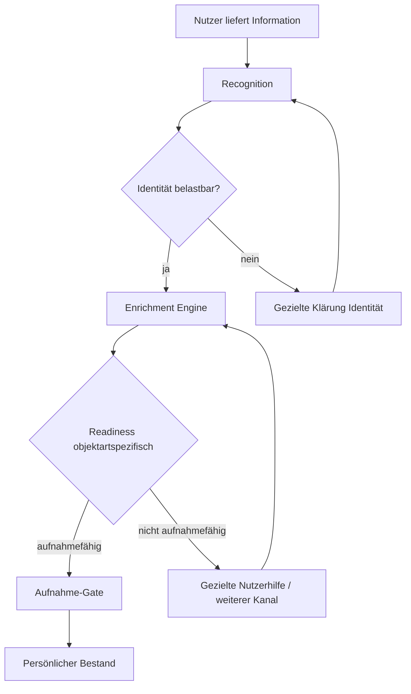
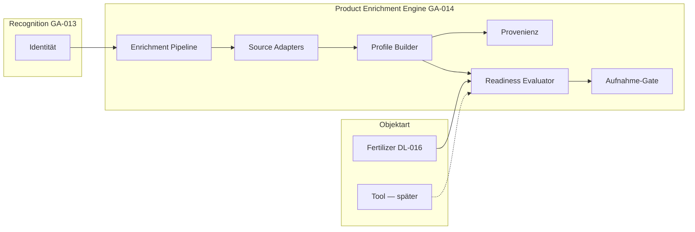

# GA-014

| Feld | Wert |
|------|------|
| **ID** | GA-014 |
| **Titel** | Product Enrichment Engine |
| **Status** | 📋 Geplant |
| **Priorität** | Hoch |
| **Erstellt** | 2026-07-29 |
| **Zuletzt geändert** | 2026-07-29 (Phase 2 DL-014-Normalizer, Provenienz, Konflikte) |
| **Verantwortlich** | — |
| **Verwandte Dokumente** | [GA-013](./ga-013.md); [DL-011](../decisions/dl-011.md); [DL-012](../decisions/dl-012.md); [DL-013](../decisions/dl-013.md); [DL-014](../decisions/dl-014.md); [DL-015](../decisions/dl-015.md); [DL-016](../decisions/dl-016.md); [GM-009](../model/gm-009.md); [DL-003](../decisions/dl-003.md); [GM-003](../model/gm-003.md); [GM-008](../model/gm-008.md); [CM-013](../playbook/conversation-model.md#cm-013--kontextbezogene-rückfragen-bei-der-erfassung); [product-governance.md](../product-governance.md); [greenkeeper-data-model.md](../greenkeeper-data-model.md) |
| **Kurzbeschreibung** | Allgemeine KI-gestützte Enrichment-Schicht: aus erkannter Identität nutzbares Product Profile aufbauen — objektartspezifische Readiness-Regeln, gemeinsame Pipeline-Infrastruktur. Dünger zuerst (DL-016). |

---

## Zweck

Dieses Dokument beschreibt das **Zielbild** der **Product Enrichment Engine** — eine übergreifende Greenkeeper-Fähigkeit, die aus erkannter **Produktidentität** **nutzbares Produktwissen** erzeugt.

Kernfrage:

> Wie baut Greenkeeper aus wenigen Nutzerinformationen ein **aufnahmefähiges Product Profile** auf — **bevor** ein Objekt im persönlichen Bestand erscheint?

**Grundprinzip:**

> **Erkennen → Anreichern → Aufnahme**

**Nicht:**

> Erkennen → Aufnahme → später hoffen

[GA-013](./ga-013.md) beschreibt Recognition und Stufe-1-Umsetzung für Dünger. **GA-014** definiert die **Enrichment-Schicht** als eigenständige Architekturentscheidung — fachlich abgestimmt mit [DL-011](../decisions/dl-011.md) bis [DL-016](../decisions/dl-016.md).

---

## 1. Zielbild

### Warum eine Enrichment-Schicht?

Greenkeeper unterscheidet sich von klassischen Verwaltungsapps: Der Nutzer **liefert** Informationen in natürlicher Form ([DL-011](../decisions/dl-011.md)); Greenkeeper **übernimmt** Identifikation, Recherche, Strukturierung und Wissensaufbau ([DL-013](../decisions/dl-013.md)).

**Recognition allein reicht nicht:**

- Identität beantwortet: *Welches Produkt ist das?*
- Nutzung erfordert: *Welche Eigenschaften hat es?* — Nährstoffe, Form, Anwendung, technische Daten, …

Ohne Enrichment entstünden leere oder halbfertige Product Profiles. Das widerspricht [DL-015](../decisions/dl-015.md) (Qualitätsbarriere) und dem Nutzerversprechen aus [DL-013](../decisions/dl-013.md).

### Wissensanreicherung als Kernbestandteil

Automatische Anreicherung ist **kein optionales Extra**, sondern **Kern der Greenkeeper-Erfahrung** ([DL-013](../decisions/dl-013.md)). Die Enrichment Engine ist die **technische und prozessuale Umsetzung** dieses Prinzips — bereichsübergreifend, mit objektartspezifischen Regeln.

### Product Profile vs. Bestand

Product Profile speichert **Produktwissen** (wiederverwendbar, quellenbasiert). Persönlicher Bestand speichert **Besitz und Verbrauch** ([DL-012](../decisions/dl-012.md)). Die Enrichment Engine schreibt in das **Product Profile**; die Aufnahme in den Bestand erfolgt erst nach bestandener Readiness-Prüfung.

---

## 2. Abgrenzung Recognition und Enrichment

| | **Product Recognition** | **Product Enrichment** |
|---|-------------------------|------------------------|
| **Frage** | Was ist das Produkt? | Welche Informationen existieren zu diesem Produkt? |
| **Ergebnis** | Produktreferenz, Identity Confidence | Aufnahmefähiges Product Profile |
| **Typische Felder** | Hersteller, Modell/Name, Variante, GTIN | Nährstoffe, Form, Anwendung, technische Specs — objektartabhängig |
| **Quellen** | Foto, Sprache, Barcode, Katalog-Match (Identität) | Hersteller, PDF, Katalog, verifizierte Web-Quellen |
| **Zeitpunkt** | Erster Schritt im Erfassungsflow | Nach belastbarer Identität, **vor** Bestandsaufnahme |
| **Bei Lücke** | Gezielte Klärung der **Identität** (CM-013) | Gezielte Klärung fehlender **Profilinformationen** oder zusätzlicher Kanal ([DL-011](../decisions/dl-011.md)) |
| **Implementierung heute** | [GA-013](./ga-013.md) — Spike + Stufe 1 | **GA-014** — Zielbild, noch nicht umgesetzt |

**Leitsatz Recognition:**

> Die Aufgabe der Produkterkennung ist ausschließlich: **Die Produktidentität möglichst schnell und eindeutig zu bestimmen.**

**Leitsatz Enrichment:**

> Die Aufgabe der Enrichment Engine ist: **Aus verifizierten Quellen ein aufnahmefähiges Product Profile aufzubauen** — ohne Werte zu erfinden ([DL-003](../decisions/dl-003.md), [GA-013](./ga-013.md)).

Web-Recherche und Profil-Vollständigkeit gehören in **Enrichment**, nicht in den blockierenden Recognition-Pfad der Stufe-1-Spike-Integration (siehe [GA-013 — Abweichung Spike vs. Ziel](./ga-013.md#abweichung-spike-vs-zielarchitektur)).

---

## 3. Aufnahmeprozess

### Zielablauf



**Schritte:**

1. **Nutzer liefert Information** — Foto, Sprache, PDF, Barcode, … ([DL-011](../decisions/dl-011.md))
2. **Recognition** — Identität ermitteln
3. **Identität vorhanden** — belastbare Produktzuordnung
4. **Enrichment** — Quellen sammeln, strukturieren, Product Profile aufbauen
5. **Objektartspezifische Readiness-Prüfung** — Aufnahmefähigkeit prüfen
6. **Aufnahme in persönlichen Bestand** — erst wenn Readiness erfüllt ([DL-015](../decisions/dl-015.md))

### Zeitverhalten

- **Recognition:** kurzer synchroner Pfad (Identität + Katalog-Match)
- **Enrichment:** technisch entkoppelte Pipeline (Worker/Queue möglich), aber **Erfassungsflow blockiert** bis Readiness oder gezielte Nutzerhilfe ([DL-015](../decisions/dl-015.md))
- Der Nutzer sieht **keinen fertigen Bestandseintrag**, solange die Qualitätsbarriere nicht erreicht ist

---

## 4. Architekturprinzip: Allgemeine Engine, objektartspezifische Regeln

Die **Product Enrichment Engine** ist eine **allgemeine Greenkeeper-Fähigkeit**. Sie stellt gemeinsame Funktionen bereit; **fachliche Regeln** werden **pro Objektart** definiert.

```
Product Enrichment Engine
    |
    +-- Dünger
    |      |
    |      +-- Fertilizer Readiness Rules
    |          (DL-016, DL-014)
    |
    +-- Werkzeuge
    |      |
    |      +-- Tool Readiness Rules
    |          (zukünftige Entscheidung)
    |
    +-- Maschinen
    |      |
    |      +-- Machine Readiness Rules
    |          (zukünftige Entscheidung)
    |
    +-- Bodenhilfsstoffe / Saatgut / …
           |
           +-- eigene Readiness Rules
               (zukünftige Entscheidungen)
```

### Keine globale Vollständigkeitsregel

Es gibt **keine** universelle Vollständigkeitsregel für alle Gartenobjekte.

Jede Objektart besitzt **eigene Aufnahmefähigkeitsregeln** (Readiness Rules). Die Engine ruft den passenden **Readiness Evaluator** für die Objektart auf.

| Readiness-Modul | Status | Grundlage |
|-----------------|--------|-----------|
| **FertilizerReadinessRules** | ✅ Spezifikation festgelegt | [GM-009](../model/gm-009.md) (DL-016, DL-014) |
| **ToolReadinessRules** | 📋 offen | zukünftiges DL/GM |
| **MachineReadinessRules** | 📋 offen | zukünftiges DL/GM |
| **SoilAmendmentReadinessRules** | 📋 offen | zukünftiges DL/GM |
| **SeedReadinessRules** | 📋 offen | zukünftiges DL/GM |

**[DL-016](../decisions/dl-016.md) gilt ausschließlich für Dünger** und darf **nicht** als allgemeine Regel für Werkzeuge, Maschinen oder andere Objektarten interpretiert werden.

---

## 5. Dünger als erste Implementierung

Die **erste konkrete Umsetzung** der Enrichment Engine erfolgt für **Dünger** — auf Basis der bestehenden GA-013-Infrastruktur (Recognition, Product Profiles Stufe 1, Capture-Flow).

### FertilizerReadinessRules

Verbindliche Implementierungsspezifikation: **[GM-009](../model/gm-009.md)**. Fachliche Grundlage: [DL-016](../decisions/dl-016.md), Deklarationsprinzip: [DL-014](../decisions/dl-014.md).

Kurzüberblick — für Dünger müssen vor Aufnahme vorliegen:

**Identität (Pflicht)**

- Hersteller
- Produktname
- eindeutige Produktzuordnung

**Basisdaten (Pflicht)**

- Produktform: Granulat oder Flüssig
- NPK-Zusammensetzung (Sonderfälle fachlich dokumentieren)

**Inhaltsstoffe (Pflicht, DL-014)**

- Herstellerangabe → Wert übernehmen
- nicht genannt → 0 %
- relevante Bereiche: Makronährstoffe, Stickstoffformen, Sekundärnährstoffe, Spurenelemente

**Anwendung**

- Aufwandmenge und weitere Empfehlungen: **sammeln**, blockieren **nicht** automatisch die Aufnahme, sofern keine Herstellerangabe verfügbar ([DL-016](../decisions/dl-016.md))

### Nicht auf Dünger übertragbar

DL-016-Anforderungen (NPK, Spurenelement-Matrix, …) gelten **nicht** für:

- Werkzeuge
- Maschinen
- Bodenhilfsstoffe
- Saatgut
- weitere Gartenobjekte

Diese Objektarten erhalten **eigene** Readiness-Definitionen in späteren Entscheidungen.

---

## 6. Technische Zielarchitektur (konzeptionell)

Noch **keine** Implementierungsdetails, Tabellenmigrationen oder Dateiplanung. Konzeptionelle Bausteine:

### Enrichment Pipeline

Orchestriert den Ablauf: Identitätsreferenz entgegennehmen → Quellen anbinden → Profile materialisieren → Readiness prüfen → Ergebnis an Aufnahme-Gate.

Technisch entkoppelt von Recognition; kann synchron (Fast Path bei Katalog) oder asynchron (Worker) ausgeführt werden — der **Erfassungsflow** wartet auf das Ergebnis.

### Source Adapter

Einheitliche Schnittstelle für Quelltypen:

- Hersteller-Webseiten
- Produktdatenblätter / PDF
- Geprüfter interner Katalog (`products`)
- GS1 / GTIN-Metadaten
- Nutzerbereitgestellte Medien (Foto Rückseite, Upload)

Priorisierung und Merge-Logik zentral; objektartspezifische Extraktionsprofile optional.

### Product Profile Builder

Materialisiert strukturiertes Wissen im **Product Profile** ([DL-012](../decisions/dl-012.md)):

- Identität und fachliche Felder
- Anwendung der **objektartspezifischen** Normalisierungsregeln (für Dünger: [DL-014](../decisions/dl-014.md))
- Trennung Aufnahmefähigkeit vs. Erweiterbarkeit

### Provenienzverwaltung

Pro Feld oder Feldgruppe:

- Quelle, URL, Kategorie, Evidenz, Zeitpunkt, Vertrauensniveau

Kein Profilfeld ohne nachvollziehbare Herkunft — außer explizit definierter Regeln (z. B. DL-014-0-%-Defaults für deklarationspflichtige Matrix).

### Readiness Evaluator

Pluggable Modul pro Objektart. Die Engine **bestimmt zuerst die Objektart**, **wählt dann** den passenden Evaluator und wendet **objektartspezifische Readiness Rules** an — erst danach entscheidet das Aufnahme-Gate.

```
Product Enrichment Engine
  → Objektart bestimmen
  → passenden Readiness Evaluator auswählen
  → objektartspezifische Readiness Rules anwenden
  → Aufnahme-Gate entscheiden
```

- Input: Product Profile (Entwurf) + `objectCategory`
- Output (regulär): objektartspezifisches Readiness-Ergebnis (Dünger: `ready` | `needs_input` | `not_ready` — siehe [GM-009](../model/gm-009.md))
- Bei falscher Evaluator-Zuordnung (z. B. Fertilizer Evaluator für Werkzeug): Vertragsfehler `unsupported_object_category` — **kein** Readiness-Status
- Dünger: **[GM-009 — Fertilizer Readiness Rules](../model/gm-009.md)** — Vorbedingung `objectCategory === 'fertilizer'`
- **Implementiert (Stufe 1):** `evaluateFertilizerReadiness()` in `src/lib/fertilizerReadinessCore.ts` — deterministisch, ohne Seiteneffekte; siehe [Abschnitt 11](#11-enrichmentreadiness-schnittstelle-dünger)

### Aufnahme-Gate

Letzte fachliche Barriere vor persistenter Bestandsaufnahme:

- Readiness erfüllt → Save (Container, Bewegungen) erlaubt
- nicht erfüllt → kein Bestand, keine Erfolgsmeldung ([DL-015](../decisions/dl-015.md))

Verknüpft Enrichment Engine mit Inventar-RPCs ([GM-008](../model/gm-008.md), [GA-012](./ga-012.md)).

### Gesamtfluss (Komponenten)



### Wiederverwendung aus GA-013 (Spike)

Bestehende Bausteine können in Source Adapter / Profile Builder einfließen — nach Entkopplung aus dem synchronen Recognition-Request:

- Web-Search und Merge-Logik (Spike)
- Katalog-Resolver (Identität + Katalog als Enrichment-Quelle)
- OpenAI Structured Extraction

---

## 7. UX-Prinzip

Der Nutzer soll **nicht** Produktdaten manuell erfassen ([DL-011](../decisions/dl-011.md), [DL-013](../decisions/dl-013.md)).

Greenkeeper übernimmt:

- Erkennung
- Recherche
- Strukturierung
- Wissensaufbau

**Nur wenn** automatische Anreicherung nicht ausreichend erfolgreich ist:

- **gezielte Rückfrage** im Gespräch ([CM-013](../playbook/conversation-model.md#cm-013--kontextbezogene-rückfragen-bei-der-erfassung))
- **zusätzliche Quelle** (Rückseitenfoto, PDF, Barcode)
- **letzter Fallback:** manuelle Eingabe

### Kommunikation

| Phase | Nutzerwahrnehmung |
|-------|-------------------|
| Recognition | „Verpackung wird gelesen…“ |
| Enrichment | „Greenkeeper sammelt Produktinformationen…“ |
| Nicht aufnahmefähig | „Ich konnte … noch nicht vollständig bestimmen. Bitte …“ |
| Aufnahmefähig | Bestandsfragen → *„Dein Dünger wurde hinzugefügt.“* |

Die Erfolgsmeldung bedeutet: **vollständig nutzbar** für die Objektart — nicht „alle denkbaren Informationen existieren“ ([DL-016](../decisions/dl-016.md)).

---

## 8. Offene Architekturentscheidungen

Vor Implementierung zu klären:

| Thema | Frage |
|-------|--------|
| **Job-Orchestrierung** | Netlify Background Functions, Supabase Edge, synchroner Fast Path bei Katalogtreffer? |
| **Quellenpriorisierung** | Feinjustierung der Prioritätsmatrix pro Objektart |
| **Datenmodell-Erweiterungen** | Normalisierte Nährstofftabellen vs. JSONB; Provenienz-Schema; Job-Tabelle |
| **Statusmodell** | `recognized` / `enriching` / `needs_input` / `intake_ready` / `extended` / `verified` |
| **Weitere Objektarten** | Reihenfolge nach Dünger; eigene DL/GM pro Readiness |
| **Governance-Übergänge** | Wann Enrichment-Ergebnis `submitNewProduct` / Change Request auslöst ([DL-003](../decisions/dl-003.md)) |
| **GA-013 Stufe 1 Abgleich** | Migration bestehender Draft-Profile vs. nur Neuerfassungen |
| **Timeout & Retry** | Wann Nutzer einbinden vs. automatisch erneut versuchen |
| **Konfliktauflösung** | Widersprüchliche Quellen → Priorität, Review, oder `needs_input` |
| **Inhaltsstoff-Matrix Dünger** | Exakte `nutrient_key`-Liste für DL-014-0-%-Regel |

---

## 9. Beziehung zu bestehenden Entscheidungen

| Dokument | Rolle |
|----------|-------|
| [DL-011](../decisions/dl-011.md) | Eingangskanäle; Enrichment nutzt und erweitert Kanäle bei Lücken |
| [DL-012](../decisions/dl-012.md) | Product Profile vs. Bestand; Zielspeicher der Engine |
| [DL-013](../decisions/dl-013.md) | Anreicherung als Kern — Engine ist Umsetzung |
| [DL-014](../decisions/dl-014.md) | Deklarationsprinzip — **nur Dünger** im Profile Builder |
| [DL-015](../decisions/dl-015.md) | Qualitätsbarriere — Aufnahme-Gate |
| [DL-016](../decisions/dl-016.md) | **FertilizerReadinessRules** — nicht global |
| [GA-013](./ga-013.md) | Recognition, Stufe 1, Spike-Bausteine |
| [DL-003](../decisions/dl-003.md) / [product-governance.md](../product-governance.md) | Kein direkter Katalog-Write aus Enrichment |

---

## 10. Empfohlene Umsetzungsphasen (Orientierung)

Die detaillierte Schnittstelle und die begründete Reihenfolge stehen in [Abschnitt 11.17](#1117-umsetzungsphasen).

| Phase | Inhalt | Status |
|-------|--------|--------|
| **1a** | Fertilizer Readiness Evaluator + Vertrag ([GM-009](../model/gm-009.md)) | ✅ umgesetzt (`fertilizerReadinessCore.ts`) |
| **1b** | Enrichment-Ergebnisstruktur + Readiness-Input-Builder (reiner Feld-Adapter, **keine** DL-014-Logik) + Unit-Tests | 📋 spezifiziert — [§11.4](#114-readiness-input-builder) |
| **2** | DL-014-Normalizer + Provenienz- und Konfliktmodell + Unit-Tests | 📋 spezifiziert — [§12](#12-phase-2-dl-014-normalizer-provenienz-und-konflikte-dünger) |
| **3** | Enrichment-Orchestrierung + Quellenadapter + Timeout — noch kein Save | 📋 offen |
| **4** | `needs_input`-Übergabe an laufenden Erfassungsflow | 📋 offen |
| **5** | Save-Gate und Bestandsintegration nach `ready` | 📋 offen |

**Abweichung gegenüber früherer GA-014-Fassung:** Phase 1 wurde in **1a** (Evaluator) und **1b** (Adapter/Builder) getrennt. Der Evaluator existiert; die Enrichment-Übergabe wird **zuerst** als reine Core-Adapter-Schicht spezifiziert und implementiert — **ohne** Worker, Queue oder UI. Phase 2 (Normalisierung) folgt bewusst **vor** Persistenz-Erweiterungen, damit DL-014-Logik testbar bleibt, bevor Provenienz in der Datenbank modelliert wird.

Details und Reihenfolge können in Project Delivery präzisiert werden — nicht Gegenstand dieses GA.

---

## 11. Enrichment–Readiness-Schnittstelle (Dünger)

Dieser Abschnitt definiert die **nächste technische Architekturstufe** nach der implementierten Fertilizer-Readiness-Prüfung ([GM-009](../model/gm-009.md), Commit `feat: add fertilizer readiness evaluator`).

**Zielablauf:**

```
Recognition
  → Product Enrichment
  → Normalisierung der Herstellerdeklaration (DL-014)
  → Aufbau FertilizerProductProfileReadinessInput
  → evaluateFertilizerReadiness()
  → ready | needs_input | not_ready  (oder Vertragsfehler)
```

Noch **keine** Bestandsaufnahme, **keine** UI-Integration, **kein** Enrichment-Worker in diesem Abschnitt — nur der **verbindliche Vertrag** zwischen Enrichment/Normalisierung und dem bestehenden Evaluator.

### 11.1 Bestandsanalyse (Repository)

#### Wiederverwendbare Bausteine

| Baustein | Ort | Rolle in der Schnittstelle |
|----------|-----|----------------------------|
| **Fertilizer Readiness Vertrag + Evaluator** | `src/types/fertilizerReadiness.ts`, `src/lib/fertilizerReadinessCore.ts` | Zielvertrag; **unverändert** deterministisch |
| **`ProductProfileForm`** | `src/types/productProfile.ts` | Aufnahmefähige Produktform (`granular` \| `liquid`) |
| **`ProductProfile`** | `src/types/productProfile.ts` | Persistiertes Produktwissen (Identität, NPK, Form); Fast-Path-Quelle |
| **`FertilizerRecognitionCandidate`** | `src/types/fertilizerRecognitionCandidate.ts` | Persönlicher Recognition-Output mit Feld-Provenienz (`source`, `evidence`, `sourceUrl`) |
| **`ProductRecognizeRecognition`** | `src/types/productRecognize.ts` | Spike-Struktur: NPK, Form, Nutrients[], Application, Feldquellen |
| **`ProductRecognizeFieldSource` / `ProductRecognizeSourceRecord`** | `src/types/productRecognize.ts` | Quellentypen und Evidenz — Basis für Enrichment-Provenienz |
| **`ProductGovernance` Quellentypen** | `src/types/productGovernance.ts` | Governance-Prioritäten (`manufacturer`, `datasheet`, …) — langfristige Ausrichtung |
| **`FERTILIZER_NUTRIENT_MATRIX_KEYS`** | `src/types/fertilizerReadiness.ts` | Verbindliche v1-Matrix — Normalizer-Ziel |

#### Fehlende Bausteine

| Lücke | Auswirkung |
|-------|------------|
| **Vollständige Nährstoffmatrix im Product Profile** | DB-Modell speichert heute nur N/P/K — keine Stickstoffformen, Sekundär-/Spurenelemente |
| **`declarationEvaluation`** | Kein persistierter Status `not_started` \| `insufficient_sources` \| `fully_evaluated` |
| **Strukturiertes Konfliktmodell** | Readiness-Input kennt nur aggregiertes `blockingSourceConflict`; keine Feld-Konflikte |
| **DL-014-Normalizer** | Keine getrennte Funktion, die 0-%-Regel **nur nach** `fully_evaluated` anwendet |
| **`buildFertilizerReadinessInput()`** | Kein Adapter Enrichment → Readiness |
| **`FertilizerEnrichmentResult`** | Kein typisierter Enrichment-Output |
| **Enrichment-Orchestrierungsstatus** | Kein `recognized` / `enriching` / … Lebenszyklus |
| **Feld-Provenienz-Persistenz** | Spike liefert Provenienz pro Feld; Product Profile speichert sie nicht |

#### Adaptergrenzen

```
┌─────────────────────┐     ┌──────────────────────────┐     ┌─────────────────────────────┐
│ Recognition Output  │     │ Enrichment + Normalizer  │     │ Readiness (implementiert)   │
│ (Identität, Kateg.) │ ──► │ FertilizerEnrichmentResult│ ──► │ buildFertilizerReadinessInput│
│                     │     │ + DL-014 Normalizer      │     │ → evaluateFertilizerReadiness│
└─────────────────────┘     └──────────────────────────┘     └─────────────────────────────┘
         │                              │                                    │
   Kein NPK/Matrix-              Kein Readiness-                   Kein Netzwerk, DB,
   Vollständigkeits-              Urteil; keine                     KI, Speichern
   urteil                         Werte erfinden
```

- **Recognition → Enrichment:** Übergabe von Identität + `objectCategory` + optional Katalog-/Candidate-Referenz — **keine** Aufnahmefähigkeitsentscheidung.
- **Enrichment → Normalizer:** Rohextraktion + Quellen — **keine** 0-%-Auffüllung ohne `fully_evaluated`.
- **Normalizer + Enrichment → Builder:** Strukturiertes `FertilizerEnrichmentResult` — **keine** Readiness-Bewertung.
- **Builder → Evaluator:** `FertilizerProductProfileReadinessInput` — Evaluator **recherchiert/normalisiert nicht**.

#### Ausdrücklich nicht wiederverwenden

| Übergangslösung | Grund |
|-----------------|-------|
| **`dataCompleteness` im Recognition Candidate** | Misst Spike-Lauf, nicht GM-009-Aufnahmefähigkeit |
| **Synchrones Web-Enrichment im Recognition-Request** | Gehört in Enrichment-Pipeline ([GA-013 Abweichung](./ga-013.md#abweichung-spike-vs-zielarchitektur)) |
| **Save ohne Readiness-Gate (GA-013 Stufe 1)** | Wird durch DL-015/GM-009 überholt — Save-Flow bleibt bis Phase 5 unangetastet |
| **Freie `ProductRecognizeNutrientField.name`-Strings** | Müssen auf `FERTILIZER_NUTRIENT_MATRIX_KEYS` gemappt werden — kein direkter Matrix-Eintrag |
| **Katalogtreffer = sofort `ready`** | Fast Path erfordert weiterhin Evaluator-Lauf ([§11.13](#1113-fast-path-für-bestehende-product-profiles)) |

#### Fachlich schwache oder widersprüchliche Strukturen

- **`ProductProfile`** vs. **`FertilizerRecognitionCandidate`:** Identität doppelt modelliert — Builder muss eine **kanonische Identitätsquelle** pro Lauf wählen (Enrichment-Ergebnis, nicht parallele Wahrheiten).
- **GA-013 Stufe 1** speichert minimales Profil **vor** Enrichment; **DL-015** verlangt Readiness **vor** Bestand — dokumentierter Zielkonflikt, Auflösung in Phase 5, nicht im Builder.
- **`ProductRecognizeFormValue` inkl. `unknown`** passt zum Readiness-Input; **`ProductProfile.productForm: null`** ist separater Persistenzzustand.

### 11.2 Verantwortungsgrenzen

Vier getrennte Verantwortlichkeiten — keine Überschneidung der Entscheidungslogik:

#### Recognition

Verantwortet **ausschließlich:**

- Hersteller, offizieller Produktname, Produktlinie, Variante
- Identity Fingerprint, Identity Confidence
- Ambiguitäten (`identityAmbiguity`)
- erkannte Produktkategorie → **`objectCategory`** für Engine-Routing

**Nicht:** vollständige Nährstoffdaten, Deklarationsauswertung, Aufnahmefähigkeit.

#### Product Enrichment

Verantwortet:

- Quellenrecherche und Auswahl geeigneter Herstellerquellen
- Extraktion: Produktform, NPK, Nährstoffe, Anwendung (nicht blockierend)
- Feldprovenienz, Quellenkonflikte (strukturiert)
- Kennzeichnung, ob Deklaration vollständig auswertbar ist (`declarationEvaluation`-Vorbereitung)

**Nicht:** DL-014-0-% anwenden (Normalizer), Readiness-Status, Speichern, Bestand.

#### Deklarationsnormalisierung (DL-014)

Verantwortet:

- Überführung in GM-009-Inhaltsstoffmatrix
- eindeutige Deklarationsbasis pro Wert
- numerische Normalisierung (keine Schätzung)
- 0-% **nur nach** `fully_evaluated`
- keine stillschweigende Element-/Oxid-Umrechnung

**Nicht:** Quellenrecherche, Readiness-Urteil.

#### Fertilizer Readiness Evaluator

Verantwortet **ausschließlich:**

- Prüfung des fertigen `FertilizerProductProfileReadinessInput`
- `ready` \| `needs_input` \| `not_ready`
- Vertragsfehler `unsupported_object_category` bei falscher Objektart

**Nicht:** recherchieren, normalisieren, speichern, UI.

### 11.3 Technische Übergabestruktur

**Namenskonvention (Repository):** Typen in `src/types/`, reine Logik in `src/lib/*Core.ts` — analog zu `fertilizerReadinessCore.ts`.

#### `FertilizerEnrichmentResult`

Zwischenergebnis der Enrichment-Schicht **vor** Readiness. Enthält Roh- **und** normalisierte Zustände plus Provenienz — der Evaluator sieht davon nichts direkt.

```typescript
type FertilizerEnrichmentResult = {
  objectCategory: 'fertilizer'           // von Recognition/Engine gesetzt
  specificationVersion: 'fertilizer-readiness-v1'

  identity: FertilizerEnrichmentIdentity
  productForm: FertilizerEnrichmentField<ProductProfileForm | 'unknown' | null>
  npk: FertilizerEnrichmentNpkBlock
  nutrientMatrix: Partial<Record<FertilizerNutrientMatrixKey, FertilizerEnrichmentNutrientEntry>>
  declarationEvaluation: FertilizerEnrichmentDeclarationEvaluation
  sourceConflicts: FertilizerEnrichmentConflict[]
  application?: FertilizerEnrichmentApplication   // optional, nicht blockierend

  enrichmentRunId: string
  enrichedAt: string
}
```

**Hilfstypen (konzeptionell):**

```typescript
type FertilizerEnrichmentField<T> = {
  value: T
  provenanceId: string | null
  evidence: string | null
  sourceUrl: string | null
  sourceCategory: ProductRecognizeWebSourceCategory | null
  confidence: number | null
  conflict: FertilizerEnrichmentConflictRef | null
}

type FertilizerEnrichmentNutrientEntry = FertilizerEnrichmentField<number | null> & {
  declarationBasis: string | null
  unit: '%'
  /** Nach DL-014 normalisiert — erst nach fully_evaluated gesetzt */
  normalization: 'declared' | 'dl014_zero' | 'unresolved' | null
}

type FertilizerEnrichmentDeclarationEvaluation = {
  status: 'not_started' | 'insufficient_sources' | 'fully_evaluated'
  evaluatedSourceIds: string[]
  evaluatedAt: string | null
  /** Warum ausreichend / unzureichend */
  coverageNotes: string | null
  variantResolved: boolean
  productScopeConfirmed: boolean
}

type FertilizerEnrichmentConflict = {
  conflictType: FertilizerEnrichmentConflictType
  fieldPath: string
  blocking: boolean
  resolvable: boolean
  participantProvenanceIds: string[]
  preferredInputAction?: FertilizerSuggestedInputAction
}
```

**Identität im Enrichment-Ergebnis:**

| Feld | Quelle |
|------|--------|
| `manufacturer`, `officialName`, `productLine`, `variant` | Recognition + ggf. Enrichment-Korrektur mit Provenienz |
| `identityFingerprint` | Recognition |
| `identityConfidence` | Recognition |
| `identityAmbiguity` | Recognition → abgebildet als `hasIdentityAmbiguity` + `identityAmbiguityResolvable` + `identityNotActionable` im Builder |

Mapping auf Readiness-Input: `hasIdentityAmbiguity` → `identity.identityAmbiguity.isAmbiguous`.

#### `NormalizedFertilizerProfile`

Optionaler **Zwischenzustand nach DL-014-Normalizer** — Teilmenge von `FertilizerEnrichmentResult`, in der Matrix nur noch numerische Endwerte oder explizit fehlende Keys (vor Builder) enthalten sind. Kann in Phase 2 als separater Typ oder als View auf `FertilizerEnrichmentResult` modelliert werden.

### 11.4 Readiness-Input-Builder

**Konzeptionelle Signatur:**

```typescript
function buildFertilizerReadinessInput(
  enrichment: FertilizerEnrichmentResult,
): FertilizerProductProfileReadinessInput
```

**Eigenschaften (Pflicht):**

- rein, deterministisch, ohne Seiteneffekte
- keine Netzwerk-/DB-/KI-Aufrufe
- erfindet **keine** Werte
- unterscheidet `0`, `null`, fehlend
- mappt aggregiertes `blockingSourceConflict` aus `sourceConflicts[]`

**Mapping-Regeln (Auszug):**

| Enrichment | Readiness-Input |
|------------|-----------------|
| `objectCategory` | `objectCategory` (unverändert) |
| Identitätsfelder | `identity.*` |
| `productForm.value` | `productForm` |
| NPK-Werte + Basis | `npk` |
| Matrix-Einträge mit `normalization !== 'unresolved'` und gültigem numerischem Wert | `nutrientMatrix[key]` |
| Matrix-Einträge `unresolved` / fehlend vor `fully_evaluated` | **nicht** in Matrix — Key fehlt oder `null` |
| `declarationEvaluation.status` | `declarationEvaluation.status` |
| Blockierender Konflikt | `blockingSourceConflict: { blocking, resolvable }` |

**Builder-Fehler (eigene Klasse, konzeptionell `FertilizerReadinessInputBuildError`):**

| Code | Wann | Beispiel |
|------|------|----------|
| `invalid_enrichment_contract` | Pflichtfelder des Enrichment-Results fehlen | kein `objectCategory` |
| `object_category_mismatch` | Enrichment liefert nicht-`fertilizer`, Builder für Dünger aufgerufen | Engine-Routing-Fehler **vor** Evaluator |

**Nicht Builder-Aufgabe:** Aufnahmefähigkeit — das bewertet **ausschließlich** `evaluateFertilizerReadiness()`.

**Phase-1b-Grenze — der Builder darf nicht:**

- fehlende Nährstoffe auf `0` setzen
- `normalization: 'dl014_zero'` erzeugen
- Deklarationsbasen umrechnen oder vereinheitlichen
- die GM-009-Matrix fachlich vervollständigen
- Quellen priorisieren
- Konflikte inhaltlich auflösen
- Werte schätzen oder erfinden

Der Builder **mappt nur** bereits strukturierte Enrichment-Daten in den bestehenden Readiness-Vertrag: Feldnamen abbilden, vorhandene Werte unverändert weiterreichen, fehlende Werte als fehlend erhalten, vorhandene Konfliktinformationen aggregieren, `declarationEvaluation.status` abbilden. DL-014-Normalisierung, Matrixvervollständigung, Basisprüfung sowie das Provenienz- und Konfliktmodell gehören **ausschließlich zu Phase 2** ([§11.5](#115-dl-014-normalisierung), [§11.8](#118-konfliktmodell)). Liegen `dl014_zero`-Werte bereits im Enrichment-Ergebnis (nach Phase 2), gibt der Builder sie **unverändert** an den Readiness-Input weiter — er erzeugt sie nicht selbst.

**Aufrufkette (Zielarchitektur):**

```typescript
// Phase 2 (Normalizer) läuft vor dem Builder — nicht Teil von Phase 1b:
const normalized = normalizeFertilizerDeclaration(enrichmentResult)
const input = buildFertilizerReadinessInput(normalized)
const result = evaluateFertilizerReadiness(input)
// objectCategory !== 'fertilizer' → FertilizerReadinessContractError (Evaluator)
```

### 11.5 DL-014-Normalisierung

Separater Normalizer (Phase 2), konzeptionell `normalizeFertilizerDeclaration(enrichmentPartial)`.

#### Vor `fully_evaluated`

- Nicht gefundene Nährstoffwerte bleiben `null` / fehlend.
- **Kein** DL-014-0-%.
- `normalization: 'unresolved'` oder kein Matrix-Eintrag.
- Readiness-Evaluator → `needs_input` + `ingredients.declaration_source`.

#### Nach `fully_evaluated`

Für **jeden** `FERTILIZER_NUTRIENT_MATRIX_KEYS`-Eintrag:

| Situation | Normalizer | Matrix |
|-----------|------------|--------|
| Hersteller nennt Wert | `normalization: 'declared'` | numerischer Wert + `declarationBasis` |
| Hersteller nennt Stoff nicht | `normalization: 'dl014_zero'` | `value: 0` |
| Widersprüchliche Herstellerwerte | Konflikt — **keine** stille Auswahl | `unresolved` + `sourceConflicts[]` |
| Keine geeignete Deklaration | Status bleibt ≠ `fully_evaluated` | keine 0-Auffüllung |

**Nachvollziehbarkeit:** Jeder Matrixwert trägt `normalization` (`declared` \| `dl014_zero`) und `provenanceId` — unterscheidet direkt deklariert vs. DL-014-0.

**Wann `fully_evaluated` gesetzt werden darf:**

- mindestens eine **produktspezifische offizielle Herstellerdeklaration** (Verpackung, Datenblatt, offizielle Produktseite) wurde vollständig für **dieses Produkt und diese Variante** ausgewertet
- alle v1-Matrix-relevanten Angaben sind entweder extrahiert oder explizit als „nicht genannt“ klassifizierbar
- **nicht** bei alleiniger KI-Zusammenfassung ohne belastbare Herstellerquelle
- **nicht** bei ungelöster Variantenzuordnung

### 11.6 Deklarationsbasis und Einheiten

**Unterstützt in v1 (Readiness-Vertrag):**

| Bereich | Erwartete Basis |
|---------|-----------------|
| NPK N | `N` |
| NPK P | `P2O5` |
| NPK K | `K2O` |
| Matrix-Einträge | wie auf Quelle deklariert (`declarationBasis: string`) |

**Regeln:**

- Keine stillschweigende Element-/Oxid-Umrechnung.
- Gemischte Basen für dasselbe Feld → **Konflikt** (`declaration_basis_conflict`) oder fehlende Basis → Readiness `needs_input` + `basis.npk.declaration_basis` / Matrix-Blocker.
- **Erlaubte Umrechnungen** (z. B. Fe ↔ Fe₂O₃) bleiben **offene Fachentscheidung** — nicht in dieser Stufe implementieren.

**Einheit v1:** Massenprozent (`unit: '%'`) — wie GM-009.

### 11.7 Quellenpriorisierung

Priorität **pro Feld**, nicht nur pro Produkt:

1. produktspezifische offizielle Herstellerdeklaration (Etikett, Datenblatt)
2. offizielles Produktdatenblatt (PDF)
3. offizielle Produktseite
4. offizieller Katalog (`verified_catalog`)
5. weitere belastbare Quellen nur ergänzend

**Prinzipien:**

- Neuere produktspezifische offizielle Quelle kann ältere überholen — mit dokumentiertem `sourceConflicts` / Versionskonflikt.
- Händlerdaten (`retailer`) **überschreiben** Herstellerwerte nicht stillschweigend.
- KI-Zusammenfassungen / Such-Snippets sind **Extraktionshilfe**, keine eigenständige Wahrheit — erfordern verlinkte Hersteller-Provenienz.
- Jede entscheidungsrelevante Angabe: `provenanceId`, `evidence`, `sourceUrl`.

Anknüpfung: `ProductRecognizeWebSourceCategory`, `ProductGovernance` `SOURCE_TYPE_PRIORITY` (Feinjustierung offen).

### 11.8 Konfliktmodell

Kontrollierte Konfliktarten (`FertilizerEnrichmentConflictType`):

| Typ | Blockierend wenn | Lösbar → | Unlösbar → | Typische Action |
|-----|------------------|----------|------------|-----------------|
| `identity_conflict` | unterschiedliche Hersteller/Produkte | `needs_input` | `not_ready` | `retry_recognition` |
| `variant_conflict` | Variante nicht zuordenbar | `needs_input` | `not_ready` | `confirm_product_variant` |
| `product_form_conflict` | granular vs. liquid | `needs_input` | `needs_input` | `confirm_product_form` |
| `npk_conflict` | N/P/K widersprüchlich | `needs_input` | `not_ready` | `upload_product_document` |
| `declaration_basis_conflict` | N vs. P₂O₅ gemischt ohne Regel | `needs_input` | `needs_input` | `manual_fallback_input` |
| `nutrient_value_conflict` | Matrixwert widersprüchlich | `needs_input` | `not_ready` | `upload_product_document` |
| `source_version_conflict` | alte vs. neue offizielle Deklaration | `needs_input` | `needs_input` | `upload_product_document` |

**Aggregation für Evaluator:** Der Builder leitet daraus **höchstens ein** aggregiertes `blockingSourceConflict` ab:

- `blocking: true` wenn mindestens ein Konflikt `blocking`
- `resolvable: false` nur wenn **explizit** mindestens ein blockierender Konflikt als unlösbar markiert ist

Keine Freitext-Logik im Evaluator — nur strukturierte Flags.

### 11.9 Verhalten bei `needs_input`

Nach `evaluateFertilizerReadiness()` — **technische Verantwortung der Orchestrierung** (Phase 4):

- **keine** Speicherung im persönlichen Bestand
- **keine** Erfolgsmeldung
- **keine** verzögerte Rückfrage außerhalb des laufenden Erfassungsflows ([DL-015](../decisions/dl-015.md), CM-013)
- Weitergabe: `missingRequirements`, `suggestedInputActions`, optional `enrichmentRunId`
- Orchestrierung wählt **eine** primäre nächste Aktion (nicht alle gleichzeitig dem Nutzer)

| Lücke (Requirement) | Bevorzugte Action |
|---------------------|------------------|
| `ingredients.declaration_source` | `upload_back_photo` oder `upload_product_document` |
| `identity.ambiguity` | `confirm_product_variant` |
| `basis.product_form` | `confirm_product_form` |
| Identität unzureichend | `retry_recognition` oder `capture_additional_packaging_photo` |

Keine UI-Texte in dieser Spezifikation.

### 11.10 Verhalten bei `not_ready`

- keine Speicherung, keine Erfolgsmeldung
- strukturierter Abbruchgrund über `blockingIssues[]` + `missingRequirements`
- **kein** technischer Systemfehler — Unterscheidung zu Orchestrierungsfehlern ([§11.15](#1115-fehlergrenzen))
- **keine** automatische Umwandlung in `needs_input`
- erneuter Identifikationsstart nur durch übergeordnete Orchestrierung

### 11.11 Verhalten bei `ready`

- `ready` **erlaubt fachlich** den nächsten Schritt (Save-Gate) — speichert **selbst nichts**
- späterer Save-Flow erhält normalisiertes, aufnahmefähiges Product Profile (aus Enrichment + Normalizer, nicht aus Evaluator-Output allein)
- Bestandssichtbarkeit und Erfolgsmeldung **erst nach erfolgreichem Save** ([DL-015](../decisions/dl-015.md))

Save-Integration: Phase 5 — außerhalb dieses Auftrags.

### 11.12 Status- und Lebenszyklusmodell

**Enrichment-Orchestrierung** (neu — nicht mit Readiness-Status verwechseln):

| Status | Bedeutung |
|--------|-----------|
| `recognized` | Identität vorhanden; Enrichment noch nicht gestartet |
| `enriching` | Quellen werden gesammelt/ausgewertet |
| `needs_input` | Readiness ≠ `ready`; Nutzer kann helfen — **kein Bestand** |
| `intake_ready` | Readiness = `ready`; Save-Gate darf prüfen |
| `failed` | **Orchestrierung** technisch/fehlgeschlagen — **kein** Evaluator-Status |

**Abgrenzung bestehender Begriffe:**

| Begriff | Kontext | ≠ |
|---------|---------|---|
| `FertilizerReadinessStatus` | Evaluator-Output | Orchestrierungsstatus |
| `ProductProfileStatus` `draft` \| `verified` | Persistenz/Governance | `intake_ready` |
| `ProductVerificationStatus` `verified` | Katalog-Governance | Aufnahmefähigkeit |
| `FertilizerRecognitionCandidateStatus` | Persönlicher Candidate | Enrichment-Lauf |
| `ProductRecognizeStatus` | Recognition Spike | Enrichment |

`intake_ready` ≡ fachlich Readiness `ready`. `needs_input` in Orchestrierung spiegelt Evaluator `needs_input` wider.

### 11.13 Fast Path für bestehende Product Profiles

Bestehendes **verifiziertes** oder vollständiges Product Profile darf Recherche abkürzen, wenn:

- Identität eindeutig übereinstimmt (`identityFingerprint` + Hersteller/Name)
- `fertilizer-readiness-v1` kompatibel
- alle GM-009-Pflichtfelder rekonstruierbar sind (inkl. Matrix + `fully_evaluated`-Nachweis)
- keine blockierenden Konflikte

**Pflicht:** Evaluator **immer** ausführen — `buildFertilizerReadinessInput(fromExistingProfile(...))` → `evaluateFertilizerReadiness()`.

Katalogtreffer allein → **nicht** `ready` ohne Evaluator.

### 11.14 Versionierung

- Readiness: `fertilizer-readiness-v1` (implementiert, Konstante in Code)
- Enrichment-Ergebnis trägt dieselbe `specificationVersion`
- v2-Matrix/Regeln: **keine** stille Interpretation v1-Profile als v2 — explizite Neuauswertung
- Ältere Product Profiles ohne Matrix: Fast Path scheitert → voller Enrichment-Lauf
- **Keine Migration** in dieser Spezifikationsstufe

### 11.15 Fehlergrenzen

| Klasse | Beispiele | Ergebnisform |
|--------|-----------|--------------|
| **Vertragsfehler** | `unsupported_object_category` | Exception — kein `FertilizerReadinessResult` |
| **Fachliche Readiness** | `ready`, `needs_input`, `not_ready` | `FertilizerReadinessResult` |
| **Builder-Vertragsfehler** | `invalid_enrichment_contract` | Exception vor Evaluator |
| **Orchestrierungsfehler** | Provider down, Timeout, PDF nicht ladbar, KI technisch fehl | `failed` — **nicht** Readiness-Status |
| **Persistenzfehler** | Profile/Save fehlgeschlagen | nach Save-Gate — getrennt behandeln |

Nicht vermischen: Timeout ≠ `not_ready`; Netzwerkfehler ≠ fehlende Deklaration.

### 11.16 Datenschutz und Persistenzgrenzen

| Daten | Lebensdauer | Speicherort (Ziel) |
|-------|-------------|---------------------|
| Rohbilder, PDF-Rohbytes | temporär während Enrichment | nicht dauerhaft im Product Profile |
| Extrahierte Feldwerte + Provenienz | dauerhaft (Product Profile) | strukturiert, quellenreferenziert |
| `recognitionSnapshot` | Candidate-Referenz | persönlich, nicht Katalog |
| Enrichment-Lauf-Metadaten | Audit/Debug | optional Job-Tabelle (offen) |
| Persönlicher Bestand | getrennt von globalem Produktwissen | [DL-012](../decisions/dl-012.md) |

Keine DB-Änderung in dieser Stufe.

### 11.17 Umsetzungsphasen

Empfohlene Reihenfolge für Cursor-Aufträge:

| Phase | Inhalt | Begründung |
|-------|--------|------------|
| **1b** | `FertilizerEnrichmentResult` + `buildFertilizerReadinessInput` (reiner Adapter) + Tests | Adapter testbar ohne Worker/Normalizer; Evaluator bereits vorhanden |
| **2** | DL-014-Normalizer + Konflikt-/Provenienztypen + Tests | 0-%-Regel isoliert testbar vor Persistenz — [§12](#12-phase-2-dl-014-normalizer-provenienz-und-konflikte-dünger) |
| **3** | Orchestrierung + Source Adapter + Timeout | nutzt 1b+2; noch kein Save |
| **4** | `needs_input` → Erfassungsflow (strukturierte Actions) | UI-Anbindung minimal |
| **5** | Save-Gate nach `ready` + Bestand | DL-015 durchsetzen |

**Abweichung von GA-014 §10 (alt):** Datenmodell-Persistenz (**früher Phase 3**) folgt **nach** Normalizer (Phase 2), damit Feldprovenenz-Schema aus getesteter Logik abgeleitet wird — nicht umgekehrt.

### 11.18 Offene Entscheidungen

| Thema | Status |
|-------|--------|
| Enrichment-Job-Orchestrierung (Netlify, Supabase Edge, hybrid) | offen |
| Persistenzmodell Feldprovenienz (JSONB vs. normalisiert) | offen |
| Vollständige Liste unterstützter Deklarationsbasen | offen |
| Erlaubte Umrechnungsfaktoren (Fe ↔ Fe₂O₃, …) | offen |
| NPK-Sonderfälle / `npk_exception` | offen ([GM-009](../model/gm-009.md)) |
| Konfliktschwellen blockierend vs. ergänzend | offen |
| Enrichment-Timeout | offen |
| Kompatibilität älterer GA-013-Stufe-1-Profile | offen |
| Quellenadapter-Auswahl und Prioritätsfeinjustierung | offen |
| Hersteller-Produktänderungen / Re-Enrichment | offen |

Keine dieser Fragen wird hier durch Annahmen entschieden.

---

## 12. Phase 2: DL-014-Normalizer, Provenienz und Konflikte (Dünger)

Diese Spezifikation definiert **Phase 2** der Product Enrichment Engine für Dünger: fachliche Normalisierung der Herstellerdeklaration nach [DL-014](../decisions/dl-014.md), strukturierte Feldprovenienz und strukturierte Quellenkonflikte — **ohne** Readiness-Entscheidung, **ohne** Persistenz, **ohne** externe Systemaufrufe.

**Zielablauf:**

```
RawFertilizerEnrichmentResult
  → normalizeFertilizerDeclaration(...)
  → FertilizerEnrichmentResult (normalisiert)
  → buildFertilizerReadinessInput(...)   [Phase 1b, unverändert]
  → evaluateFertilizerReadiness(...)     [unverändert]
```

Phase 2 entscheidet **nicht** über Bestandsaufnahme und speichert **nichts**.

### 12.1 Bestandsanalyse (Repository)

#### Direkt wiederverwendbar

| Baustein | Ort | Phase-2-Rolle |
|----------|-----|---------------|
| **`FERTILIZER_NUTRIENT_MATRIX_KEYS`** (16 Keys) | `fertilizerReadiness.ts` / `fertilizerEnrichment.ts` | Verbindliche v1-Matrix |
| **`FertilizerEnrichmentNormalization`** | `fertilizerEnrichment.ts` | `declared` \| `dl014_zero` \| `unresolved` |
| **`FertilizerEnrichmentConflictType`** (7 Arten) | `fertilizerEnrichment.ts` | Konfliktarten — Phase 2 erweitert um Metadaten |
| **`FertilizerEnrichmentSourceType` / `SourceCategory`** | `fertilizerEnrichment.ts` | Enrichment-eigene Quellentypen |
| **`DeclarationEvaluationStatus`** | `fertilizerReadiness.ts` | `not_started` \| `insufficient_sources` \| `fully_evaluated` |
| **`FertilizerNpkDeclarationBasis`** | `fertilizerReadiness.ts` | N / P₂O₅ / K₂O für NPK-Block |
| **`buildFertilizerReadinessInput`** | `fertilizerReadinessInputBuilderCore.ts` | unverändert nach Normalizer |
| **`evaluateFertilizerReadiness`** | `fertilizerReadinessCore.ts` | unverändert |

#### Erweiterung in Phase 2 (Typen)

| Erweiterung | Grund |
|-------------|-------|
| **`RawFertilizerEnrichmentResult`** | Vor-Normalisierungszustand: extrahierte, noch nicht DL-014-bewertete Felder |
| **`FertilizerFieldProvenance`** | Vollständige Feldprovenienz (Phase 1b: nur Einzelreferenzen pro Matrixeintrag) |
| **`FertilizerEnrichmentConflict`** | `conflictId`, beteiligte Werte, `resolutionStatus`, Begründung |
| **`FertilizerDeclarationNormalizationResult`** | Optionaler Normalizer-Status (`normalized` \| `partially_normalized` \| `blocked`) |
| **Provenance-Registry** im Ergebnis | `provenanceRecords: Record<provenanceId, …>` |

#### Bewusst nicht wiederverwendet

| Baustein | Grund |
|----------|-------|
| **`ProductRecognize*`-Typen** | Recognition-Spike — Enrichment bleibt entkoppelt |
| **`ProductGovernance` Spike-Typen** | Governance-Persistenzmodell — konzeptionell ausrichten, nicht importieren |
| **`ProductProfile` (persistiert)** | Enthält nur N/P/K — keine Matrix/Provenienz; kein Fast-Path-Ersatz ohne Erweiterung |
| **Phase-1b-Enrichment als Raw-Input** | Phase 1b-Result kann strukturell ähnlich sein, aber Raw-Vertrag trennt extrahierte vs. normalisierte Semantik explizit |

#### Fachliche Lücken vor Implementierung

- Kein `RawFertilizerEnrichmentResult`-Vertrag
- Keine Provenance-Registry pro Lauf
- Konflikte ohne `resolutionStatus` und Wertepaare
- Normalizer setzt `fully_evaluated` — heute nur manuell/im Input, keine Regelengine
- Keine deterministischen Konfliktauflösungsregeln codiert

### 12.2 Verantwortungsgrenze Phase 2

#### Phase 2 verantwortet

- Prüfung, ob eine **geeignete Herstellerdeklaration vollständig ausgewertet** wurde
- Überführung deklarierter Werte in die GM-009-v1-Matrix
- Anwendung der **DL-014-0-Regel** (nur bei `fully_evaluated`)
- Erhalt der Unterscheidung **0 ≠ fehlend**
- Deklarationsbasis pro Wert
- Strukturierte **Feldprovenienz**
- Strukturierte **Quellenkonflikte** (inkl. deterministischer Auflösung aus Metadaten)
- Erzeugung eines **normalisierten** `FertilizerEnrichmentResult`

#### Phase 2 verantwortet nicht

Websuche, Dokumentdownload, KI-Auswertung, Bilderkennung, Recognition, Source-Adapter-Auswahl, Job-Orchestrierung, Timeout, Readiness-Entscheidung, UI-Rückfragen, Product-Profile-Persistenz, Bestandsaufnahme, Katalog-Promotion.

### 12.3 Eingabe- und Ausgabevertrag

#### Eingabe: `RawFertilizerEnrichmentResult`

Vor-normalisiertes strukturiertes Enrichment — Output der **Extraktions-/Recherche-Schicht** (Phase 3+), noch **ohne** DL-014-Anwendung.

Muss pro Feld ausdrücken können:

| Zustand | Bedeutung |
|---------|-----------|
| `declared_value` | Numerischer Wert + Basis + Quellenreferenz |
| `missing` | In Quelle nicht gefunden |
| `unreadable` | Quelle vorhanden, Wert nicht extrahierbar |
| `conflicting_values` | Mehrere strukturierte Kandidaten |
| `basis_known` / `basis_unknown` | Deklarationsbasis |
| `source_fully_evaluated` / `source_partial` | Deklarationsabdeckung |
| `variant_matched` / `variant_unclear` | Variantenbezug |

Strukturell parallel zu `FertilizerEnrichmentResult`, aber:

- `normalization` **noch nicht** durch Normalizer gesetzt (oder nur `unresolved`)
- `declarationEvaluation.status` **noch nicht** final durch Normalizer bestätigt
- Roh-Konflikte und Roh-Provenienz-Einträge enthalten

#### Ausgabe: `FertilizerEnrichmentResult`

**Kein paralleler Ausgabe-Vertrag nötig** — das bestehende `FertilizerEnrichmentResult` ([Phase 1b](./ga-014.md#114-readiness-input-builder), implementiert in `src/types/fertilizerEnrichment.ts`) ist das **Phase-2-Ausgabeformat**, sobald der Normalizer es befüllt hat.

Erweiterungen in Phase 2a (Typen):

```typescript
type FertilizerEnrichmentResult = {
  // … bestehende Felder …
  normalizationRunId: string
  normalizedAt: string
  normalizationStatus: 'normalized' | 'partially_normalized' | 'blocked'
  normalizationRulesVersion: 'fertilizer-declaration-normalization-v1'
  provenanceRecords: Record<string, FertilizerFieldProvenance>
  // nutrientMatrix[*]: finaler Wert | fehlend, normalization, provenanceId, conflictStatus
}
```

Der **Builder (Phase 1b)** bleibt unverändert; er mappt das normalisierte Ergebnis.

### 12.4 DL-014-Normalizer

**Konzeptionelle Signatur:**

```typescript
function normalizeFertilizerDeclaration(
  input: RawFertilizerEnrichmentResult,
): FertilizerDeclarationNormalizationResult
// enthält: enrichment: FertilizerEnrichmentResult, status, conflicts, …
```

**Erlaubt:** strukturierte Werte prüfen, deklarierte Werte übertragen, DL-014-0 bei `fully_evaluated`, Normalisierungsmetadaten setzen, Konflikte weitergeben/ deterministisch auflösen.

**Verboten:** recherchieren, Netzwerk, PDF/KI, Freitext-Interpretation, Quellenpriorisierung ohne strukturierte Metadaten, Einheiten-/Basen-Umrechnung, Schätzung, fehlende Quelle als vollständig werten, Readiness, Speichern.

**Determinismus:** Gleiches Raw-Input → gleiches normalisiertes Ergebnis.

### 12.5 Voraussetzungen für `fully_evaluated`

`declarationEvaluation.status === 'fully_evaluated'` darf **nur** gesetzt werden, wenn **alle** Bedingungen erfüllt sind:

1. **Geeignete offizielle oder gleichwertig belastbare** produktspezifische Deklarationsquelle vorhanden ([§12.10](#1210-quellenrollen))
2. Deklaration **vollständig gelesen** (Nährstofftabelle / vollständiger Deklarationsblock erfasst)
3. **Konkrete Produktvariante eindeutig** zugeordnet (`variantResolved === true`)
4. **Deklarationsbasis** für NPK und Matrix nachvollziehbar
5. **Keine unaufgelösten blockierenden Widersprüche** in der Primärdeklaration
6. **Produktversions-/Abdeckungsnachweis** dokumentiert (`productScopeConfirmed === true`, `evaluatedSourceIds[]`)

**Nicht ausreichend:**

- Such-Snippet, Händlerbeschreibung, KI-Zusammenfassung ohne Primärquelle
- Unvollständiges Verpackungsfoto
- Quelle für **ähnliche**, nicht identische Variante
- Fehlgeschlagene Suche
- Bloßes Nichtfinden eines Nährstoffs **ohne** vollständige Deklarationsauswertung

Bei Nichterfüllung: `not_started` oder `insufficient_sources` — **kein** DL-014-0.

**Deterministische Ableitung (Grenze):** Der Normalizer leitet `fully_evaluated` **ausschließlich** aus bereits strukturierten Raw-Metadaten ab — z. B. `source_fully_evaluated` / `source_partial`, `variant_matched`, `evaluatedSourceIds[]`, `productScopeConfirmed`, dokumentierte Abdeckungs- und Konfliktflags. Er darf **nicht** subjektiv beurteilen, ob eine Quelle vertrauenswürdig wirkt, ob eine Webseite vollständig genug erscheint, ob ein Dokument wahrscheinlich zur richtigen Variante gehört oder welche Quelle aufgrund einer KI-Einschätzung glaubwürdiger ist. Fehlen erforderliche strukturierte Metadaten, darf `normalizationStatus` **nicht** `normalized` werden — es bleibt `partially_normalized` oder `blocked`.

### 12.6 DL-014-0-Regel (pro Matrixschlüssel)

Für jeden der **16 GM-009-v1-Schlüssel** ([GM-009](../model/gm-009.md)):

| Situation | Aktion | `normalization` |
|-----------|--------|-----------------|
| Hersteller nennt Wert | Übernehmen + Provenienz | `declared` |
| Hersteller nennt Stoff **nicht**, `fully_evaluated` | Wert **0** + Provenenz auf Deklarationsquelle | `dl014_zero` |
| Quelle unvollständig / unzureichend | Kein 0; Wert fehlend | `unresolved`; Status ≠ `fully_evaluated` |
| Widersprüchliche Angaben | Kein 0; Konflikt strukturiert | `unresolved` + `sourceConflicts[]` |

**Kritisch (DL-014-Präzisierung aus GM-009):** Fehlende Quelle ≠ „nicht genannt“ — ohne `fully_evaluated` **darf** der Normalizer **keinen** Matrixwert auf 0 setzen.

### 12.7 Matrixmodell v1

Verbindliche Schlüssel — identisch mit `FERTILIZER_NUTRIENT_MATRIX_KEYS`:

| Gruppe | Schlüssel |
|--------|-----------|
| Makro | `nitrogen`, `phosphate`, `potash` |
| N-Formen | `nitrateNitrogen`, `ammoniumNitrogen`, `ureaNitrogen`, `organicNitrogen` |
| Sekundär | `magnesium`, `calcium`, `sulfur` |
| Spur | `iron`, `manganese`, `copper`, `zinc`, `boron`, `molybdenum` |

Pro `FertilizerEnrichmentNutrientEntry` (Ausgabe):

| Feld | Typ / Semantik |
|------|----------------|
| `value` | `number` (≥ 0 wenn gesetzt) \| `null` \| fehlend |
| `declarationBasis` | `string` — wie auf Quelle deklariert |
| `unit` | `'%'` (v1) |
| `normalization` | `declared` \| `dl014_zero` \| `unresolved` |
| `provenanceId` | Referenz in `provenanceRecords` |
| `conflictStatus` | `none` \| blockierend/lösbar \| … |

Keine stillen Zusatzschlüssel in v1 — Erweiterungen nur über Matrix-/Spezifikations-Bump.

### 12.8 Deklarationsbasis

#### Im Repository verbindlich (NPK)

| Element | Basis | Typ |
|---------|-------|-----|
| N | Element N | `FertilizerNpkDeclarationBasis.nitrogen: 'N'` |
| P | Phosphat P₂O₅ | `'P2O5'` |
| K | Kalium K₂O | `'K2O'` |

#### Matrix (Sekundär/Spur)

Basis **wie auf Quelle deklariert** (z. B. `Fe`, `Fe2O3`, `MgO`, `SO3`) — freier `string` pro Eintrag, **keine** stille Umrechnung.

#### Zustände

| Zustand | Phase-2-Verhalten |
|---------|-------------------|
| Basis bekannt | Wert übernehmen, wenn numerisch gültig |
| Basis unbekannt | Wert nicht normalisieren; ggf. `declaration_basis_conflict` |
| Gemischte Basen (gleiches Feld) | Konflikt — keine Vermischung |
| Element ↔ Oxid | **Keine Umrechnung** in Phase 2 (offene Fachentscheidung) |

### 12.9 Provenienzmodell

**`FertilizerFieldProvenance`** (Phase 2a — erweitert Phase-1b-`FertilizerEnrichmentProvenance`):

| Feld | Pflicht | Beschreibung |
|------|---------|--------------|
| `provenanceId` | ja | Stabile ID innerhalb des Laufes |
| `fieldPath` | ja | z. B. `nutrientMatrix.iron`, `npk.nitrogen` |
| `sourceType` | ja | `FertilizerEnrichmentSourceType` |
| `sourceCategory` | ja | `FertilizerEnrichmentSourceCategory` |
| `sourceUrl` | nein | URL oder stabile Referenz |
| `sourceTitle` | nein | Anzeigetitel |
| `evidence` | ja | Wörtlicher/deklarativer Auszug — **kein** frei erfundener Text |
| `retrievedAt` | ja | ISO-8601 |
| `confidence` | nein | Extraktions-/Zuordnungskonfidenz — **ersetzt keine Quelle** |
| `productVariantReference` | nein | Varianten-ID/Name aus Quelle |
| `normalization` | nein | Wie der Wert entstanden ist |
| `sourceVersion` | nein | Produktversions-/Revisionshinweis |
| `isPrimary` | nein | Primärquelle für dieses Feld |

**Regeln:**

- Provenienz **pro Feld**, nicht nur pro Produkt
- Mehrere Quellenreferenzen pro Feld möglich
- Eine primäre Quelle markierbar
- KI-Ausgabe ist **keine** eigenständige Primärquelle ohne verlinkte Hersteller-Provenienz

Noch **keine** DB-Persistenz — nur Laufzeitstruktur im Enrichment-Ergebnis.

### 12.10 Quellenrollen

| Priorität | Quelle | `sourceType` / `sourceCategory` (Beispiel) |
|-----------|--------|---------------------------------------------|
| 1 | Produktspezifische offizielle Herstellerdeklaration | `manufacturer_page` / `official_manufacturer` |
| 2 | Offizielles Produktdatenblatt | `product_document` / `official_document` |
| 3 | Offizielle Produktseite | `manufacturer_page` / `official_manufacturer` |
| 4 | Offizieller Herstellerkatalog | `catalog` / `official_catalog` |
| 5 | Verpackungsdeklaration | `packaging` / `packaging_evidence` |
| 6 | Nutzerdokument | `user_document` / `user_provided` |
| 7 | Händlerquelle | `other` / `supplementary` |
| 8 | Sonstige ergänzende Quelle | `other` / `supplementary` |

**Verbindlich:**

- Priorität gilt **pro Feld**
- Herstellerquellen haben Vorrang für deklarierte Produktwerte
- Händler **überschreibt** Hersteller nicht stillschweigend
- Neuere produktspezifische offizielle Quelle kann ältere überholen — als `source_version_conflict` sichtbar, bis aufgelöst
- Konflikte bleiben sichtbar, wenn keine eindeutige Auflösung aus Metadaten möglich

Phase 2 **priorisiert nicht frei** — sie wendet nur **bereits strukturierte** Primärmarkierungen und deterministische Regeln ([§12.13](#1213-konfliktauflösung-und-grenzen)) an.

### 12.11 Konfliktmodell

Erweiterung von `FertilizerEnrichmentConflict`:

```typescript
type FertilizerEnrichmentConflict = {
  conflictId: string
  type: FertilizerEnrichmentConflictType
  fieldPath: string
  participantProvenanceIds: string[]
  participantValues: { provenanceId: string; value: unknown; declarationBasis?: string }[]
  blocking: boolean
  resolvable: boolean
  resolutionStatus: FertilizerConflictResolutionStatus
  suggestedInputAction?: FertilizerSuggestedInputAction
  reason: string  // kontrollierter Kurzcode + optional strukturierte Details — kein Freitext-Primary-Contract
  code?: string
}
```

**`FertilizerConflictResolutionStatus`:**

- `unresolved`
- `resolved_by_authoritative_source`
- `resolved_by_variant_match`
- `resolved_by_newer_official_version`
- `requires_user_input`
- `not_resolvable`

Bestehende **7 Konfliktarten** aus Phase 1b bleiben; Phase 2 füllt Metadaten und Auflösungsstatus.

### 12.12 Konfliktregeln (pro Art)

| Art | Blockierend wenn | Automatisch lösbar wenn | Nutzer / nicht fortsetzbar |
|-----|------------------|-------------------------|----------------------------|
| `identity_conflict` | Verschiedene konkrete Produkte | — | `not_resolvable` wenn keine Variante zuordenbar |
| `variant_conflict` | NPK/Deklaration variantenabhängig widersprüchlich | Exakte Variantenübereinstimmung | `requires_user_input` |
| `product_form_conflict` | granular vs. liquid offiziell widersprüchlich | — | `requires_user_input` |
| `npk_conflict` | Offizielle NPK-Werte widersprechen | Gleiche Werte mehrfach; eindeutig neuere Version | sonst `unresolved` / `requires_user_input` |
| `declaration_basis_conflict` | Basen nicht vergleichbar | — | `requires_user_input` |
| `nutrient_value_conflict` | Offizielle Matrixwerte widersprechen | Identische Werte, produktspezifische Quelle gewinnt deterministisch | sonst strukturiert offen |
| `source_version_conflict` | Unklare Produktversion | Metadaten belegen eindeutig neuere Gültigkeit | `requires_user_input` |

Der **Builder** aggregiert weiterhin mechanisch zu `blockingSourceConflict`; der **Evaluator** entscheidet `needs_input` / `not_ready`.

### 12.13 Konfliktauflösung und Grenzen

**Zulässig (deterministisch aus Metadaten):**

- Exakte Variantenübereinstimmung
- Eindeutig neuere offizielle Version (`sourceVersion`, `retrievedAt` + Produktbezug)
- Produktspezifische Quelle gegenüber allgemeinem Katalogeintrag (**wenn** in Raw-Input als `isPrimary` / Rolle markiert)
- Identische Werte aus mehreren offiziellen Quellen → kein Konflikt

**Unzulässig:**

- KI-Plausibilitätsentscheidung
- Händlerwert überschreibt Herstellerwert
- Mittelwert / häufigster Wert
- Schätzung aus ähnlichen Produkten

Nicht lösbare Konflikte bleiben in `sourceConflicts[]` mit `resolutionStatus: 'unresolved' | 'requires_user_input' | 'not_resolvable'`.

### 12.14 Normalisierungsmetadaten

Kontrollierte Werte (`FertilizerEnrichmentNormalization`):

| Wert | Bedeutung |
|------|-----------|
| `declared` | Direkt aus Herstellerdeklaration |
| `dl014_zero` | Nach vollständiger Auswertung nicht genannt → 0 ([DL-014](../decisions/dl-014.md)) |
| `unresolved` | Noch nicht final normalisierbar |

**Nicht in Phase 2 einführen:** `converted`, `derived` — solange keine fachlich beschlossene Umrechnungsregel existiert.

### 12.15 Fehlergrenzen

| Klasse | Beispiel | Phase-2-Reaktion |
|--------|----------|------------------|
| **Vertragsfehler** | Ungültiges Raw-Input | Exception — kein normalisiertes Ergebnis |
| **Normalisierungsergebnis** | `normalized` / `partially_normalized` / `blocked` | Eigener Status — ≠ Readiness |
| **Fachliche Konflikte** | In `sourceConflicts[]` | Strukturiert |
| **Readiness** | `ready` / `needs_input` / `not_ready` | Nur Evaluator |
| **Orchestrierung** | Timeout, PDF-Fehler | Phase 3 — **nicht** als DL-014-0 maskieren |

### 12.16 Normalizer-Ergebnisstatus

**`normalizationStatus`** (Phase 2 — **nicht** Readiness):

| Status | Bedeutung |
|--------|-----------|
| `normalized` | Matrix und Deklarationsauswertung regelkonform abgeschlossen |
| `partially_normalized` | Teilweise Werte/Konflikte; `fully_evaluated` nicht gesetzt oder Matrix unvollständig |
| `blocked` | Blockierende Konflikte verhindern sinnvolle Normalisierung — **≠** automatisch `not_ready` |

`normalized` **impliziert nicht** `ready`. Readiness prüft der Evaluator separat.

### 12.17 Versionsmodell

| Ebene | Version | Bindung |
|-------|---------|---------|
| Enrichment-Vertrag | `fertilizer-enrichment-v1` | Transport / Felder |
| Normalizer-Regeln | `fertilizer-declaration-normalization-v1` | DL-014 + Matrix v1 |
| Readiness-Matrix | `fertilizer-readiness-v1` | GM-009 Pflichtfelder |

**Keine unnötige Vielfalt:** Die **16 Matrixschlüssel** sind an `fertilizer-readiness-v1` gebunden; der Normalizer referenziert dieselbe Key-Liste. Eigene Normalizer-Version, weil DL-014-Regeln unabhängig evolvieren können.

Keine automatische Gleichsetzung der Versionen.

### 12.18 Fast Path

Bereits normalisiertes Product Profile darf den **Re-Normalizer** überspringen und direkt in `FertilizerEnrichmentResult` rekonstruiert werden, **wenn:**

- Identität eindeutig passt (`identityFingerprint`)
- `normalizationRulesVersion` kompatibel
- Provenienz-Metadaten vollständig genug
- `declarationEvaluation` nachvollziehbar `fully_evaluated`
- Keine blockierenden Konflikte

**Pflicht:** `buildFertilizerReadinessInput` → `evaluateFertilizerReadiness` — kein ungeprüfter Katalog-Fast-Path.

*(Hinweis: Persistiertes Product Profile enthält heute keine Matrix — Fast Path erfordert spätere Profil-Erweiterung; Phase 2 spezifiziert nur die Regeln.)*

### 12.19 Datenschutz und Speichergrenzen

**Dauerhaft sinnvoll (spätere Persistenz):** finale Werte, Basis, Normalisierungsart, stabile Quellenreferenzen, Evidence-Auszüge, Konfliktstatus, Versions-IDs.

**Nur temporär:** vollständige Rohseiten/PDFs, große KI-Zwischenergebnisse, unstrukturierte Suchresultate.

Persönlicher Bestand getrennt von globalem Product Profile ([DL-012](../decisions/dl-012.md)). Keine Migration in Phase 2.

### 12.20 Acceptance Criteria (Implementierung Phase 2)

| # | Szenario | Erwartung |
|---|----------|-----------|
| **N-1** | Vollständige Deklaration, Stoff genannt | Wert übernommen; `normalization: 'declared'` |
| **N-2** | Vollständige Deklaration, Stoff nicht genannt | Wert 0; `normalization: 'dl014_zero'` |
| **N-3** | Unvollständige Quelle, Stoff nicht gefunden | kein 0; fehlend; ≠ `fully_evaluated` |
| **N-4** | Widersprüchliche offizielle Werte | Konflikt; keine stille Auswahl |
| **N-5** | NPK 0-0-30 | 0 bleibt gültig |
| **N-6** | `null` vor Normalisierung ohne `fully_evaluated` | bleibt fehlend |
| **N-7** | Gemischte Deklarationsbasis | Konflikt oder `partially_normalized` |
| **N-8** | Händler vs. Hersteller | Hersteller maßgeblich; Konflikt dokumentiert |
| **N-9** | Falsche Variante | keine fälschliche Normalisierung |
| **N-10** | Gleicher Wert, mehrere offizielle Quellen | kein Konflikt; mehrere Provenienz-IDs |
| **N-11** | Blockierender unlösbarer Konflikt | erhalten; Builder → `resolvable: false` |
| **N-12** | Nicht blockierender Konflikt | blockiert Normalisierung nicht pauschal |
| **N-13** | Normalizer | keine Readiness-Prüfung |
| **N-14** | Normalizer | kein Speichern |
| **N-15** | Normalizer | keine externen Aufrufe |

### 12.21 Umsetzungszerlegung (Cursor)

| Stufe | Inhalt |
|-------|--------|
| **2a** | `RawFertilizerEnrichmentResult`, erweiterte Provenienz/Konflikt-Typen, `FertilizerDeclarationNormalizationResult` — **keine** Normalisierungslogik |
| **2b** | `normalizeFertilizerDeclaration` — deterministische DL-014-Regeln + Unit-Tests (N-1 … N-15) |
| **2c** | Mapping → `FertilizerEnrichmentResult`; Kette Normalizer → Builder → Evaluator **nur in Tests** — keine Orchestrierung |

Passt zur Repository-Struktur: `src/types/fertilizerEnrichment.ts`, `src/lib/fertilizerDeclarationNormalizationCore.ts` (Name folgt `*Core.ts`-Konvention).

### 12.22 Offene Entscheidungen

| Thema | Status |
|-------|--------|
| Endgültige Liste unterstützter Deklarationsbasen (Fe ↔ Fe₂O₃, …) | offen |
| Erlaubte Umrechnungen | offen |
| Aktualitätsentscheidung bei widersprüchlichen Versionen | offen |
| Hersteller-Produktversionierung | offen |
| Confidence-Grenzwerte | offen |
| Persistenzmodell Feldprovenienz | offen |
| Maximale Evidence-Länge | offen |
| Mehrsprachige Deklarationen | offen |
| NPK-Sonderfälle / `npk_exception` | offen ([GM-009](../model/gm-009.md)) |
| Zusätzliche Stickstoffformen (Matrix v2) | offen |
| Re-Enrichment bei Herstelleränderungen | offen |

Keine offene Entscheidung wird durch Annahmen geschlossen.

---

## Ersetzt durch

—

## Verwandte Dokumente

- [GA-013 — KI-gestützte Düngererkennung](./ga-013.md)
- [GM-009 — Fertilizer Readiness Rules](../model/gm-009.md)
- [DL-011 bis DL-016](../decisions/index.md)
- [GM-008 — Dünger-Inventar](../model/gm-008.md)
- [Produkt-Governance](../product-governance.md)
- [Fachliches Datenmodell](../greenkeeper-data-model.md)
