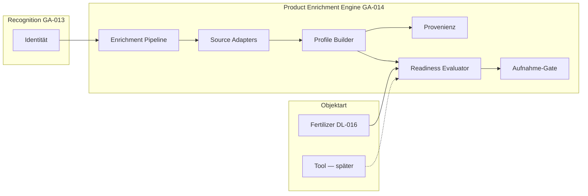

# GA-014

| Feld | Wert |
|------|------|
| **ID** | GA-014 |
| **Titel** | Product Enrichment Engine |
| **Status** | 📋 Geplant |
| **Priorität** | Hoch |
| **Erstellt** | 2026-07-29 |
| **Zuletzt geändert** | 2026-07-29 |
| **Verantwortlich** | — |
| **Verwandte Dokumente** | [GA-013](./ga-013.md); [DL-011](../decisions/dl-011.md); [DL-012](../decisions/dl-012.md); [DL-013](../decisions/dl-013.md); [DL-014](../decisions/dl-014.md); [DL-015](../decisions/dl-015.md); [DL-016](../decisions/dl-016.md); [GM-009](../model/gm-009.md); [DL-003](../decisions/dl-003.md); [GM-003](../model/gm-003.md); [GM-008](../model/gm-008.md); [CM-013](../playbook/conversation-model.md#cm-013--kontextbezogene-rückfragen-bei-der-erfassung); [product-governance.md](../product-governance.md); [greenkeeper-data-model.md](../greenkeeper-data-model.md) |
| **Kurzbeschreibung** | Allgemeine KI-gestützte Enrichment-Schicht: aus erkannter Identität nutzbares Product Profile aufbauen — objektartspezifische Readiness-Regeln, gemeinsame Pipeline-Infrastruktur. Dünger zuerst (DL-016). |

---

## Zweck

Dieses Dokument beschreibt das **Zielbild** der **Product Enrichment Engine** — eine übergreifende Greenkeeper-Fähigkeit, die aus erkannter **Produktidentität** **nutzbares Produktwissen** erzeugt.

Kernfrage:

> Wie baut Greenkeeper aus wenigen Nutzerinformationen ein **aufnahmefähiges Product Profile** auf — **bevor** ein Objekt im persönlichen Bestand erscheint?

**Grundprinzip:**

> **Erkennen → Anreichern → Aufnahme**

**Nicht:**

> Erkennen → Aufnahme → später hoffen

[GA-013](./ga-013.md) beschreibt Recognition und Stufe-1-Umsetzung für Dünger. **GA-014** definiert die **Enrichment-Schicht** als eigenständige Architekturentscheidung — fachlich abgestimmt mit [DL-011](../decisions/dl-011.md) bis [DL-016](../decisions/dl-016.md).

---

## 1. Zielbild

### Warum eine Enrichment-Schicht?

Greenkeeper unterscheidet sich von klassischen Verwaltungsapps: Der Nutzer **liefert** Informationen in natürlicher Form ([DL-011](../decisions/dl-011.md)); Greenkeeper **übernimmt** Identifikation, Recherche, Strukturierung und Wissensaufbau ([DL-013](../decisions/dl-013.md)).

**Recognition allein reicht nicht:**

- Identität beantwortet: *Welches Produkt ist das?*
- Nutzung erfordert: *Welche Eigenschaften hat es?* — Nährstoffe, Form, Anwendung, technische Daten, …

Ohne Enrichment entstünden leere oder halbfertige Product Profiles. Das widerspricht [DL-015](../decisions/dl-015.md) (Qualitätsbarriere) und dem Nutzerversprechen aus [DL-013](../decisions/dl-013.md).

### Wissensanreicherung als Kernbestandteil

Automatische Anreicherung ist **kein optionales Extra**, sondern **Kern der Greenkeeper-Erfahrung** ([DL-013](../decisions/dl-013.md)). Die Enrichment Engine ist die **technische und prozessuale Umsetzung** dieses Prinzips — bereichsübergreifend, mit objektartspezifischen Regeln.

### Product Profile vs. Bestand

Product Profile speichert **Produktwissen** (wiederverwendbar, quellenbasiert). Persönlicher Bestand speichert **Besitz und Verbrauch** ([DL-012](../decisions/dl-012.md)). Die Enrichment Engine schreibt in das **Product Profile**; die Aufnahme in den Bestand erfolgt erst nach bestandener Readiness-Prüfung.

---

## 2. Abgrenzung Recognition und Enrichment

| | **Product Recognition** | **Product Enrichment** |
|---|-------------------------|------------------------|
| **Frage** | Was ist das Produkt? | Welche Informationen existieren zu diesem Produkt? |
| **Ergebnis** | Produktreferenz, Identity Confidence | Aufnahmefähiges Product Profile |
| **Typische Felder** | Hersteller, Modell/Name, Variante, GTIN | Nährstoffe, Form, Anwendung, technische Specs — objektartabhängig |
| **Quellen** | Foto, Sprache, Barcode, Katalog-Match (Identität) | Hersteller, PDF, Katalog, verifizierte Web-Quellen |
| **Zeitpunkt** | Erster Schritt im Erfassungsflow | Nach belastbarer Identität, **vor** Bestandsaufnahme |
| **Bei Lücke** | Gezielte Klärung der **Identität** (CM-013) | Gezielte Klärung fehlender **Profilinformationen** oder zusätzlicher Kanal ([DL-011](../decisions/dl-011.md)) |
| **Implementierung heute** | [GA-013](./ga-013.md) — Spike + Stufe 1 | **GA-014** — Zielbild, noch nicht umgesetzt |

**Leitsatz Recognition:**

> Die Aufgabe der Produkterkennung ist ausschließlich: **Die Produktidentität möglichst schnell und eindeutig zu bestimmen.**

**Leitsatz Enrichment:**

> Die Aufgabe der Enrichment Engine ist: **Aus verifizierten Quellen ein aufnahmefähiges Product Profile aufzubauen** — ohne Werte zu erfinden ([DL-003](../decisions/dl-003.md), [GA-013](./ga-013.md)).

Web-Recherche und Profil-Vollständigkeit gehören in **Enrichment**, nicht in den blockierenden Recognition-Pfad der Stufe-1-Spike-Integration (siehe [GA-013 — Abweichung Spike vs. Ziel](./ga-013.md#abweichung-spike-vs-zielarchitektur)).

---

## 3. Aufnahmeprozess

### Zielablauf

```mermaid
flowchart TB
  U[Nutzer liefert Information]
  REC[Recognition]
  ID{Identität belastbar?}
  ENR[Enrichment Engine]
  RDY{Readiness objektartspezifisch}
  GATE[Aufnahme-Gate]
  STK[Persönlicher Bestand]

  U --> REC
  REC --> ID
  ID -->|nein| HELP1[Gezielte Klärung Identität]
  HELP1 --> REC
  ID -->|ja| ENR
  ENR --> RDY
  RDY -->|nicht aufnahmefähig| HELP2[Gezielte Nutzerhilfe / weiterer Kanal]
  HELP2 --> ENR
  RDY -->|aufnahmefähig| GATE
  GATE --> STK
```



**Schritte:**

1. **Nutzer liefert Information** — Foto, Sprache, PDF, Barcode, … ([DL-011](../decisions/dl-011.md))
2. **Recognition** — Identität ermitteln
3. **Identität vorhanden** — belastbare Produktzuordnung
4. **Enrichment** — Quellen sammeln, strukturieren, Product Profile aufbauen
5. **Objektartspezifische Readiness-Prüfung** — Aufnahmefähigkeit prüfen
6. **Aufnahme in persönlichen Bestand** — erst wenn Readiness erfüllt ([DL-015](../decisions/dl-015.md))

### Zeitverhalten

- **Recognition:** kurzer synchroner Pfad (Identität + Katalog-Match)
- **Enrichment:** technisch entkoppelte Pipeline (Worker/Queue möglich), aber **Erfassungsflow blockiert** bis Readiness oder gezielte Nutzerhilfe ([DL-015](../decisions/dl-015.md))
- Der Nutzer sieht **keinen fertigen Bestandseintrag**, solange die Qualitätsbarriere nicht erreicht ist

---

## 4. Architekturprinzip: Allgemeine Engine, objektartspezifische Regeln

Die **Product Enrichment Engine** ist eine **allgemeine Greenkeeper-Fähigkeit**. Sie stellt gemeinsame Funktionen bereit; **fachliche Regeln** werden **pro Objektart** definiert.

```
Product Enrichment Engine
    |
    +-- Dünger
    |      |
    |      +-- Fertilizer Readiness Rules
    |          (DL-016, DL-014)
    |
    +-- Werkzeuge
    |      |
    |      +-- Tool Readiness Rules
    |          (zukünftige Entscheidung)
    |
    +-- Maschinen
    |      |
    |      +-- Machine Readiness Rules
    |          (zukünftige Entscheidung)
    |
    +-- Bodenhilfsstoffe / Saatgut / …
           |
           +-- eigene Readiness Rules
               (zukünftige Entscheidungen)
```

### Keine globale Vollständigkeitsregel

Es gibt **keine** universelle Vollständigkeitsregel für alle Gartenobjekte.

Jede Objektart besitzt **eigene Aufnahmefähigkeitsregeln** (Readiness Rules). Die Engine ruft den passenden **Readiness Evaluator** für die Objektart auf.

| Readiness-Modul | Status | Grundlage |
|-----------------|--------|-----------|
| **FertilizerReadinessRules** | ✅ Spezifikation festgelegt | [GM-009](../model/gm-009.md) (DL-016, DL-014) |
| **ToolReadinessRules** | 📋 offen | zukünftiges DL/GM |
| **MachineReadinessRules** | 📋 offen | zukünftiges DL/GM |
| **SoilAmendmentReadinessRules** | 📋 offen | zukünftiges DL/GM |
| **SeedReadinessRules** | 📋 offen | zukünftiges DL/GM |

**[DL-016](../decisions/dl-016.md) gilt ausschließlich für Dünger** und darf **nicht** als allgemeine Regel für Werkzeuge, Maschinen oder andere Objektarten interpretiert werden.

---

## 5. Dünger als erste Implementierung

Die **erste konkrete Umsetzung** der Enrichment Engine erfolgt für **Dünger** — auf Basis der bestehenden GA-013-Infrastruktur (Recognition, Product Profiles Stufe 1, Capture-Flow).

### FertilizerReadinessRules

Verbindliche Implementierungsspezifikation: **[GM-009](../model/gm-009.md)**. Fachliche Grundlage: [DL-016](../decisions/dl-016.md), Deklarationsprinzip: [DL-014](../decisions/dl-014.md).

Kurzüberblick — für Dünger müssen vor Aufnahme vorliegen:

**Identität (Pflicht)**

- Hersteller
- Produktname
- eindeutige Produktzuordnung

**Basisdaten (Pflicht)**

- Produktform: Granulat oder Flüssig
- NPK-Zusammensetzung (Sonderfälle fachlich dokumentieren)

**Inhaltsstoffe (Pflicht, DL-014)**

- Herstellerangabe → Wert übernehmen
- nicht genannt → 0 %
- relevante Bereiche: Makronährstoffe, Stickstoffformen, Sekundärnährstoffe, Spurenelemente

**Anwendung**

- Aufwandmenge und weitere Empfehlungen: **sammeln**, blockieren **nicht** automatisch die Aufnahme, sofern keine Herstellerangabe verfügbar ([DL-016](../decisions/dl-016.md))

### Nicht auf Dünger übertragbar

DL-016-Anforderungen (NPK, Spurenelement-Matrix, …) gelten **nicht** für:

- Werkzeuge
- Maschinen
- Bodenhilfsstoffe
- Saatgut
- weitere Gartenobjekte

Diese Objektarten erhalten **eigene** Readiness-Definitionen in späteren Entscheidungen.

---

## 6. Technische Zielarchitektur (konzeptionell)

Noch **keine** Implementierungsdetails, Tabellenmigrationen oder Dateiplanung. Konzeptionelle Bausteine:

### Enrichment Pipeline

Orchestriert den Ablauf: Identitätsreferenz entgegennehmen → Quellen anbinden → Profile materialisieren → Readiness prüfen → Ergebnis an Aufnahme-Gate.

Technisch entkoppelt von Recognition; kann synchron (Fast Path bei Katalog) oder asynchron (Worker) ausgeführt werden — der **Erfassungsflow** wartet auf das Ergebnis.

### Source Adapter

Einheitliche Schnittstelle für Quelltypen:

- Hersteller-Webseiten
- Produktdatenblätter / PDF
- Geprüfter interner Katalog (`products`)
- GS1 / GTIN-Metadaten
- Nutzerbereitgestellte Medien (Foto Rückseite, Upload)

Priorisierung und Merge-Logik zentral; objektartspezifische Extraktionsprofile optional.

### Product Profile Builder

Materialisiert strukturiertes Wissen im **Product Profile** ([DL-012](../decisions/dl-012.md)):

- Identität und fachliche Felder
- Anwendung der **objektartspezifischen** Normalisierungsregeln (für Dünger: [DL-014](../decisions/dl-014.md))
- Trennung Aufnahmefähigkeit vs. Erweiterbarkeit

### Provenienzverwaltung

Pro Feld oder Feldgruppe:

- Quelle, URL, Kategorie, Evidenz, Zeitpunkt, Vertrauensniveau

Kein Profilfeld ohne nachvollziehbare Herkunft — außer explizit definierter Regeln (z. B. DL-014-0-%-Defaults für deklarationspflichtige Matrix).

### Readiness Evaluator

Pluggable Modul pro Objektart. Die Engine **bestimmt zuerst die Objektart**, **wählt dann** den passenden Evaluator und wendet **objektartspezifische Readiness Rules** an — erst danach entscheidet das Aufnahme-Gate.

```
Product Enrichment Engine
  → Objektart bestimmen
  → passenden Readiness Evaluator auswählen
  → objektartspezifische Readiness Rules anwenden
  → Aufnahme-Gate entscheiden
```

- Input: Product Profile (Entwurf) + `objectCategory`
- Output (regulär): objektartspezifisches Readiness-Ergebnis (Dünger: `ready` | `needs_input` | `not_ready` — siehe [GM-009](../model/gm-009.md))
- Bei falscher Evaluator-Zuordnung (z. B. Fertilizer Evaluator für Werkzeug): Vertragsfehler `unsupported_object_category` — **kein** Readiness-Status
- Dünger: **[GM-009 — Fertilizer Readiness Rules](../model/gm-009.md)** — Vorbedingung `objectCategory === 'fertilizer'`

### Aufnahme-Gate

Letzte fachliche Barriere vor persistenter Bestandsaufnahme:

- Readiness erfüllt → Save (Container, Bewegungen) erlaubt
- nicht erfüllt → kein Bestand, keine Erfolgsmeldung ([DL-015](../decisions/dl-015.md))

Verknüpft Enrichment Engine mit Inventar-RPCs ([GM-008](../model/gm-008.md), [GA-012](./ga-012.md)).

### Gesamtfluss (Komponenten)



### Wiederverwendung aus GA-013 (Spike)

Bestehende Bausteine können in Source Adapter / Profile Builder einfließen — nach Entkopplung aus dem synchronen Recognition-Request:

- Web-Search und Merge-Logik (Spike)
- Katalog-Resolver (Identität + Katalog als Enrichment-Quelle)
- OpenAI Structured Extraction

---

## 7. UX-Prinzip

Der Nutzer soll **nicht** Produktdaten manuell erfassen ([DL-011](../decisions/dl-011.md), [DL-013](../decisions/dl-013.md)).

Greenkeeper übernimmt:

- Erkennung
- Recherche
- Strukturierung
- Wissensaufbau

**Nur wenn** automatische Anreicherung nicht ausreichend erfolgreich ist:

- **gezielte Rückfrage** im Gespräch ([CM-013](../playbook/conversation-model.md#cm-013--kontextbezogene-rückfragen-bei-der-erfassung))
- **zusätzliche Quelle** (Rückseitenfoto, PDF, Barcode)
- **letzter Fallback:** manuelle Eingabe

### Kommunikation

| Phase | Nutzerwahrnehmung |
|-------|-------------------|
| Recognition | „Verpackung wird gelesen…“ |
| Enrichment | „Greenkeeper sammelt Produktinformationen…“ |
| Nicht aufnahmefähig | „Ich konnte … noch nicht vollständig bestimmen. Bitte …“ |
| Aufnahmefähig | Bestandsfragen → *„Dein Dünger wurde hinzugefügt.“* |

Die Erfolgsmeldung bedeutet: **vollständig nutzbar** für die Objektart — nicht „alle denkbaren Informationen existieren“ ([DL-016](../decisions/dl-016.md)).

---

## 8. Offene Architekturentscheidungen

Vor Implementierung zu klären:

| Thema | Frage |
|-------|--------|
| **Job-Orchestrierung** | Netlify Background Functions, Supabase Edge, synchroner Fast Path bei Katalogtreffer? |
| **Quellenpriorisierung** | Feinjustierung der Prioritätsmatrix pro Objektart |
| **Datenmodell-Erweiterungen** | Normalisierte Nährstofftabellen vs. JSONB; Provenienz-Schema; Job-Tabelle |
| **Statusmodell** | `recognized` / `enriching` / `needs_input` / `intake_ready` / `extended` / `verified` |
| **Weitere Objektarten** | Reihenfolge nach Dünger; eigene DL/GM pro Readiness |
| **Governance-Übergänge** | Wann Enrichment-Ergebnis `submitNewProduct` / Change Request auslöst ([DL-003](../decisions/dl-003.md)) |
| **GA-013 Stufe 1 Abgleich** | Migration bestehender Draft-Profile vs. nur Neuerfassungen |
| **Timeout & Retry** | Wann Nutzer einbinden vs. automatisch erneut versuchen |
| **Konfliktauflösung** | Widersprüchliche Quellen → Priorität, Review, oder `needs_input` |
| **Inhaltsstoff-Matrix Dünger** | Exakte `nutrient_key`-Liste für DL-014-0-%-Regel |

---

## 9. Beziehung zu bestehenden Entscheidungen

| Dokument | Rolle |
|----------|-------|
| [DL-011](../decisions/dl-011.md) | Eingangskanäle; Enrichment nutzt und erweitert Kanäle bei Lücken |
| [DL-012](../decisions/dl-012.md) | Product Profile vs. Bestand; Zielspeicher der Engine |
| [DL-013](../decisions/dl-013.md) | Anreicherung als Kern — Engine ist Umsetzung |
| [DL-014](../decisions/dl-014.md) | Deklarationsprinzip — **nur Dünger** im Profile Builder |
| [DL-015](../decisions/dl-015.md) | Qualitätsbarriere — Aufnahme-Gate |
| [DL-016](../decisions/dl-016.md) | **FertilizerReadinessRules** — nicht global |
| [GA-013](./ga-013.md) | Recognition, Stufe 1, Spike-Bausteine |
| [DL-003](../decisions/dl-003.md) / [product-governance.md](../product-governance.md) | Kein direkter Katalog-Write aus Enrichment |

---

## 10. Empfohlene Umsetzungsphasen (Orientierung)

| Phase | Inhalt |
|-------|--------|
| **1** | ~~FertilizerReadinessRules als Spezifikation~~ → [GM-009](../model/gm-009.md); Enrichment-Core konzeptionell; GA-013-Entkopplung planen |
| **2** | Enrichment Pipeline + Source Adapter (Dünger); DL-014-Normalizer |
| **3** | Datenmodell-Erweiterung Product Profile + Provenienz + Jobs |
| **4** | Aufnahme-Gate in Capture-Flow; UX-States |
| **5** | Weitere Objektarten (eigene Readiness-DLs) |

Details und Reihenfolge können in Project Delivery präzisiert werden — nicht Gegenstand dieses GA.

---

## Ersetzt durch

—

## Verwandte Dokumente

- [GA-013 — KI-gestützte Düngererkennung](./ga-013.md)
- [GM-009 — Fertilizer Readiness Rules](../model/gm-009.md)
- [DL-011 bis DL-016](../decisions/index.md)
- [GM-008 — Dünger-Inventar](../model/gm-008.md)
- [Produkt-Governance](../product-governance.md)
- [Fachliches Datenmodell](../greenkeeper-data-model.md)
