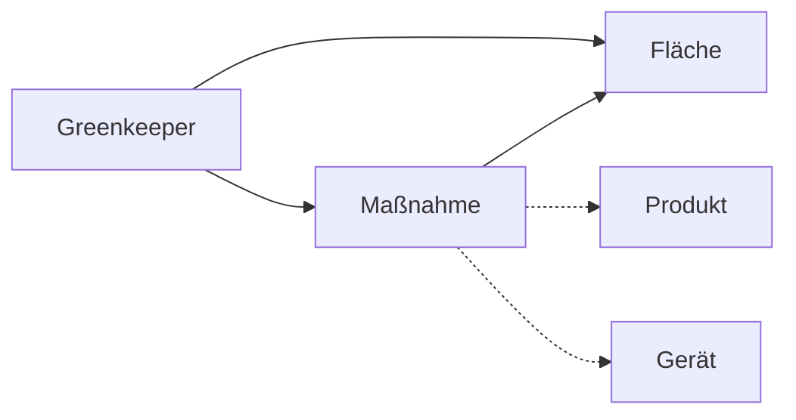
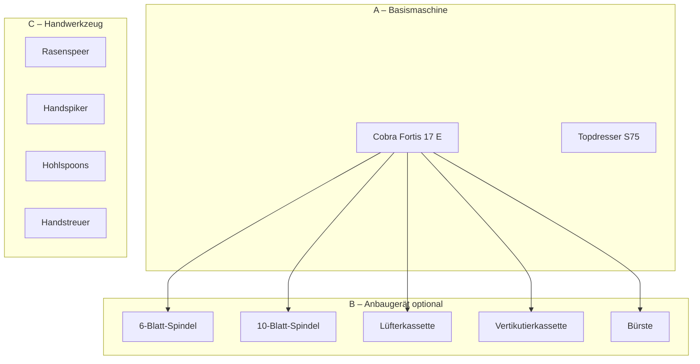
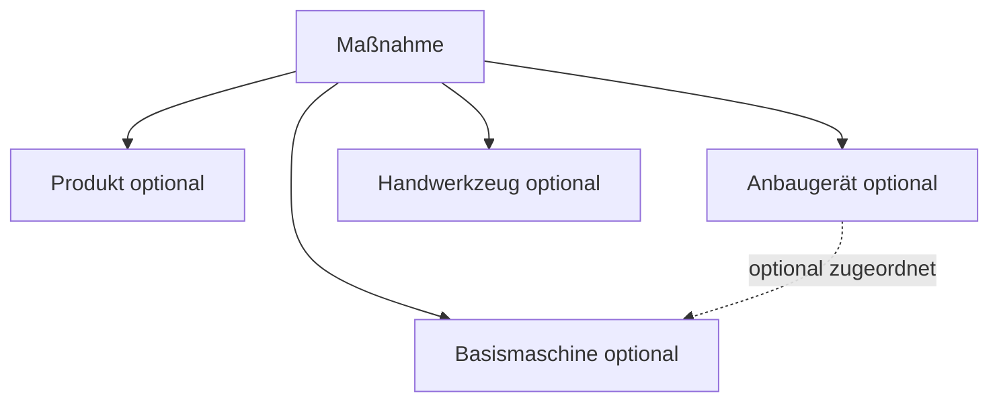

# Greenkeeper – Fachliches Datenmodell

Greenkeeper ist ein **Journal für Rasenpflegemaßnahmen**. Nutzer beschreiben ihre Arbeit in natürlicher Sprache; das System strukturiert daraus konkrete Einträge. Dieses Dokument beschreibt die **fachliche Sicht** auf Daten und Abläufe – unabhängig von der technischen Umsetzung in Tabellen oder UI.

Verwandte Dokumente:

- [Produkt-Governance](./product-governance.md) – offizielle Produktdatenbank und Review-Workflow
- [Model-Index](./model/index.md) – fachliche Modellentscheidungen (**GM-**)
- [Architecture-Index](./architecture/index.md) – technische GA-Entscheidungen
- [Dokumentations-Übersicht](./README.md) – ID-Präfixe inkl. GM

---

## Grundprinzip

Greenkeeper orientiert sich an der **Arbeitsweise eines Greenkeepers**, nicht an abstrakten Software-Kategorien.

| In der Praxis sagt ein Greenkeeper … | Greenkeeper modelliert … |
|--------------------------------------|--------------------------|
| „Ich habe heute aerifiziert.“ | Maßnahme: **Aerifizieren** |
| „Ich habe mit dem Topdresser gearbeitet.“ | Basismaschine + ggf. Anbaugerät |
| „25 g Spring Start ausgebracht.“ | Maßnahme: **Düngen** + Produkt + Menge |

Es gibt **keine Sammelbegriffe** wie „mechanische Maßnahme“, „Pflegeaktion“ oder „generische Aktivität“ in der fachlichen Sprache. Jeder Journaleintrag bezieht sich auf eine **konkrete Maßnahme**, die ein Greenkeeper auch so benennen würde.

---

## Kernentitäten (Überblick)

| Entität | Bedeutung |
|---------|-----------|
| **Fläche** | Eine verwaltete Rasenfläche (Vorgarten, Grün, Teetime …) |
| **Maßnahme** | Ein Journal-Eintrag: *Was* wurde *wann* auf *welcher Fläche* getan? |
| **Produkt** | Dünger, Bodenhilfsstoff, Pflanzenschutzmittel, Topdress-Material … (Governance-Workflow) |
| **Gerät** | Maschine, Anbaugerät oder Handwerkzeug, das bei einer Maßnahme eine Rolle spielt |
| **Pflegegruppe** | Welche Rasenflächen im Alltag gemeinsam angesprochen werden (internes Modell) |

---

## Pflegegruppen (Multi-Lawn)

Rasenflächen bleiben **eigenständige** Einheiten (Stammdaten, Historie, Maßnahmen je Fläche).

Gemeinsame Pflege wird über **Pflegegruppen** abgebildet:

- Eine Pflegegruppe gehört einem Nutzer.
- Eine Rasenfläche gehört in der aktuellen Ausbaustufe **genau einer** Pflegegruppe an.
- Die Onboarding-Eingaben `together` / `separate` sind **kein** dauerhaftes Domänenmodell — sie werden beim Abschluss in Pflegegruppen übersetzt.

Siehe [GM-007](./model/gm-007.md), [DL-007](./decisions/dl-007.md).

---

## Maßnahmen

### Fachliche Regel

Greenkeeper arbeitet mit **konkreten Maßnahmentypen**. Der Nutzer wählt keinen Typ vor; die Spracheingabe wird ausgewertet und einer passenden Maßnahme zugeordnet. Im Journal und in Auswertungen erscheint immer der **fachliche Name** (z. B. „Vertikutieren“, nicht „Mechanische Maßnahme“).

Der frühere Sammelbegriff **„mechanische Maßnahmen“** wird **nicht** verwendet. Maßnahmen wie Vertikutieren, Aerifizieren oder Mähen sind jeweils **eigenständige Typen** mit eigenem fachlichen Kontext und eigenen typischen Attributen (Schnitthöhe, Menge, Produkt …).

### Maßnahmentypen (Mindestumfang)

| Maßnahme | Typische Inhalte | Anmerkung |
|----------|------------------|-----------|
| **Mähen** | Schnitthöhe, Fläche, Datum | ggf. Gerät / Anbaugerät |
| **Düngen** | Produkt, Menge, Einheit | Produkt-Governance |
| **Bewässern** | Menge (z. B. l/m²), Dauer, Methode | ggf. Bewässerungssystem |
| **Nachsäen** | Saatgut, Menge, Fläche | |
| **Vertikutieren** | Tiefe, Richtung, Gerät | eigenständiger Typ |
| **Aerifizieren** | Gerät, Dichte, Muster | eigenständiger Typ |
| **Spiken** | Gerät, Tiefe, Abstand | eigenständiger Typ |
| **Schlitzen** | Gerät, Schlitztiefe | eigenständiger Typ |
| **Lüften** | Gerät (z. B. Lüfterkassette), Intensität | eigenständiger Typ |
| **Topdressen** | Material, Menge, Gerät | oft mit Topdresser |
| **Bodenhilfsstoffe ausbringen** | Produkt/Material, Menge | z. B. Sand, Ton, Kalk |
| **Bodenprobe** | Entnahmeort, Tiefe, Labor | dokumentarisch |
| **Pflanzenschutz** *(optional)* | Mittel, Menge, Indikation | regulierter Kontext |
| **Sonstige Maßnahme** | Freitext / Notiz | Fallback bei unklarem Fall |

### Typische Attribute einer Maßnahme

Je nach Typ können folgende Felder relevant sein (nicht alle sind immer Pflicht):

- **Datum / Zeitpunkt**
- **Fläche**
- **Produkt** (Name, ggf. Verknüpfung zur Produktdatenbank)
- **Menge und Einheit** (g/m², l/m², kg, mm …)
- **Schnitthöhe** (Mähen)
- **Gerät / Anbaugerät / Handwerkzeug** (siehe unten)
- **Notiz** (ergänzende Beobachtungen)
- **Quelle der Erfassung** (Sprache, manuelle Korrektur)

### Spracheingabe und Strukturierung

1. Nutzer beschreibt die Tätigkeit frei („Ich habe heute …“).
2. Greenkeeper erkennt **Maßnahmentyp** und extrahiert strukturierte Felder.
3. Bei unbekanntem **Produkt** startet der Product-Learn-Assistent (siehe Produkt-Governance).
4. Nutzer prüft die **Zusammenfassung** und speichert – ohne die Spracheingabe zu wiederholen.

---

## Geräte

### Grundsatz

**Nicht jedes Werkzeug ist eine eigenständige Maschine.**

Greenkeeper unterscheidet drei fachliche Rollen. Sie beschreiben, *wie* ein Gerät in der Praxis eingesetzt wird – nicht nur einen technischen Datensatztyp.

### A) Basismaschine

Eine **eigenständig betreibbare Maschine** – Antrieb, Chassis oder festes Gerät als Träger.

| Beispiel | Geräteart (s. u.) |
|----------|-------------------|
| Cobra Fortis 17 E | Mäher |
| Topdresser S75 | Streuer / Sonstiges |

Eigenschaften (typisch):

- Hersteller, Modell, Bezeichnung
- Geräteart und ggf. Gerätetyp
- Antrieb (Akku, Benzin, Elektro, Hand …)
- Arbeitsbreite, Inventarnummer (optional)

### B) Anbaugerät

Ein **wechselbares Modul**, das optional an eine Basismaschine montiert wird.

| Beispiel | Typische Basismaschine |
|----------|-------------------------|
| 6-Blatt-Spindel | Spindelmäher / Fortis-Klasse |
| 10-Blatt-Spindel | Spindelmäher / Fortis-Klasse |
| Lüfterkassette | Basismäher mit Kassettensystem |
| Vertikutierkassette | Basismäher mit Kassettensystem |
| Bürste | Basismäher mit Kassettensystem |

**Anbaugeräte gehören optional zu einer Basismaschine.** Sie sind nicht zwingend an genau eine Maschine gebunden (siehe offene Fragen).

Bei einer Maßnahme kann relevant sein:

- welche **Basismaschine** genutzt wurde,
- welches **Anbaugerät** montiert war,
- oder beides gemeinsam (z. B. Fortis 17 E + 6-Blatt-Spindel beim Mähen).

### C) Handwerkzeug

Werkzeuge **ohne Maschinenträger**, die direkt von Hand geführt werden.

| Beispiel | Typische Maßnahme |
|----------|-------------------|
| Rasenspeer | Aerifizieren / Spiken |
| Handspiker | Spiken |
| Hohlspoons | Bodenprobe |
| Handstreuer | Düngen / Bodenhilfsstoffe |

Handwerkzeuge sind **keine** Basismaschinen und **keine** Anbaugeräte. Sie werden bei Bedarf der Maßnahme zugeordnet.

---

## Gerätearten und Gerätetypen

### Geräteart (Pflichtklassifikation)

Jedes Gerät (Basismaschine, Anbaugerät oder Handwerkzeug) erhält eine **Geräteart**:

| Geräteart | Beispiele |
|-----------|-----------|
| **Mäher** | Cobra Fortis, Mähroboter, Handmäher |
| **Streuer** | Topdresser, Handstreuer |
| **Sprühgerät** | Spritzgerät, Kleingerät |
| **Bewässerung** | Regner, Tropfsystem, Schlauchwagen |
| **Sensor** | Bodensensor, Feuchtemessung |
| **Sonstiges** | Kassetten ohne eigene Kategorie, Spezialgeräte |

### Gerätetyp (nur für Geräteart „Mäher“)

Zusätzlich zur Geräteart kann ein Mäher einen **Gerätetyp** haben:

| Gerätetyp |
|-----------|
| Spindelmäher |
| Sichelmäher |
| Mähroboter |
| Handmäher |
| Aufsitzmäher |
| Rasentraktor |

**Anbaugeräte** (Spindel, Lüfterkassette …) sind in der Regel **kein** eigener Gerätetyp, sondern Anbaugeräte mit Bezug zur Basismaschine und passender Maßnahme (Lüften, Vertikutieren, Mähen …).

---

## Produkte (Kurzbezug)

Produkte (Dünger, Bodenhilfsstoffe, Pflanzenschutzmittel …) folgen dem **Product-Governance-Workflow**. Nutzer können Produkte sofort im persönlichen Journal verwenden; die Freigabe für die öffentliche Produktdatenbank erfolgt unabhängig über den Review-Prozess.

Details: [product-governance.md](./product-governance.md)

---

## Beziehungen Maßnahme ↔ Gerät ↔ Produkt

Eine Maßnahme kann **kein**, **ein** oder **mehrere** optionale Bezüge haben – abhängig vom Maßnahmentyp und dem, was der Nutzer dokumentiert hat.

---

## Modellentscheidungen (GM)

Einzelne Einträge: [Model-Index](./model/index.md)

| ID | Entscheidung |
|----|--------------|
| [GM-001](./model/gm-001.md) | Greenkeeper ist ein **Maßnahmen-Journal**, kein reines Düngejournal. |
| [GM-002](./model/gm-002.md) | **Spracheingabe** ist der primäre Einstieg; Strukturierung erfolgt durch Auswertung, nicht durch Vorab-Auswahl. |
| [GM-003](./model/gm-003.md) | **Produkte** werden ausschließlich über den Governance-Workflow in die offizielle Bibliothek geschrieben. |
| [GM-004](./model/gm-004.md) | Unbekannte Produkte lösen den **Product-Learn-Assistenten** aus; der Journal-Eintrag wird danach fortgesetzt. |
| [GM-005](./model/gm-005.md) | Maßnahmen werden als **konkrete Typen** modelliert (Mähen, Aerifizieren, Topdressen …), nicht als technische Enum-Sammelbegriffe. |
| [GM-006](./model/gm-006.md) | Greenkeeper orientiert sich an der **Arbeitsweise eines Greenkeepers**. Die Datenstruktur folgt den tatsächlichen Arbeitsabläufen und nicht einer technischen Datenbankstruktur. Ein Greenkeeper spricht von Aerifizieren, Topdressen, Spiken und Lüften – **nicht** von „mechanischen Maßnahmen“. Tabellen, Enums und APIs sind der Praxis unterzuordnen, nicht umgekehrt. |

---

## Offene Architekturfragen

Die folgenden Punkte sind **bewusst noch nicht entschieden** und beeinflussen die spätere technische Modellierung (Tabellen, Relationen, UI):

1. **Sollen Anbaugeräte eigenständige Datensätze sein?**  
   Oder reicht eine textuelle Referenz in der Maßnahme, bis ein Geräte-Inventar eingeführt wird?

2. **Können Anbaugeräte mehreren Basismaschinen zugeordnet werden?**  
   (z. B. eine Kassette, die an Fortis 17 E und an einem anderen Mäher passt)

3. **Können Maschinen mehrere Konfigurationen besitzen?**  
   (z. B. „Fortis 17 E + 6-Blatt-Spindel“ als gespeicherte Preset-Kombination)

4. **Soll eine Maßnahme gleichzeitig Basismaschine und Anbaugerät referenzieren?**  
   Fachlich oft ja (Mähen mit Fortis + Spindel) – wie wird das im Datenmodell abgebildet: zwei FKs, eine Konfigurations-Entität oder ein zusammengesetzter Gerätebezug?

5. **Feingranularität der Maßnahmentypen**  
   Sollen Spiken, Schlitzen und Aerifizieren dauerhaft getrennte Typen bleiben, oder gibt es übergeordnete Gruppierungen nur für **Auswertung/Statistik** (ohne sie in der UI als Sammelbegriff zu zeigen)?

6. **Pflanzenschutz**  
   Soll der optionale Maßnahmentyp regulierte Zusatzfelder (Mittel, Aufwandmenge, Wartezeit) verlangen, bevor ein Eintrag als vollständig gilt?

7. **Handwerkzeug vs. Geräteart „Sonstiges“**  
   Braucht Handwerkzeug eine eigene Entitätsebene oder reicht Geräteart + Flag „handgeführt“?

---

## Abgrenzung: Fachmodell vs. technische Umsetzung

Dieses Dokument beschreibt die **Ziel-Arbeitsweise**. Die aktuelle technische Umsetzung (Enums, Tabellen, KI-Parser) kann schrittweise an dieses Modell angeglichen werden, ohne dass fachliche Begriffe an DB-Limits ausgerichtet werden.

| Fachlich (Ziel) | Technisch (Stand kann abweichen) |
|-----------------|----------------------------------|
| Aerifizieren, Spiken, Lüften als eigene Maßnahmen | ggf. noch zusammengefasste oder generische Typen |
| Basismaschine + Anbaugerät | ggf. noch nicht modelliert |
| Geräteart + Gerätetyp (Mäher) | ggf. noch nicht modelliert |

Änderungen an Schema, Migrationen und UI erfolgen **in separaten Schritten** und leiten sich aus diesem Dokument ab – nicht umgekehrt.
