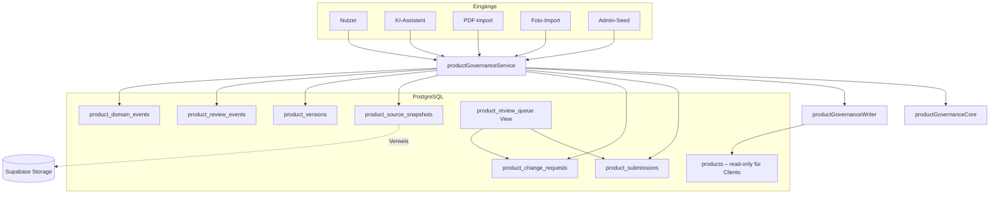

# Produkt-Governance V2 – Architektur

Greenkeeper besitzt **einen einzigen offiziellen Schreibpfad** für Produktdaten: den **Product Governance Service** (`src/lib/productGovernanceService.ts`). Weder Nutzer, KI noch andere Teile der App dürfen direkt `public.products` verändern.

## Zentraler Service

```
importProductViaGovernance()     ← KI-, PDF-, Foto-, Admin-Import
submitNewProduct()                ← Nutzer/Assistent: neues Produkt
submitChangeRequest()             ← Korrekturvorschlag
approveSubmission() / approveChangeRequest()   ← Reviewer
registerSourceSnapshot()          ← Quellenmomentaufnahme
fetchReviewQueue()                ← priorisierte Warteschlange
```

Interne Schreiblogik ausschließlich in `productGovernanceWriter.ts` → `writeOfficialProductRecord()`.

## Architekturdiagramm V2



## Vertrauensmodell (getrennt)

| Ebene | Feld | Sichtbarkeit |
|-------|------|--------------|
| KI-Sicherheit | `ai_confidence_score`, `ai_field_confidence` | intern |
| Review-Sicherheit | `review_confidence_score`, `review_field_confidence` | intern |
| Nutzer-Anzeige | `buildProductUserTrustDisplay()` | „Verifiziert“, „Technisch übernommen“, „Quelle vorhanden“, „Änderung in Prüfung“ |

## Quellen-Snapshots

Tabelle `product_source_snapshots` – **unveränderlich** nach Erstellung:

- Metadaten: Quelle, Art, Hash, Zeitpunkt, extrahierter Text, KI-Extraktion
- Dateien (PDF, Fotos) in **Supabase Storage**; DB speichert nur `storage_bucket` + `storage_path`
- Verknüpfung mit Submission, Change Request oder Produkt

## Versionierung V2

Jede `product_versions`-Zeile enthält:

- Vollständigen `snapshot`
- Strukturierte `field_changes` (Vergleich zur Vorgängerversion)
- `submission_id` / `change_request_id` / `approved_by`
- `source_snapshot_ids`
- Getrennte KI-/Review-Vertrauenswerte

## Legacy-Strategie

Bestehende Produkte **ohne menschliche Freigabe** (`verified_by IS NULL`):

- Status → `legacy_imported` (nicht `verified`)
- `legacy_imported_at` + Hinweistext
- Keine automatische Version-Backfill – optional später via `legacy_backfill`-Submission
- Daten bleiben unverändert lesbar; Review kann sie normal verifizieren

## Review-Warteschlange

View `product_review_queue` – sortiert nach `review_priority DESC`:

- Herstellerquellen > PDF > Foto > KI > Nutzer
- +10 Punkte pro übereinstimmender Meldung (max. +30)

## Domain Events

Tabelle `product_domain_events` – Vorbereitung Event-Engine:

- `dispatched_at IS NULL` = noch nicht an externe Consumer gesendet
- Events: `product.published`, `product.updated`, `product.submission_created`, …

## Migrationen (manuell ausführen)

**Verbindlicher Neuaufbau:** siehe [database-bootstrap.md](./database-bootstrap.md).

Kurzform — nach `schema.sql` alle Migrationen in **Dateiname-Reihenfolge**:

1. `20250717` … `20250721` — Produktfelder
2. `20250722_product_governance.sql` — Phase 1
3. `20250723_product_governance_v2.sql` — V2-Erweiterung
4. `20250724`, `20250725` — Maßnahmen, Onboarding/Pflegegruppen
5. `20250726`, `20250727` — idempotente Legacy-Korrekturen (No-Op auf frischem Neuaufbau)

**Keine Sonderreihenfolge mehr nötig**, sofern `schema.sql` die Governance-Enums enthält (Stand ab 2026-07-25).

**Historische Fallstricke** (nur bei altem `schema.sql` ohne Enum-Baseline):

| Fehler | Korrektur |
|--------|-----------|
| `COALESCE types text and app_user_role cannot be matched` | `20250726` (Legacy) oder Baseline-Fix |
| `unsafe use of new value "legacy_imported"` (55P04) | `20250727` (Legacy) oder Baseline-Fix |

## Risiken

- Admin-Seed-Skripte benötigen `GOVERNANCE_ADMIN_USER_ID` (Reviewer/Admin-Profil)
- Legacy-Produkte erscheinen als „Technisch übernommen“ bis Review
- `importProductWithServiceRole` ist deprecated und leitet auf Governance um
